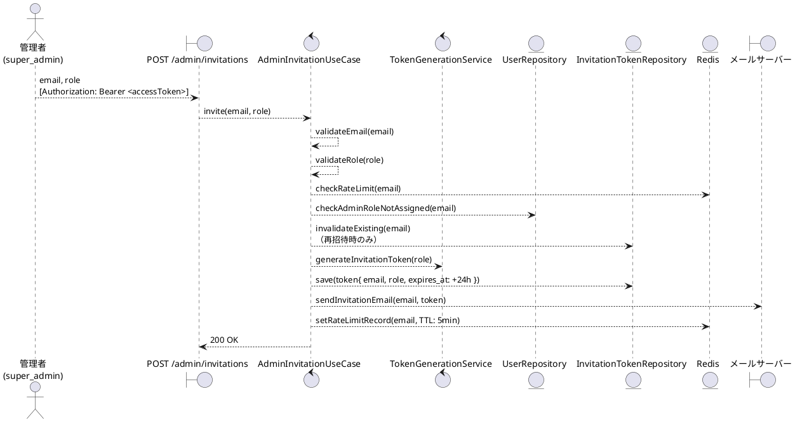
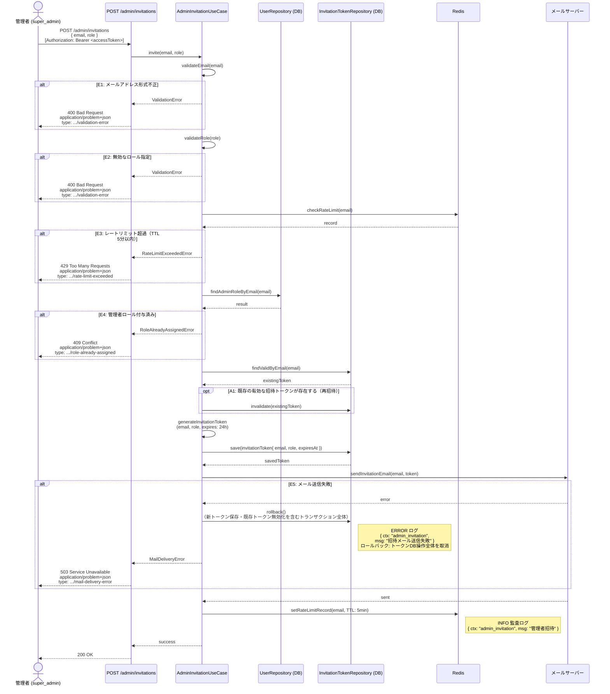

# BUC-A01 管理者招待

## メタデータ

| 項目 | 値 |
|---|---|
| BUC ID | BUC-A01 |
| BUC名 | 管理者招待 |
| アクター | ACT-02（管理者・`super_admin`のみ） |
| スコープ | Must |
| 関連FR | FR-11, FR-12 |
| 関連NFR | NFR-06, NFR-07, NFR-08, NFR-09, NFR-13 |
| 関連情報 | INF-01（ユーザー情報）, INF-02（ロール情報）, INF-07（招待トークン）, INF-12（招待トークン送信記録） |
| 関連条件 | CND-11（招待対象メールアドレスに管理者ロールが未付与であること）。再招待時は既存の招待トークンを無効化してから新トークンを発行する（FR-12） |
| 事後状態 | STM-01.招待済み未受付 |

---

## ユースケース記述

### 事前条件

- アクセストークンが有効であること
- 操作者が `super_admin` ロールを持つこと
- 招待対象メールアドレスに管理者ロールが未付与であること

### 基本フロー

1. 管理者は招待対象のメールアドレスと付与するロールを送信する
2. システムはメールアドレスの形式（RFC5322準拠、最大254文字）を検証する
3. システムは指定されたロールが有効な管理者ロール（`super_admin`・`operator`・`system_admin`）であることを検証する
4. システムはRedisで招待トークン送信記録を確認する（レートリミット: 同一メールアドレスにつき5分に1回）
5. システムは招待対象メールアドレスに管理者ロールが付与済みでないことをDBで確認する
6. システムは同一メールアドレスに対する有効な招待トークンの有無をDBで確認する
7. システムは招待トークン（有効期限24時間、使い切り、ロール情報を含む）を生成しDBに保存する
8. システムは招待メールをメールサーバー経由で送信する
9. システムはRedisに招待トークン送信記録を保存する（TTL 5分）
10. システムは監査ログ（管理者招待、INFO）を記録する
11. システムは200レスポンスを返す

### 代替フロー

**A1. 同一メールアドレスへの再招待の場合（ステップ6）**

- a. システムは既存の有効な招待トークンを無効化する（FR-12）
- b. 基本フローのステップ7に進む

### 例外フロー

> 全ログにはNFR-09の必須フィールド（`ts`・`lvl`・`svc`・`ctx`・`trace_id`/`span_id`・`req_id`・`msg`）を含めること。以下の例示は差分フィールド（`ctx`・`msg`・`lvl`）のみを記載する。

**E1. メールアドレス形式バリデーションエラー（ステップ2）**

- a. システムは処理を中断する
- b. システムは400 (Bad Request)、`application/problem+json`、`type: https://example.com/probs/validation-error` を返す
- c. 監査ログ対象外。ただしビジネス例外としてWARNINGログを出力する（`{ ctx: "admin_invitation", msg: "メールアドレス形式不正", lvl: "WARNING" }`。NFR-08）

**E2. 無効なロール指定（ステップ3）**

- a. システムは処理を中断する
- b. システムは400 (Bad Request)、`application/problem+json`、`type: https://example.com/probs/validation-error` を返す
- c. 監査ログ対象外。ただしビジネス例外としてWARNINGログを出力する（`{ ctx: "admin_invitation", msg: "無効なロール指定", lvl: "WARNING" }`。NFR-08）

**E3. レートリミット超過（ステップ4）**

- a. システムは処理を中断する
- b. システムは429 (Too Many Requests)、`application/problem+json`、`type: https://example.com/probs/rate-limit-exceeded` を返す
- c. 監査ログ対象外。ただしビジネス例外としてWARNINGログを出力する（`{ ctx: "admin_invitation", msg: "招待トークン送信レートリミット超過", lvl: "WARNING" }`。NFR-08）

**E4. 招待対象に管理者ロールが付与済みの場合（ステップ5）**

- a. システムは処理を中断する
- b. システムは409 (Conflict)、`application/problem+json`、`type: https://example.com/probs/role-already-assigned` を返す
- c. 監査ログ対象外。ただしビジネス例外としてWARNINGログを出力する（`{ ctx: "admin_invitation", msg: "管理者ロール付与済み", lvl: "WARNING" }`。NFR-08）

**E5. メール送信失敗（ステップ8）**

- a. システムは招待トークンの保存および既存トークン無効化（再招待時）を含むトランザクション全体をロールバックする
- b. システムは503 (Service Unavailable)、`application/problem+json`、`type: https://example.com/probs/mail-delivery-error` を返す
- c. 外部依存失敗としてERRORログを出力する（`{ ctx: "admin_invitation", msg: "招待メール送信失敗", lvl: "ERROR" }`。NFR-08）
- ロールバックスコープ: ステップ7の招待トークンDB保存、および再招待時のA1-aの既存トークン無効化を含むトランザクション全体を取り消す。Redisへの送信記録保存（ステップ9）は未実行のためロールバック不要

---

## ロバストネス図

---

## シーケンス図

---

## 監査ログ

| イベント | レベル | ターゲット | 備考 |
|----------|--------|------------|------|
| 管理者招待 | INFO | 招待対象メールアドレスのハッシュ or 招待トークンID | 基本フロー完了時。招待対象のメールアドレスはログに含めない |

---

## 備考・設計上の決定事項

| 項目 | 決定内容 | 理由 |
|---|---|---|
| 招待対象の制限 | 管理者ロールが未付与のメールアドレスのみ招待可能。同一メールアドレスのエンドユーザー登録は許可 | CND-11（招待対象メールアドレスに管理者ロールが未付与であること）に準拠。エンドユーザーと管理者は同一メールアドレスで共存可能 |
| 再招待の扱い | 既存の有効な招待トークンを無効化し新トークンを発行する | FR-12準拠。招待未受付の管理者に対して招待を再送信する際、古いトークンが残ることによる不整合を防ぐ |
| メール送信失敗時のロールバック | 新トークン保存・既存トークン無効化を含むトランザクション全体をロールバック | 送信されないトークンがDBに残る、または既存トークンだけが無効化されてリカバリ不能になる事態を防ぐ |
| レートリミット管理 | RedisのTTL付きキーで管理（5分に1回）。パスワードリセット・メール確認再送信と同値だが独立した設定値 | NFR-13・VAR-14（招待トークン送信レートリミット）に準拠 |
| 409 Conflict の採用 | 管理者ロール付与済みの場合に409を返す | 既にリソース（管理者ロール割当）が存在する競合状態。400（入力エラー）とは性質が異なるため区別する |
| ロール検証 | `user` ロールは招待対象外とし、管理者ロール（`super_admin`・`operator`・`system_admin`）のみ許可 | 管理者招待は管理者ロール付与が目的。`user` ロールは自己登録（BUC-U01）でデフォルト付与されるため招待の対象外 |
| 監査ログのターゲット | 招待対象メールアドレスをログに含めず、招待トークンIDまたはハッシュで記録 | NFR-09の機密情報保護方針。メールアドレスは個人情報のためログに含めない |
