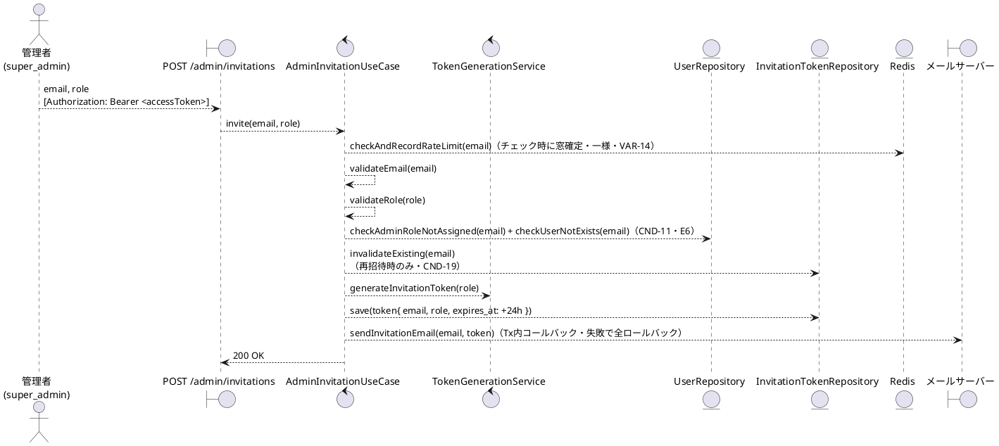
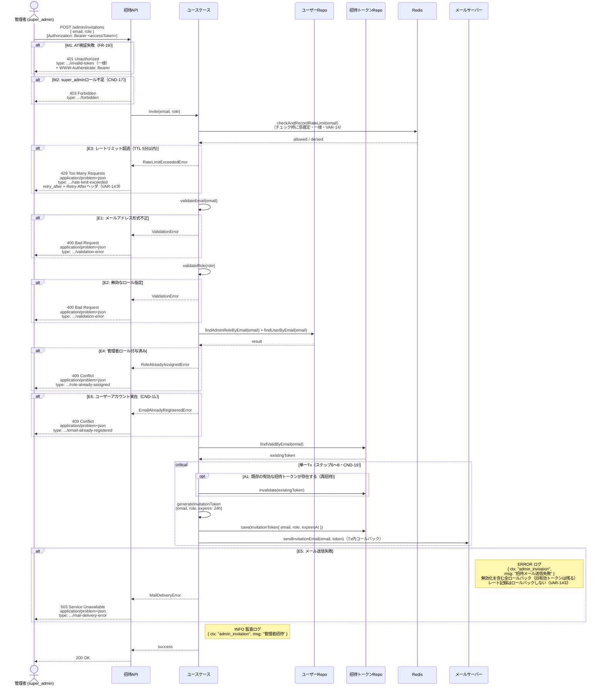

# BUC-A01 管理者招待

## メタデータ

| 項目 | 値 |
|---|---|
| BUC ID | BUC-A01 |
| BUC名 | 管理者招待 |
| アクター | ACT-02（管理者・`super_admin`のみ） |
| スコープ | Must |
| 関連FR | FR-11, FR-12 |
| 関連NFR | NFR-06, NFR-07, NFR-08, NFR-09, NFR-13 |
| 関連情報 | INF-01（ユーザー情報）, INF-02（ロール情報）, INF-07（招待トークン）, INF-12（招待トークン送信記録） |
| 関連条件 | CND-11（招待対象メールアドレスに管理者ロールが未付与であり、かつユーザーアカウントが存在しないこと）・CND-17（ロール認可のOR評価・`super_admin`）・CND-19（招待トークンの有効は常に最大1本。再招待時の既存トークン無効化=FR-12を包含） |
| 事後状態 | 招待済み未受付（INF-07（招待トークン）の有効未使用トークンの存在で表す・STM-01遷移なし・CND-19） |

---

## ユースケース記述

### 事前条件

- アクセストークンが有効であること
- 操作者が `super_admin` ロールを持つこと
- 招待対象メールアドレスに管理者ロールが未付与であり、かつユーザーアカウント（INF-01）が存在しないこと（CND-11）

### 基本フロー

1. 管理者は招待対象のメールアドレスと付与するロールを送信する
2. システムはRedisで招待トークン送信記録を確認し、同時に記録を確定する（レートリミット: 同一メールアドレスにつき5分に1回・チェック時に窓確定・一様適用・VAR-14）
3. システムはメールアドレスの形式（RFC5322準拠、最大254文字）を検証する
4. システムは指定されたロールが有効な管理者ロール（`super_admin`・`operator`・`system_admin`）であることを検証する
5. システムは招待対象メールアドレスに管理者ロールが付与済みでないこと、およびユーザーアカウント（INF-01）が存在しないことをDBで確認する（CND-11）
6. システムは同一メールアドレスに対する有効な招待トークンの有無をDBで確認する
7. システムは招待トークン（有効期限24時間、使い切り、付与ロールはDBレコード紐付け）を生成しDBに保存する
8. システムは招待メールをメールサーバー経由で送信する

> ステップ6〜8（A1の無効化を含む）は単一トランザクションで実行する（メール送信はTx内コールバック。送信失敗=E5で全ロールバック）

9. システムは監査ログ（管理者招待、INFO）を記録する
10. システムは200レスポンスを返す

### 代替フロー

**A1. 同一メールアドレスへの再招待の場合（ステップ6）**

- a. システムは既存の有効な招待トークンを無効化する（FR-12・CND-19）
- b. 基本フローのステップ7に進む

### 例外フロー

> 全ログにはNFR-09の必須フィールド（`ts`・`lvl`・`svc`・`ctx`・`trace_id`/`span_id`・`req_id`・`msg`）を含めること。以下の例示は差分フィールド（`ctx`・`msg`・`lvl`）のみを記載する。

**M1. アクセストークン検証失敗（事前条件・FR-19）**

- a. システムは処理を中断し、401 (Unauthorized)、`application/problem+json`、`type: https://example.com/probs/invalid-token`（一様）＋`WWW-Authenticate: Bearer` を返す（応答・ログともFR-19既定）

**M2. `super_admin` ロール不足（事前条件・CND-17）**

- a. システムは処理を中断し、403 (Forbidden)、`application/problem+json`、`type: https://example.com/probs/forbidden` を返す
- b. 監査ログ対象外。ただしビジネス例外としてWARNINGログを出力する（`{ ctx: "admin_invitation", msg: "権限不足", lvl: "WARNING" }`。NFR-08）

**E1. メールアドレス形式バリデーションエラー（ステップ3）**

- a. システムは処理を中断する
- b. システムは400 (Bad Request)、`application/problem+json`、`type: https://example.com/probs/validation-error` を返す
- c. 監査ログ対象外。ただしビジネス例外としてWARNINGログを出力する（`{ ctx: "admin_invitation", msg: "メールアドレス形式不正", lvl: "WARNING" }`。NFR-08）

**E2. 無効なロール指定（ステップ4）**

- a. システムは処理を中断する
- b. システムは400 (Bad Request)、`application/problem+json`、`type: https://example.com/probs/validation-error` を返す
- c. 監査ログ対象外。ただしビジネス例外としてWARNINGログを出力する（`{ ctx: "admin_invitation", msg: "無効なロール指定", lvl: "WARNING" }`。NFR-08）

**E3. レートリミット超過（ステップ2）**

- a. システムは処理を中断する（記録は更新しない＝固定ウィンドウ・TTL非延長・VAR-14②）
- b. システムは429 (Too Many Requests)、`application/problem+json`、`type: https://example.com/probs/rate-limit-exceeded`、`retry_after`（TTL残秒）＋HTTP `Retry-After`ヘッダ（VAR-14③）を返す
- c. 監査ログ対象外。ただしビジネス例外としてWARNINGログを出力する（`{ ctx: "admin_invitation", msg: "招待リクエストレートリミット超過", lvl: "WARNING" }`。NFR-08）

**E4. 招待対象に管理者ロールが付与済みの場合（ステップ5）**

- a. システムは処理を中断する
- b. システムは409 (Conflict)、`application/problem+json`、`type: https://example.com/probs/role-already-assigned` を返す
- c. 監査ログ対象外。ただしビジネス例外としてWARNINGログを出力する（`{ ctx: "admin_invitation", msg: "管理者ロール付与済み", lvl: "WARNING" }`。NFR-08）

**E5. メール送信失敗（ステップ8）**

- a. システムは招待トークンの保存および既存トークン無効化（再招待時）を含むトランザクション全体をロールバックする（旧有効トークンはそのまま残る）
- b. システムは503 (Service Unavailable)、`application/problem+json`、`type: https://example.com/probs/mail-delivery-error` を返す
- c. 外部依存失敗としてERRORログを出力する（`{ ctx: "admin_invitation", msg: "招待メール送信失敗", lvl: "ERROR" }`。NFR-08）
- ロールバックスコープ: ステップ6〜7のDB操作（再招待時のA1-aの既存トークン無効化を含む）を取り消す。レート記録（ステップ2）は確定済みのままロールバックしない（試行を数える・VAR-14①）

**E6. 招待対象メールアドレスのユーザーアカウントが存在する場合（ステップ5・CND-11）**

- a. システムは処理を中断する
- b. システムは409 (Conflict)、`application/problem+json`、`type: https://example.com/probs/email-already-registered` を返す
- c. 監査ログ対象外。ただしビジネス例外としてWARNINGログを出力する（`{ ctx: "admin_invitation", msg: "既存アカウントへの招待", lvl: "WARNING" }`。NFR-08）
- 備考: 既存ユーザーの管理者化はBUC-A07（ロール変更）の正規経路で行う（招待受付によるパスワード上書き＝乗っ取り経路の封止）

---

## ロバストネス図

```plantuml
@startuml
skinparam componentStyle rectangle
skinparam backgroundColor White

actor "管理者\n(super_admin)" as 管理者

boundary "POST /admin/invitations" as 招待API
control "AdminInvitationUseCase" as ユースケース
control "TokenGenerationService" as トークン生成
entity "UserRepository" as ユーザーRepo
entity "InvitationTokenRepository" as 招待トークンRepo
entity "Redis" as Redis
boundary "メールサーバー" as メールサーバー

管理者 --> 招待API : email, role\n[Authorization: Bearer <accessToken>]

招待API --> ユースケース : invite(email, role)

ユースケース --> Redis : checkAndRecordRateLimit(email)（チェック時に窓確定・一様・VAR-14）
ユースケース --> ユースケース : validateEmail(email)
ユースケース --> ユースケース : validateRole(role)
ユースケース --> ユーザーRepo : checkAdminRoleNotAssigned(email) + checkUserNotExists(email)（CND-11・E6）
ユースケース --> 招待トークンRepo : invalidateExisting(email)\n（再招待時のみ・CND-19）
ユースケース --> トークン生成 : generateInvitationToken(role)
ユースケース --> 招待トークンRepo : save(token{ email, role, expires_at: +24h })
ユースケース --> メールサーバー : sendInvitationEmail(email, token)（Tx内コールバック・失敗で全ロールバック）

招待API <-- ユースケース : 200 OK

@enduml
```

---

## シーケンス図

```mermaid
sequenceDiagram
  actor Admin as 管理者 (super_admin)
  participant InviteAPI as 招待API
  participant UseCase as ユースケース
  participant UserRepo as ユーザーRepo
  participant InviteRepo as 招待トークンRepo
  participant Redis as Redis
  participant MailServer as メールサーバー
  Admin->>InviteAPI: POST /admin/invitations<br/>{ email, role }<br/>[Authorization: Bearer <accessToken>]
  alt M1: AT検証失敗（FR-19）
  InviteAPI-->>Admin: 401 Unauthorized<br/>type: .../invalid-token（一様）<br/>+ WWW-Authenticate: Bearer
  end
  alt M2: super_adminロール不足（CND-17）
  InviteAPI-->>Admin: 403 Forbidden<br/>type: .../forbidden
  end
  InviteAPI->>UseCase: invite(email, role)
  UseCase->>Redis: checkAndRecordRateLimit(email)<br/>（チェック時に窓確定・一様・VAR-14）
  Redis-->>UseCase: allowed / denied
  alt E3: レートリミット超過（TTL 5分以内）
  UseCase-->>InviteAPI: RateLimitExceededError
  InviteAPI-->>Admin: 429 Too Many Requests<br/>application/problem+json<br/>type: .../rate-limit-exceeded<br/>retry_after + Retry-Afterヘッダ（VAR-14③）
  end
  UseCase->>UseCase: validateEmail(email)
  alt E1: メールアドレス形式不正
  UseCase-->>InviteAPI: ValidationError
  InviteAPI-->>Admin: 400 Bad Request<br/>application/problem+json<br/>type: .../validation-error
  end
  UseCase->>UseCase: validateRole(role)
  alt E2: 無効なロール指定
  UseCase-->>InviteAPI: ValidationError
  InviteAPI-->>Admin: 400 Bad Request<br/>application/problem+json<br/>type: .../validation-error
  end
  UseCase->>UserRepo: findAdminRoleByEmail(email) + findUserByEmail(email)
  UserRepo-->>UseCase: result
  alt E4: 管理者ロール付与済み
  UseCase-->>InviteAPI: RoleAlreadyAssignedError
  InviteAPI-->>Admin: 409 Conflict<br/>application/problem+json<br/>type: .../role-already-assigned
  end
  alt E6: ユーザーアカウント実在（CND-11）
  UseCase-->>InviteAPI: EmailAlreadyRegisteredError
  InviteAPI-->>Admin: 409 Conflict<br/>application/problem+json<br/>type: .../email-already-registered
  end
  UseCase->>InviteRepo: findValidByEmail(email)
  InviteRepo-->>UseCase: existingToken
  critical 単一Tx（ステップ6〜8・CND-19）
  opt A1: 既存の有効な招待トークンが存在する（再招待）
  UseCase->>InviteRepo: invalidate(existingToken)
  end
  UseCase->>UseCase: generateInvitationToken<br/>(email, role, expires: 24h)
  UseCase->>InviteRepo: save(invitationToken{ email, role, expiresAt })
  UseCase->>MailServer: sendInvitationEmail(email, token)（Tx内コールバック）
  end
  alt E5: メール送信失敗
  Note right of MailServer: ERROR ログ<br/>{ ctx: "admin_invitation",<br/>msg: "招待メール送信失敗" }<br/>無効化を含む全ロールバック（旧有効トークンは残る）<br/>レート記録はロールバックしない（VAR-14①）
  UseCase-->>InviteAPI: MailDeliveryError
  InviteAPI-->>Admin: 503 Service Unavailable<br/>application/problem+json<br/>type: .../mail-delivery-error
  end
  Note right of UseCase: INFO 監査ログ<br/>{ ctx: "admin_invitation", msg: "管理者招待" }
  UseCase-->>InviteAPI: success
  InviteAPI-->>Admin: 200 OK
```

---

## 監査ログ

| イベント | レベル | ターゲット | 備考 |
|----------|--------|------------|------|
| 管理者招待 | INFO | 招待対象メールアドレスのハッシュ or 招待トークンID | 基本フロー完了時。招待対象のメールアドレスはログに含めない |

---

## 備考・設計上の決定事項

| 項目 | 決定内容 | 理由 |
|---|---|---|
| 招待対象の制限 | 管理者ロールが未付与かつユーザーアカウント（INF-01）が存在しないメールアドレスのみ招待可能（既存アカウント実在時は409=E6） | CND-11準拠。招待受付によるパスワード上書き＝アカウント乗っ取り経路を封止する。既存ユーザーの管理者化はBUC-A07（ロール変更）の正規経路で行う |
| 再招待の扱い | 既存の有効な招待トークンを無効化し新トークンを発行する | FR-12準拠。招待未受付の管理者に対して招待を再送信する際、古いトークンが残ることによる不整合を防ぐ |
| メール送信失敗時のロールバック | 新トークン保存・既存トークン無効化を含むトランザクション全体をロールバック | 送信されないトークンがDBに残る、または既存トークンだけが無効化されてリカバリ不能になる事態を防ぐ |
| レートリミット管理 | RedisのTTL付きキーで管理（5分に1回）。パスワードリセット・メール確認再送信と同値だが独立した設定値 | NFR-13・VAR-14（招待トークン送信レートリミット）に準拠 |
| 409 Conflict の採用 | 管理者ロール付与済みの場合に409を返す | 既にリソース（管理者ロール割当）が存在する競合状態。400（入力エラー）とは性質が異なるため区別する |
| ロール検証 | `user` ロールは招待対象外とし、管理者ロール（`super_admin`・`operator`・`system_admin`）のみ許可 | 管理者招待は管理者ロール付与が目的。`user` ロールは自己登録（BUC-U01）でデフォルト付与されるため招待の対象外 |
| 監査ログのターゲット | 招待対象メールアドレスをログに含めず、招待トークンIDまたはハッシュで記録 | NFR-09の機密情報保護方針。メールアドレスは個人情報のためログに含めない |
