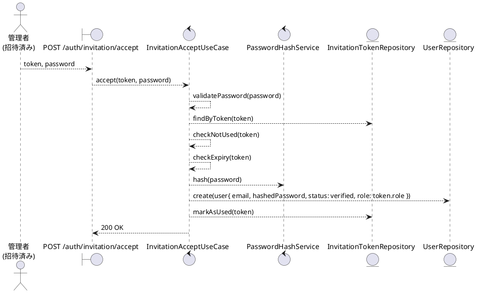
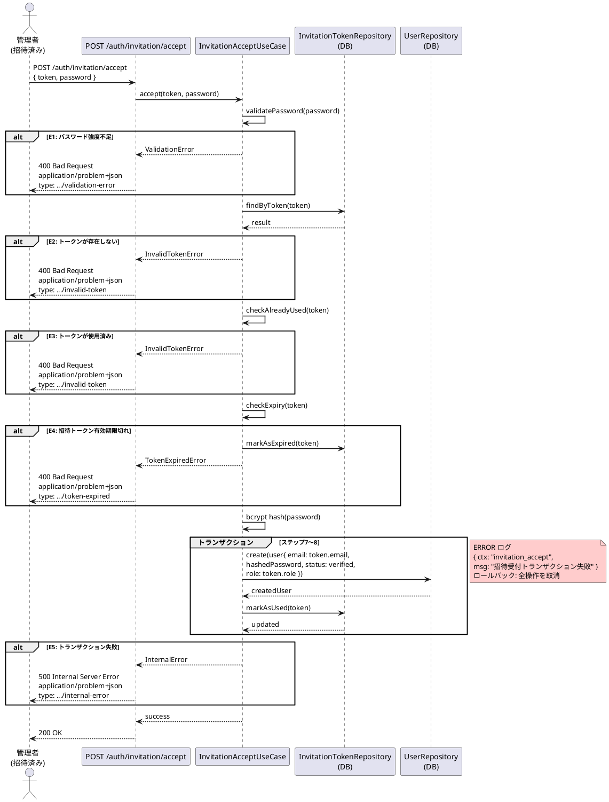

# BUC-A02 招待受付

## メタデータ

| 項目 | 値 |
|---|---|
| BUC ID | BUC-A02 |
| BUC名 | 招待受付 |
| アクター | ACT-02（管理者・招待済み） |
| スコープ | Must |
| 関連FR | FR-13 |
| 関連NFR | NFR-01, NFR-06, NFR-08, NFR-09 |
| 関連情報 | INF-01（ユーザー情報）, INF-02（ロール情報）, INF-07（招待トークン） |
| 関連条件 | CND-12（招待トークンが有効期限内であること） |
| 事後状態 | STM-01.未認証 |

---

## ユースケース記述

### 事前条件

- 招待トークンが有効期限内であること

### 基本フロー

1. 管理者（招待済み）は招待トークンと新しいパスワードを送信する
2. システムはパスワード強度（最小15文字、最大64文字、全ASCII文字・Unicode許容、文字種の混在強制なし）を検証する
3. システムは招待トークンをDBで検索する
4. システムは招待トークンが未使用であることを確認する
5. システムは招待トークンの有効期限を確認する（24時間）
6. システムはパスワードをbcryptでハッシュ化する
7. システムはユーザーを `未認証` 状態で作成し、招待トークンに含まれるロールを付与する
8. システムは招待トークンを使用済みに更新する

> ステップ7〜8は単一トランザクションで実行する

9. システムは200レスポンスを返す

### 代替フロー

なし

### 例外フロー

> 全ログにはNFR-09の必須フィールド（`ts`・`lvl`・`svc`・`ctx`・`trace_id`/`span_id`・`req_id`・`msg`）を含めること。以下の例示は差分フィールド（`ctx`・`msg`・`lvl`）のみを記載する。

**E1. パスワード強度バリデーションエラー（ステップ2）**

- a. システムは処理を中断する
- b. システムは400 (Bad Request)、`application/problem+json`、`type: https://example.com/probs/validation-error` を返す
- c. 監査ログ対象外。ただしビジネス例外としてWARNINGログを出力する（`{ ctx: "invitation_accept", msg: "パスワード強度不足", lvl: "WARNING" }`。NFR-08）

**E2. 招待トークンが存在しない場合（ステップ3）**

- a. システムは処理を中断する
- b. システムは400 (Bad Request)、`application/problem+json`、`type: https://example.com/probs/invalid-token` を返す
- c. 監査ログ対象外。ただしビジネス例外としてWARNINGログを出力する（`{ ctx: "invitation_accept", msg: "無効な招待トークン", lvl: "WARNING" }`。NFR-08）

**E3. 招待トークンが使用済みの場合（ステップ4）**

- a. システムは処理を中断する
- b. システムは400 (Bad Request)、`application/problem+json`、`type: https://example.com/probs/invalid-token` を返す
- c. 監査ログ対象外。ただしビジネス例外としてWARNINGログを出力する（`{ ctx: "invitation_accept", msg: "無効な招待トークン", lvl: "WARNING" }`。NFR-08）

**E4. 招待トークン有効期限切れ（ステップ5）**

- a. システムは招待トークンを期限切れとして更新する
- b. システムは400 (Bad Request)、`application/problem+json`、`type: https://example.com/probs/token-expired` を返す
- c. 監査ログ対象外。ただしビジネス例外としてWARNINGログを出力する（`{ ctx: "invitation_accept", msg: "招待トークン有効期限切れ", lvl: "WARNING" }`。NFR-08）

**E5. トランザクション失敗（ステップ7〜8）**

- a. システムはトランザクション全体をロールバックする（ユーザー作成・ロール付与・トークン使用済み更新のいずれも適用しない）
- b. システムは500 (Internal Server Error)、`application/problem+json`、`type: https://example.com/probs/internal-error` を返す
- c. 外部依存失敗としてERRORログを出力する（`{ ctx: "invitation_accept", msg: "招待受付トランザクション失敗", lvl: "ERROR" }`。NFR-08）
- ロールバックスコープ: ステップ7〜8の全操作。ユーザー作成・ロール付与・トークン状態のいずれも変更前の状態に戻す

---

## ロバストネス図

---

## シーケンス図

---

## 監査ログ

本BUCでは監査ログの対象操作なし。

> non-functional-requirements.md（NFR-07）の監査ログ対象操作に「招待受付」は含まれていない。招待の監査はBUC-A01（管理者招待）で記録済み。

---

## 備考・設計上の決定事項

| 項目 | 決定内容 | 理由 |
|---|---|---|
| 認証不要のエンドポイント | 招待受付はJWT認証なしで実行可能 | 招待済み未受付の管理者はまだアカウントを持たないため認証できない。招待トークン自体が認可の根拠となる |
| ユーザー作成時の状態 | `未認証` 状態で作成する | states.md（STM-01）の状態遷移図で「STM-01.招待済み未受付 → STM-01.未認証: 招待受付完了（パスワード設定）」と定義されている。メール確認は招待メール送信時に実在確認済みのためスキップ |
| ロール付与 | 招待トークンに含まれるロールをそのまま付与する | FR-13準拠。招待時に指定されたロールが受付時に付与される |
| トークン検証順序 | 存在確認 → 使用済み確認 → 有効期限確認の順 | BUC-U07（パスワードリセット）のE5〜E7と同一パターン。期限切れトークンを明示的に更新するためステップを分離 |
| エンドユーザーとの共存 | 同一メールアドレスでエンドユーザーアカウントが存在する場合の扱いは本BUCのスコープ外 | CND-11（BUC-A01の前提条件）で「同一メールアドレスのエンドユーザー登録は許可」とされているが、アカウント統合の詳細設計は実装フェーズで決定する |
