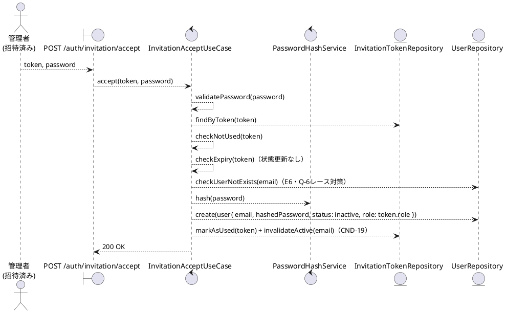
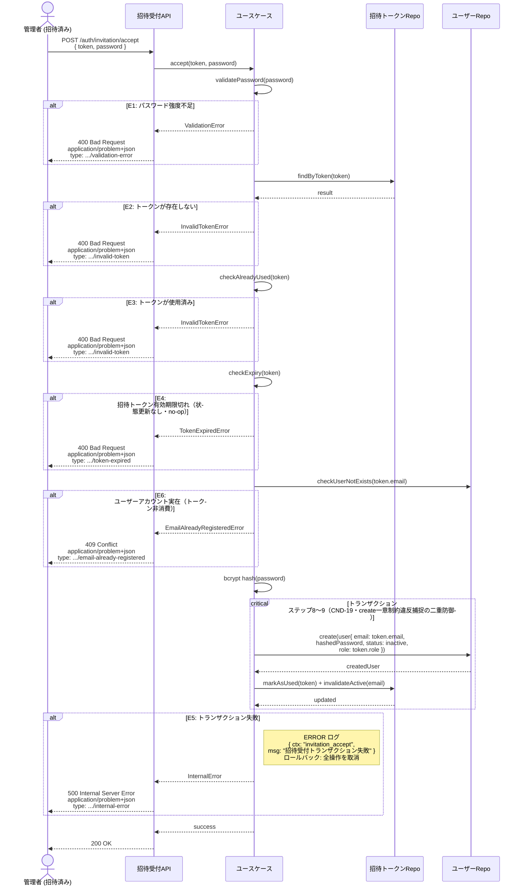

# BUC-A02 招待受付

## メタデータ

| 項目 | 値 |
|---|---|
| BUC ID | BUC-A02 |
| BUC名 | 招待受付 |
| アクター | ACT-02（管理者・招待済み） |
| スコープ | Must |
| 関連FR | FR-13 |
| 関連NFR | NFR-01, NFR-06, NFR-08, NFR-09 |
| 関連情報 | INF-01（ユーザー情報）, INF-02（ロール情報）, INF-07（招待トークン） |
| 関連条件 | CND-12（招待トークンが有効期限内であること）・CND-19（招待トークンの有効は常に最大1本＝受付完了時の一括無効化を含む） |
| 事後状態 | STM-01.未認証 |

---

## ユースケース記述

### 事前条件

- 招待トークンが有効期限内であること

### 基本フロー

1. 管理者（招待済み）は招待トークンと新しいパスワードを送信する
2. システムはパスワード強度（最小15文字、最大64文字、全ASCII文字・Unicode許容、文字種の混在強制なし、UTF-8エンコード時72バイト以下）を検証する
3. システムは招待トークンをDBで検索する
4. システムは招待トークンが未使用であることを確認する
5. システムは招待トークンの有効期限を確認する（24時間）
6. システムはINF-01（ユーザー情報）に同一メールアドレスのレコードが実在しないことを再確認する（招待発行〜受付間の自己登録レース対策・E6）
7. システムはパスワードをbcryptでハッシュ化する
8. システムはユーザーを `未認証` 状態で作成し、招待トークンに紐付けられたロールを付与する
9. システムは招待トークンを使用済みに更新し、同一メールアドレス宛の他の有効な招待トークンを一括無効化する（CND-19）

> ステップ8〜9は単一トランザクションで実行する（E6はTx内のcreate一意制約違反捕捉との二重防御）

10. システムは200レスポンスを返す

### 代替フロー

なし

### 例外フロー

> 全ログにはNFR-09の必須フィールド（`ts`・`lvl`・`svc`・`ctx`・`trace_id`/`span_id`・`req_id`・`msg`）を含めること。以下の例示は差分フィールド（`ctx`・`msg`・`lvl`）のみを記載する。

**E1. パスワード強度バリデーションエラー（ステップ2）**

- a. システムは処理を中断する
- b. システムは400 (Bad Request)、`application/problem+json`、`type: https://example.com/probs/validation-error` を返す
- c. 監査ログ対象外。ただしビジネス例外としてWARNINGログを出力する（`{ ctx: "invitation_accept", msg: "パスワード強度不足", lvl: "WARNING" }`。NFR-08）

**E2. 招待トークンが存在しない場合（ステップ3）**

- a. システムは処理を中断する
- b. システムは400 (Bad Request)、`application/problem+json`、`type: https://example.com/probs/invalid-token` を返す
- c. 監査ログ対象外。ただしビジネス例外としてWARNINGログを出力する（`{ ctx: "invitation_accept", msg: "無効な招待トークン", lvl: "WARNING" }`。NFR-08）

**E3. 招待トークンが使用済みの場合（ステップ4）**

- a. システムは処理を中断する
- b. システムは400 (Bad Request)、`application/problem+json`、`type: https://example.com/probs/invalid-token` を返す
- c. 監査ログ対象外。ただしビジネス例外としてWARNINGログを出力する（`{ ctx: "invitation_accept", msg: "無効な招待トークン", lvl: "WARNING" }`。NFR-08）

**E4. 招待トークン有効期限切れ（ステップ5）**

- a. システムは期限切れを検出する（状態更新なし・`expires_at` 判定のみ。DB書き込みは行わず、使い切りは `used_at` が担う）
- b. システムは400 (Bad Request)、`application/problem+json`、`type: https://example.com/probs/token-expired` を返す
- c. 監査ログ対象外。ただしビジネス例外としてWARNINGログを出力する（`{ ctx: "invitation_accept", msg: "招待トークン有効期限切れ", lvl: "WARNING" }`。NFR-08）

**E5. トランザクション失敗（ステップ8〜9）**

- a. システムはトランザクション全体をロールバックする（ユーザー作成・ロール付与・トークン使用済み更新・一括無効化のいずれも適用しない）
- b. システムは500 (Internal Server Error)、`application/problem+json`、`type: https://example.com/probs/internal-error` を返す
- c. 外部依存失敗としてERRORログを出力する（`{ ctx: "invitation_accept", msg: "招待受付トランザクション失敗", lvl: "ERROR" }`。NFR-08）
- ロールバックスコープ: ステップ8〜9の全操作。ユーザー作成・ロール付与・トークン状態のいずれも変更前の状態に戻す

**E6. 同一メールアドレスのユーザーアカウントが存在する場合（ステップ6）**

- a. システムは処理を中断する（招待トークンは消費しない）
- b. システムは409 (Conflict)、`application/problem+json`、`type: https://example.com/probs/email-already-registered` を返す（500にしない）
- c. 監査ログ対象外。ただしビジネス例外としてWARNINGログを出力する（`{ ctx: "invitation_accept", msg: "既存アカウントとの競合", lvl: "WARNING" }`。NFR-08）
- 備考: 登録側（UC-002（アカウントを登録する））は変更しない（招待の存在を登録応答から漏らさない）。既存ユーザーの管理者化はBUC-A07（ロール変更）・不要アカウントの削除はBUC-A06（アカウント削除）の正規経路で行う

---

## ロバストネス図

```plantuml
@startuml
skinparam componentStyle rectangle
skinparam backgroundColor White

actor "管理者\n(招待済み)" as 管理者

boundary "POST /auth/invitation/accept" as 招待受付API
control "InvitationAcceptUseCase" as ユースケース
control "PasswordHashService" as ハッシュ化
entity "InvitationTokenRepository" as 招待トークンRepo
entity "UserRepository" as ユーザーRepo

管理者 --> 招待受付API : token, password

招待受付API --> ユースケース : accept(token, password)

ユースケース --> ユースケース : validatePassword(password)
ユースケース --> 招待トークンRepo : findByToken(token)
ユースケース --> ユースケース : checkNotUsed(token)
ユースケース --> ユースケース : checkExpiry(token)（状態更新なし）
ユースケース --> ユーザーRepo : checkUserNotExists(email)（E6・Q-6レース対策）
ユースケース --> ハッシュ化 : hash(password)
ユースケース --> ユーザーRepo : create(user{ email, hashedPassword, status: inactive, role: token.role })
ユースケース --> 招待トークンRepo : markAsUsed(token) + invalidateActive(email)（CND-19）

招待受付API <-- ユースケース : 200 OK

@enduml
```

---

## シーケンス図

```mermaid
sequenceDiagram
  actor Admin as 管理者 (招待済み)
  participant InviteAcceptAPI as 招待受付API
  participant UseCase as ユースケース
  participant InviteRepo as 招待トークンRepo
  participant UserRepo as ユーザーRepo
  Admin->>InviteAcceptAPI: POST /auth/invitation/accept<br/>{ token, password }
  InviteAcceptAPI->>UseCase: accept(token, password)
  UseCase->>UseCase: validatePassword(password)
  alt E1: パスワード強度不足
  UseCase-->>InviteAcceptAPI: ValidationError
  InviteAcceptAPI-->>Admin: 400 Bad Request<br/>application/problem+json<br/>type: .../validation-error
  end
  UseCase->>InviteRepo: findByToken(token)
  InviteRepo-->>UseCase: result
  alt E2: トークンが存在しない
  UseCase-->>InviteAcceptAPI: InvalidTokenError
  InviteAcceptAPI-->>Admin: 400 Bad Request<br/>application/problem+json<br/>type: .../invalid-token
  end
  UseCase->>UseCase: checkAlreadyUsed(token)
  alt E3: トークンが使用済み
  UseCase-->>InviteAcceptAPI: InvalidTokenError
  InviteAcceptAPI-->>Admin: 400 Bad Request<br/>application/problem+json<br/>type: .../invalid-token
  end
  UseCase->>UseCase: checkExpiry(token)
  alt E4: 招待トークン有効期限切れ（状態更新なし・no-op）
  UseCase-->>InviteAcceptAPI: TokenExpiredError
  InviteAcceptAPI-->>Admin: 400 Bad Request<br/>application/problem+json<br/>type: .../token-expired
  end
  UseCase->>UserRepo: checkUserNotExists(token.email)
  alt E6: ユーザーアカウント実在（トークン非消費）
  UseCase-->>InviteAcceptAPI: EmailAlreadyRegisteredError
  InviteAcceptAPI-->>Admin: 409 Conflict<br/>application/problem+json<br/>type: .../email-already-registered
  end
  UseCase->>UseCase: bcrypt hash(password)
  critical トランザクション ステップ8〜9（CND-19・create一意制約違反捕捉の二重防御）
  UseCase->>UserRepo: create(user{ email: token.email,<br/>hashedPassword, status: inactive,<br/>role: token.role })
  UserRepo-->>UseCase: createdUser
  UseCase->>InviteRepo: markAsUsed(token) + invalidateActive(email)
  InviteRepo-->>UseCase: updated
  end
  alt E5: トランザクション失敗
  Note right of UseCase: ERROR ログ<br/>{ ctx: "invitation_accept",<br/>msg: "招待受付トランザクション失敗" }<br/>ロールバック: 全操作を取消
  UseCase-->>InviteAcceptAPI: InternalError
  InviteAcceptAPI-->>Admin: 500 Internal Server Error<br/>application/problem+json<br/>type: .../internal-error
  end
  UseCase-->>InviteAcceptAPI: success
  InviteAcceptAPI-->>Admin: 200 OK
```

---

## 監査ログ

本BUCでは監査ログの対象操作なし。

> non-functional-requirements.md（NFR-07）の監査ログ対象操作に「招待受付」は含まれていない。招待の監査はBUC-A01（管理者招待）で記録済み。

---

## 備考・設計上の決定事項

| 項目 | 決定内容 | 理由 |
|---|---|---|
| 認証不要のエンドポイント | 招待受付はJWT認証なしで実行可能 | 招待済み未受付の管理者はまだアカウントを持たないため認証できない。招待トークン自体が認可の根拠となる |
| ユーザー作成時の状態 | `未認証` 状態で作成する | states.md（STM-01）で「（初期）→ STM-01.未認証: UC-012（招待を受け付ける）完了」と定義（招待済み未受付はINF-07（招待トークン）の有効未使用トークンの存在で表し、STM-01の状態ではない・CND-19）。メール確認は招待メール送信時に実在確認済みのためスキップ |
| ロール付与 | 招待トークンに紐付けられたロールをそのまま付与する | FR-13準拠。招待時に指定されたロールが受付時に付与される |
| トークン検証順序 | 存在確認 → 使用済み確認 → 有効期限確認の順 | BUC-U07（パスワードリセット）のE5〜E7と同一パターン（応答type・msgの差分を状態ごとに規定するためステップを分離。期限切れは検出のみ・状態更新なし） |
| エンドユーザーとの共存 | 同一メールアドレスのユーザーアカウントが存在する場合、招待時（BUC-A01 E6）・受付時（E6）とも409で遮断する（アカウント統合は行わない） | 招待受付によるパスワード上書き＝アカウント乗っ取り経路の封止（CND-11）。既存ユーザーの管理者化はBUC-A07（ロール変更）、不要アカウントの削除はBUC-A06（アカウント削除）の正規経路で行う |
