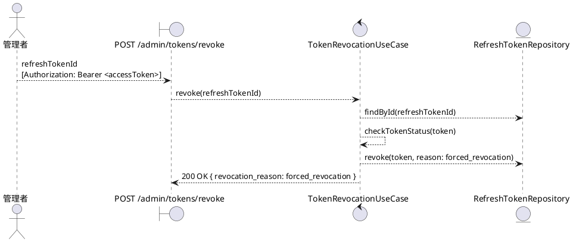
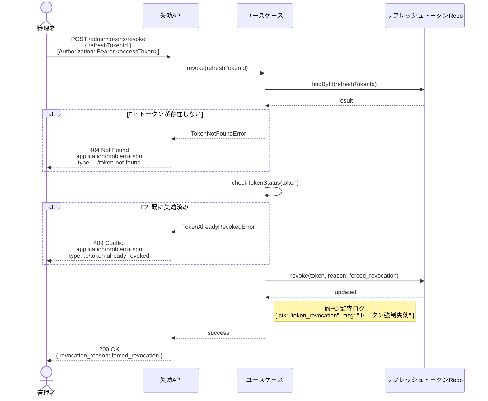

# BUC-A03 トークン強制失効

## メタデータ

| 項目 | 値 |
|---|---|
| BUC ID | BUC-A03 |
| BUC名 | トークン強制失効 |
| アクター | ACT-02（管理者・`super_admin`／`operator`／`system_admin`） |
| スコープ | Must |
| 関連FR | FR-14 |
| 関連NFR | NFR-06, NFR-07, NFR-08, NFR-09 |
| 関連情報 | INF-03（アクセストークン）, INF-04（リフレッシュトークン） |
| 関連条件 | — |
| 事後状態 | STM-02.セッション失効（対象トークンのみ） |

---

## ユースケース記述

### 事前条件

- アクセストークンが有効であること
- 操作者が管理者ロール（`super_admin`・`operator`・`system_admin`）を持つこと

### 基本フロー

1. 管理者は対象のリフレッシュトークンIDを送信する
2. システムはリフレッシュトークンをDBで検索する
3. システムはリフレッシュトークンが有効（未失効）であることを確認する
4. システムはリフレッシュトークンを失効させる（失効理由: `forced_revocation`）
5. システムは監査ログ（トークン強制失効、INFO）を記録する
6. システムは200レスポンスを返す（`revocation_reason: forced_revocation` を含める）

### 代替フロー

なし

### 例外フロー

> 全ログにはNFR-09の必須フィールド（`ts`・`lvl`・`svc`・`ctx`・`trace_id`/`span_id`・`req_id`・`msg`）を含めること。以下の例示は差分フィールド（`ctx`・`msg`・`lvl`）のみを記載する。

**E1. リフレッシュトークンが存在しない場合（ステップ2）**

- a. システムは処理を中断する
- b. システムは404 (Not Found)、`application/problem+json`、`type: https://example.com/probs/token-not-found` を返す
- c. 監査ログ対象外。ただしビジネス例外としてWARNINGログを出力する（`{ ctx: "token_revocation", msg: "対象リフレッシュトークンが存在しない", lvl: "WARNING" }`。NFR-08）

**E2. リフレッシュトークンが既に失効済みの場合（ステップ3）**

- a. システムは処理を中断する
- b. システムは409 (Conflict)、`application/problem+json`、`type: https://example.com/probs/token-already-revoked` を返す
- c. 監査ログ対象外。ただしビジネス例外としてWARNINGログを出力する（`{ ctx: "token_revocation", msg: "リフレッシュトークン既に失効済み", lvl: "WARNING" }`。NFR-08）

---

## ロバストネス図

---

## シーケンス図

---

## 監査ログ

| イベント | レベル | ターゲット | 備考 |
|----------|--------|------------|------|
| トークン強制失効 | INFO | 対象user_id, refreshTokenId | 基本フロー完了時。操作者の管理者IDも記録する |

---

## 備考・設計上の決定事項

| 項目 | 決定内容 | 理由 |
|---|---|---|
| 失効対象 | 指定された単一のリフレッシュトークンのみ失効させる | FR-14準拠。全セッション無効化はBUC-A04（アカウント無効化）等の別BUCで担当する |
| 失効理由 | `forced_revocation` を使用する | VAR-10（セッション失効理由コード）に準拠 |
| レスポンスに失効理由を含める | 200レスポンスに `revocation_reason: forced_revocation` を含める | FR-14準拠。NFR-06の`revocation_reason`拡張フィールド仕様に従う |
| 既に失効済みトークンへの操作 | 409 Conflict を返す | 冪等性を考慮した場合200を返す選択肢もあるが、管理者操作では操作結果を正確にフィードバックすることが重要であるため409で状態の競合を通知する |
| 操作者のロール制限 | `super_admin`・`operator`・`system_admin` の全管理者ロールで実行可能 | buc.md BUC-A03の定義でアクターが3ロール全て（VAR-09）に許可されている。トークン強制失効は即時性が求められるセキュリティ操作であるため、管理者ロール全体に権限を持たせる |
