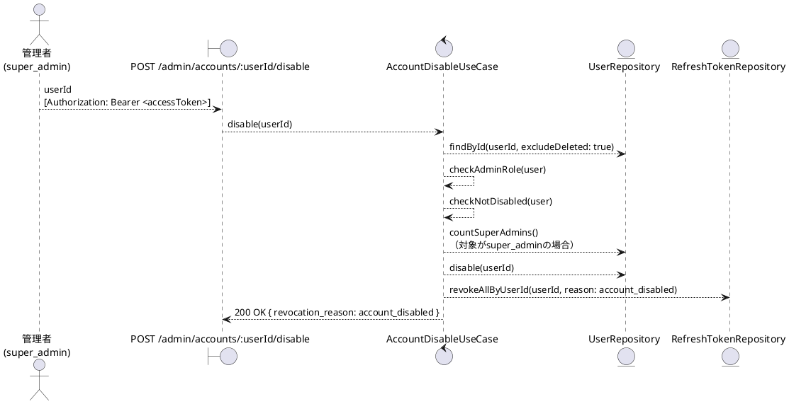
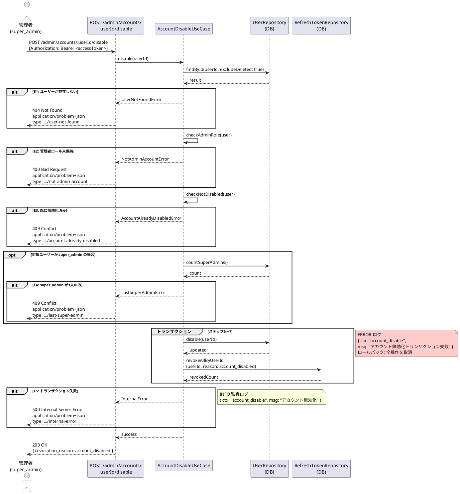

# BUC-A04 管理者アカウント無効化

## メタデータ

| 項目 | 値 |
|---|---|
| BUC ID | BUC-A04 |
| BUC名 | 管理者アカウント無効化 |
| アクター | ACT-02（管理者・`super_admin`のみ） |
| スコープ | Must |
| 関連FR | FR-15 |
| 関連NFR | NFR-06, NFR-07, NFR-08, NFR-09 |
| 関連情報 | INF-01（ユーザー情報）, INF-04（リフレッシュトークン） |
| 関連条件 | CND-14（`super_admin`が2人以上存在すること。対象が`super_admin`の場合） |
| 事後状態 | STM-01.無効化済み |

---

## ユースケース記述

### 事前条件

- アクセストークンが有効であること
- 操作者が `super_admin` ロールを持つこと

### 基本フロー

1. 管理者は対象ユーザーIDを送信する
2. システムは対象ユーザー（削除済みを除く）をDBで検索する
3. システムは対象ユーザーが管理者ロール（`super_admin`・`operator`・`system_admin`）を持つことを確認する
4. システムは対象ユーザーが無効化済みでないことを確認する
5. システムは対象ユーザーが `super_admin` の場合、`super_admin` が2人以上存在することをDBで確認する
6. システムは対象ユーザーのアカウントを無効化する
7. システムは対象ユーザーの全リフレッシュトークンを失効させる（失効理由: `account_disabled`）

> ステップ6〜7は単一トランザクションで実行する

8. システムは監査ログ（アカウント無効化、INFO）を記録する
9. システムは200レスポンスを返す（`revocation_reason: account_disabled` を含める）

### 代替フロー

なし

### 例外フロー

> 全ログにはNFR-09の必須フィールド（`ts`・`lvl`・`svc`・`ctx`・`trace_id`/`span_id`・`req_id`・`msg`）を含めること。以下の例示は差分フィールド（`ctx`・`msg`・`lvl`）のみを記載する。

**E1. 対象ユーザーが存在しない場合（ステップ2）**

- a. システムは処理を中断する
- b. システムは404 (Not Found)、`application/problem+json`、`type: https://example.com/probs/user-not-found` を返す
- c. 監査ログ対象外。ただしビジネス例外としてWARNINGログを出力する（`{ ctx: "account_disable", msg: "対象ユーザーが存在しない", lvl: "WARNING" }`。NFR-08）

**E2. 対象ユーザーが管理者ロールを持たない場合（ステップ3）**

- a. システムは処理を中断する
- b. システムは400 (Bad Request)、`application/problem+json`、`type: https://example.com/probs/not-admin-account` を返す
- c. 監査ログ対象外。ただしビジネス例外としてWARNINGログを出力する（`{ ctx: "account_disable", msg: "管理者ロール未保持のアカウントへの無効化試行", lvl: "WARNING" }`。NFR-08）

**E3. 対象ユーザーが既に無効化済みの場合（ステップ4）**

- a. システムは処理を中断する
- b. システムは409 (Conflict)、`application/problem+json`、`type: https://example.com/probs/account-already-disabled` を返す
- c. 監査ログ対象外。ただしビジネス例外としてWARNINGログを出力する（`{ ctx: "account_disable", msg: "既に無効化済みのアカウント", lvl: "WARNING" }`。NFR-08）

**E4. `super_admin` が1人しか存在しない場合（ステップ5）**

- a. システムは処理を中断する
- b. システムは409 (Conflict)、`application/problem+json`、`type: https://example.com/probs/last-super-admin` を返す
- c. 監査ログ対象外。ただしビジネス例外としてWARNINGログを出力する（`{ ctx: "account_disable", msg: "最後のsuper_adminの無効化試行", lvl: "WARNING" }`。NFR-08）

**E5. トランザクション失敗（ステップ6〜7）**

- a. システムはトランザクション全体をロールバックする（アカウント無効化・全セッション失効のいずれも適用しない）
- b. システムは500 (Internal Server Error)、`application/problem+json`、`type: https://example.com/probs/internal-error` を返す
- c. 外部依存失敗としてERRORログを出力する（`{ ctx: "account_disable", msg: "アカウント無効化トランザクション失敗", lvl: "ERROR" }`。NFR-08）
- ロールバックスコープ: ステップ6〜7の全操作。アカウント状態・セッションのいずれも変更前の状態に戻す

---

## ロバストネス図

---

## シーケンス図

---

## 監査ログ

| イベント | レベル | ターゲット | 備考 |
|----------|--------|------------|------|
| アカウント無効化 | INFO | 対象user_id | 基本フロー完了時。操作者の管理者IDも記録する |

---

## 備考・設計上の決定事項

| 項目 | 決定内容 | 理由 |
|---|---|---|
| 無効化対象 | 管理者ロールを持つアカウントのみ無効化可能 | BUC名およびFR-15が「管理者アカウント」を対象としている |
| `super_admin` の保護 | 最後の `super_admin` は無効化不可 | CND-14（`super_admin`が2人以上存在すること）に準拠。システム管理不能状態を防止する |
| 全セッション無効化 | アカウント無効化と同時に全リフレッシュトークンを失効させる | FR-15準拠。無効化されたアカウントの既存セッションが残ることを防ぐ |
| 失効理由 | `account_disabled` を使用する | VAR-10（セッション失効理由コード）に準拠 |
| 自己無効化 | `super_admin` が自身を無効化することは、他に `super_admin` が存在する場合に限り許可する | カタログの条件（CND-14）は「2人以上存在すること」のみで、自己無効化の制限は定義されていない。条件を満たす限り許可する |
| 既に無効化済みの場合 | 409 Conflict を返す | BUC-A03（トークン強制失効）の既失効済みパターンと同一方針。管理者操作では正確なフィードバックを優先する |
