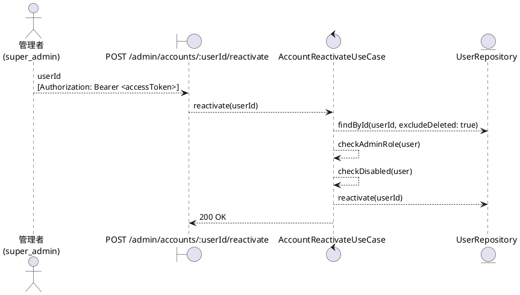
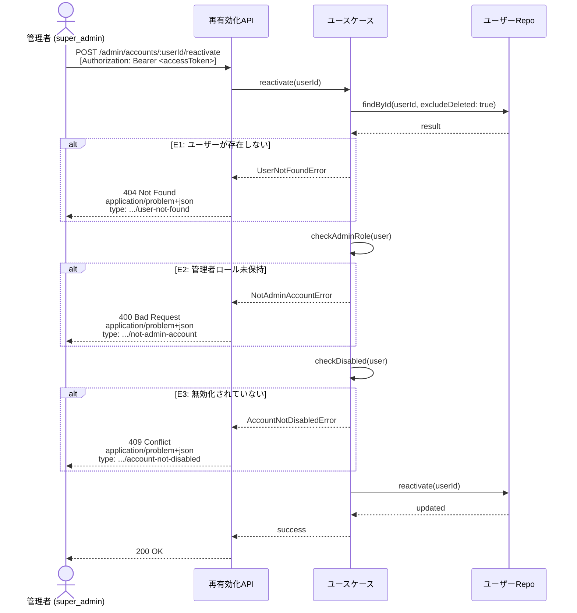

# BUC-A05 管理者アカウント再有効化

## メタデータ

| 項目 | 値 |
|---|---|
| BUC ID | BUC-A05 |
| BUC名 | 管理者アカウント再有効化 |
| アクター | ACT-02（管理者・`super_admin`のみ） |
| スコープ | Must |
| 関連FR | FR-16 |
| 関連NFR | NFR-06, NFR-07, NFR-08, NFR-09 |
| 関連情報 | INF-01（ユーザー情報） |
| 関連条件 | CND-13（対象アカウントが無効化済みであること） |
| 事後状態 | STM-01.未認証 |

---

## ユースケース記述

### 事前条件

- アクセストークンが有効であること
- 操作者が `super_admin` ロールを持つこと
- 対象アカウントが無効化済みであること

### 基本フロー

1. 管理者は対象ユーザーIDを送信する
2. システムは対象ユーザー（削除済みを除く）をDBで検索する
3. システムは対象ユーザーが管理者ロール（`super_admin`・`operator`・`system_admin`）を持つことを確認する
4. システムは対象ユーザーが無効化済みであることを確認する
5. システムは対象ユーザーのアカウントを再有効化する（`未認証` 状態に遷移）
6. システムは200レスポンスを返す

### 代替フロー

なし

### 例外フロー

> 全ログにはNFR-09の必須フィールド（`ts`・`lvl`・`svc`・`ctx`・`trace_id`/`span_id`・`req_id`・`msg`）を含めること。以下の例示は差分フィールド（`ctx`・`msg`・`lvl`）のみを記載する。

**E1. 対象ユーザーが存在しない場合（ステップ2）**

- a. システムは処理を中断する
- b. システムは404 (Not Found)、`application/problem+json`、`type: https://example.com/probs/user-not-found` を返す
- c. 監査ログ対象外。ただしビジネス例外としてWARNINGログを出力する（`{ ctx: "account_reactivate", msg: "対象ユーザーが存在しない", lvl: "WARNING" }`。NFR-08）

**E2. 対象ユーザーが管理者ロールを持たない場合（ステップ3）**

- a. システムは処理を中断する
- b. システムは400 (Bad Request)、`application/problem+json`、`type: https://example.com/probs/not-admin-account` を返す
- c. 監査ログ対象外。ただしビジネス例外としてWARNINGログを出力する（`{ ctx: "account_reactivate", msg: "管理者ロール未保持のアカウントへの再有効化試行", lvl: "WARNING" }`。NFR-08）

**E3. 対象ユーザーが無効化済みでない場合（ステップ4）**

- a. システムは処理を中断する
- b. システムは409 (Conflict)、`application/problem+json`、`type: https://example.com/probs/account-not-disabled` を返す
- c. 監査ログ対象外。ただしビジネス例外としてWARNINGログを出力する（`{ ctx: "account_reactivate", msg: "無効化されていないアカウントへの再有効化試行", lvl: "WARNING" }`。NFR-08）

---

## ロバストネス図

---

## シーケンス図

---

## 監査ログ

| イベント | レベル | ターゲット | 備考 |
|----------|--------|------------|------|
| アカウント再有効化 | INFO | 対象user_id | 基本フロー完了時。操作者の管理者IDも記録する |

---

## 備考・設計上の決定事項

| 項目 | 決定内容 | 理由 |
|---|---|---|
| 再有効化後のセッション | セッションは作成しない。再有効化後は手動ログインが必要 | FR-16準拠。自動ログインはセキュリティリスクとなるため、明示的なログインを要求する |
| 再有効化後の状態 | `未認証` 状態に遷移する | states.md（STM-01）の状態遷移図で「STM-01.無効化済み → STM-01.未認証: 管理者による再有効化」と定義されている |
| 再有効化対象 | 管理者ロールを持つアカウントのみ再有効化可能 | BUC名およびFR-16が「管理者アカウント」を対象としている。BUC-A04（無効化）と対称的な制約 |
| 無効化されていないアカウント | 409 Conflict を返す | BUC-A04 E3（既に無効化済み）と対称的な設計。状態の前提条件が満たされていない競合として扱う |
