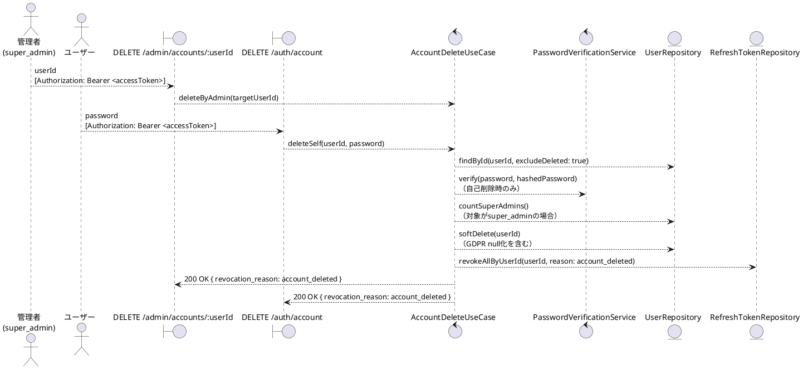
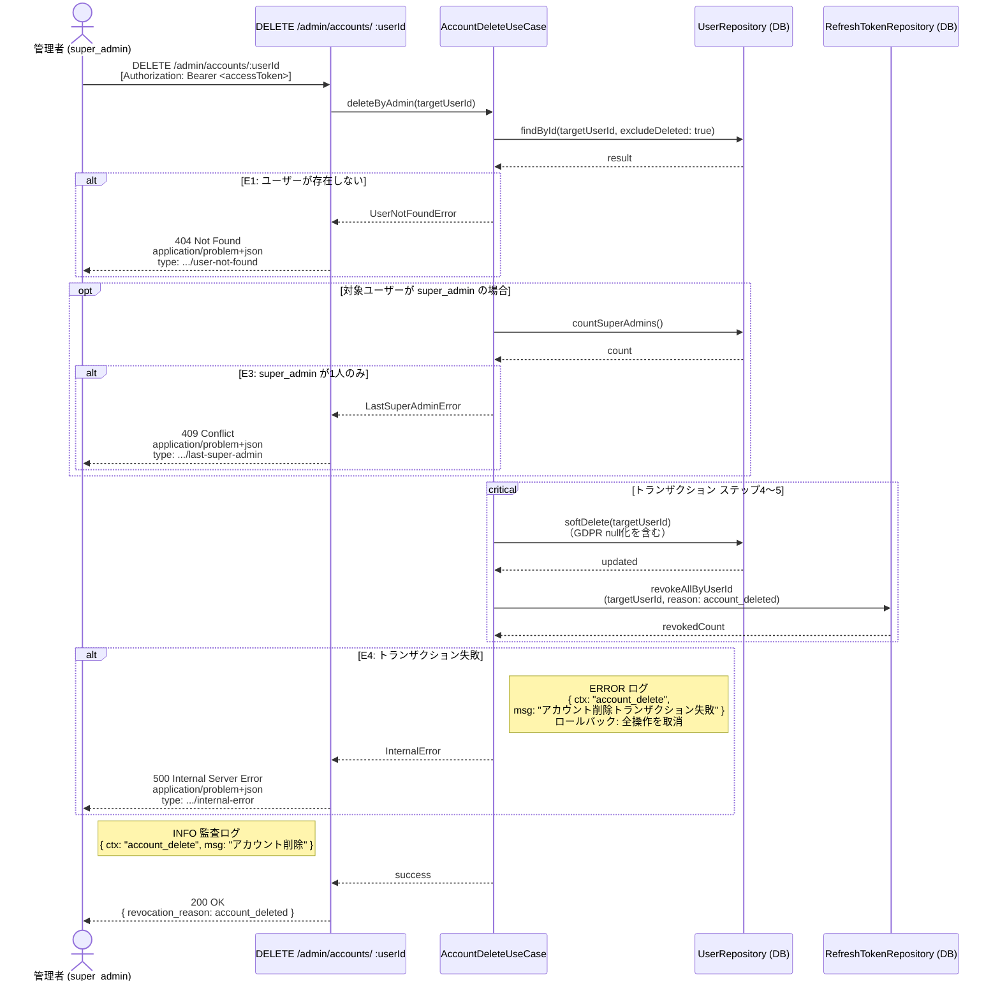
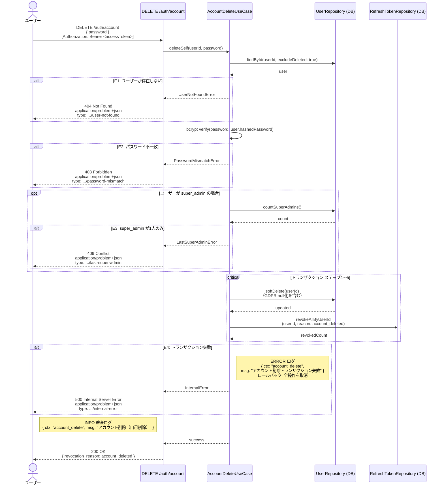

# BUC-A06 アカウント削除

## メタデータ

| 項目 | 値 |
|---|---|
| BUC ID | BUC-A06 |
| BUC名 | アカウント削除 |
| アクター | ACT-02（管理者・`super_admin`のみ）・ACT-01（ユーザー・自己削除） |
| スコープ | Must |
| 関連FR | FR-17 |
| 関連NFR | NFR-01, NFR-06, NFR-07, NFR-08, NFR-09 |
| 関連情報 | INF-01（ユーザー情報）, INF-03（アクセストークン）, INF-04（リフレッシュトークン） |
| 関連条件 | CND-14（対象が`super_admin`の場合）。自己削除時はCND-06（アクセストークンが有効であること）およびCND-15（パスワードが一致すること） |
| 事後状態 | STM-01.削除済み |

---

## ユースケース記述

### 事前条件

- アクセストークンが有効であること
- 管理者削除の場合: 操作者が `super_admin` ロールを持つこと
- 自己削除の場合: パスワードが一致すること

### 基本フロー（管理者による削除）

1. 管理者は対象ユーザーIDを送信する
2. システムは対象ユーザー（削除済みを除く）をDBで検索する
3. システムは対象ユーザーが `super_admin` の場合、`super_admin` が2人以上存在することをDBで確認する
4. システムは対象ユーザーのアカウントを論理削除する（GDPR対応カラムnull化を含む）
5. システムは対象ユーザーの全リフレッシュトークンを失効させる（失効理由: `account_deleted`）

> ステップ4〜5は単一トランザクションで実行する

6. システムは監査ログ（アカウント削除、INFO）を記録する
7. システムは200レスポンスを返す（`revocation_reason: account_deleted` を含める）

### 代替フロー

**A1. ユーザーによる自己削除**

- a. ユーザーはパスワードを送信する
- b. システムはアクセストークンからユーザーIDを取得し、ユーザー（削除済みを除く）をDBで検索する
- c. システムはパスワードをbcryptで検証する
- d. 基本フローのステップ3に進む（自身が `super_admin` の場合、`super_admin` が2人以上存在するかの確認を含む）

### 例外フロー

> 全ログにはNFR-09の必須フィールド（`ts`・`lvl`・`svc`・`ctx`・`trace_id`/`span_id`・`req_id`・`msg`）を含めること。以下の例示は差分フィールド（`ctx`・`msg`・`lvl`）のみを記載する。

**E1. 対象ユーザーが存在しない場合（ステップ2 / A1-b）**

- a. システムは処理を中断する
- b. システムは404 (Not Found)、`application/problem+json`、`type: https://example.com/probs/user-not-found` を返す
- c. 監査ログ対象外。ただしビジネス例外としてWARNINGログを出力する（`{ ctx: "account_delete", msg: "対象ユーザーが存在しない", lvl: "WARNING" }`。NFR-08）

**E2. パスワード不一致の場合（A1-c、自己削除時のみ）**

- a. システムは処理を中断する
- b. システムは403 (Forbidden)、`application/problem+json`、`type: https://example.com/probs/password-mismatch` を返す
- c. 監査ログ対象外。ただしビジネス例外としてWARNINGログを出力する（`{ ctx: "account_delete", msg: "自己削除パスワード不一致", lvl: "WARNING" }`。NFR-08）

**E3. `super_admin` が1人しか存在しない場合（ステップ3）**

- a. システムは処理を中断する
- b. システムは409 (Conflict)、`application/problem+json`、`type: https://example.com/probs/last-super-admin` を返す
- c. 監査ログ対象外。ただしビジネス例外としてWARNINGログを出力する（`{ ctx: "account_delete", msg: "最後のsuper_adminの削除試行", lvl: "WARNING" }`。NFR-08）

**E4. トランザクション失敗（ステップ4〜5）**

- a. システムはトランザクション全体をロールバックする（論理削除・GDPR null化・全セッション失効のいずれも適用しない）
- b. システムは500 (Internal Server Error)、`application/problem+json`、`type: https://example.com/probs/internal-error` を返す
- c. 外部依存失敗としてERRORログを出力する（`{ ctx: "account_delete", msg: "アカウント削除トランザクション失敗", lvl: "ERROR" }`。NFR-08）
- ロールバックスコープ: ステップ4〜5の全操作。アカウント状態・個人情報・セッションのいずれも変更前の状態に戻す

---

## ロバストネス図

---

## シーケンス図（管理者による削除）

---

## シーケンス図（ユーザーによる自己削除）

---

## 監査ログ

| イベント | レベル | ターゲット | 備考 |
|----------|--------|------------|------|
| アカウント削除 | INFO | 対象user_id | 管理者削除時: 操作者の管理者IDも記録する。自己削除時: 本人のuser_idのみ |

---

## 備考・設計上の決定事項

| 項目 | 決定内容 | 理由 |
|---|---|---|
| 論理削除 | 物理削除ではなく論理削除を行う | FR-17（論理削除＋セッション全失効）および `.docs/operations/policies/coding.md` 設計決定（削除方式）に準拠。データ復元可能性を保持する |
| GDPRカラムnull化 | 論理削除と同時に個人情報カラム（メールアドレス等）をnullにする | STM-01.削除済み（GDPR対応カラムnull化）および `.docs/operations/policies/coding.md` 設計決定（削除方式）に準拠。論理削除でレコードは保持しつつ、個人情報は消去する |
| 自己削除のパスワード確認 | 自己削除時はパスワード再入力を必須とする | FR-17・CND-15（自己削除時はパスワードが一致すること）に準拠。不可逆操作のため本人確認が必要（セッション乗っ取り対策） |
| 自己削除のレスポンスコード | 403 Forbidden（`password-mismatch`）を返す | BUC-U08（パスワード変更）E2と同一パターン。認証済みだがパスワード再確認に失敗した状態 |
| `super_admin` の保護 | 管理者削除・自己削除いずれの場合も、最後の `super_admin` は削除不可 | CND-14（`super_admin`が2人以上存在すること）に準拠。管理者削除・自己削除を問わず条件を適用する |
| 全セッション無効化 | アカウント削除と同時に全リフレッシュトークンを失効させる | FR-17準拠。削除済みアカウントの既存セッションが残ることを防ぐ |
| エンドポイント分離 | 管理者削除（`DELETE /admin/accounts/:userId`）と自己削除（`DELETE /auth/account`）を分離する | 認可要件が異なる（管理者はsuper_admin限定、自己削除はパスワード確認）ため、エンドポイントを分けることで責務を明確化する |
