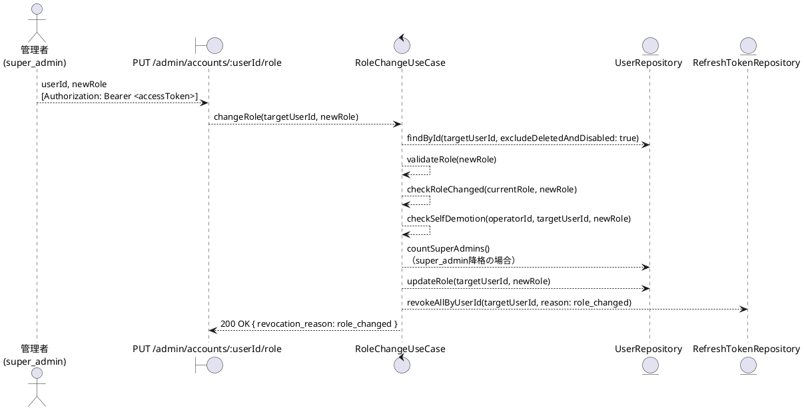
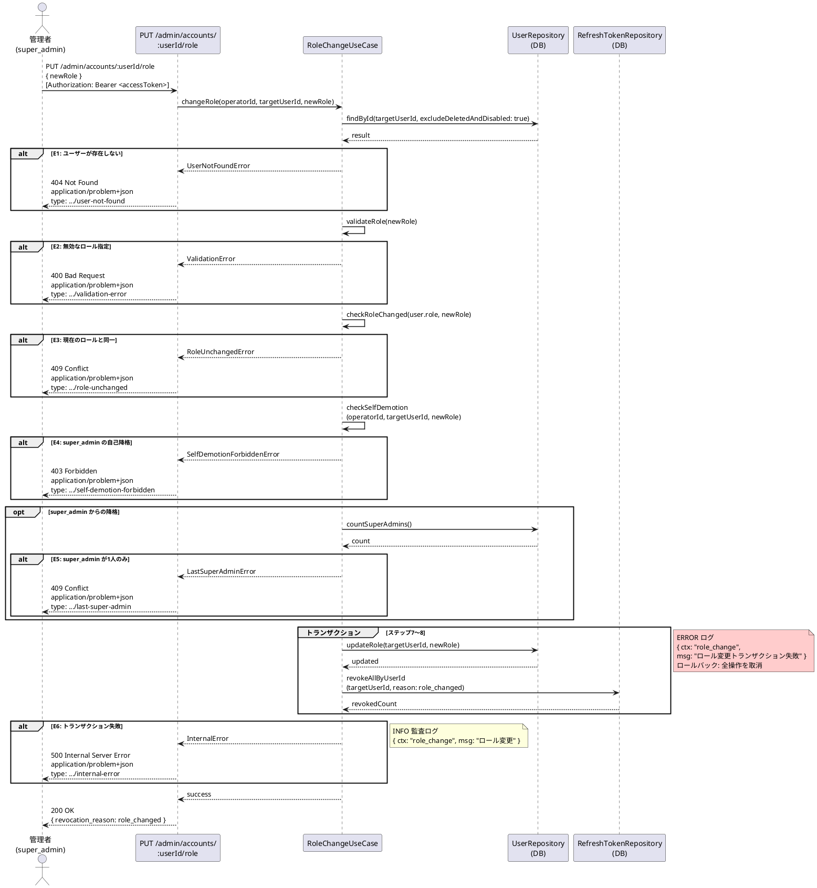

# BUC-A07 ロール変更

## メタデータ

| 項目 | 値 |
|---|---|
| BUC ID | BUC-A07 |
| BUC名 | ロール変更 |
| アクター | ACT-02（管理者・`super_admin`のみ） |
| スコープ | Must |
| 関連FR | FR-18 |
| 関連NFR | NFR-06, NFR-07, NFR-08, NFR-09 |
| 関連情報 | INF-01（ユーザー情報）, INF-02（ロール情報）, INF-04（リフレッシュトークン） |
| 関連条件 | 操作者（ログイン中の`super_admin`）は自分自身の`super_admin`ロールを降格できない。`super_admin`への昇格は人数に関わらず許可。降格はCND-14を満たす場合のみ許可（最低1人を維持するため） |
| 事後状態 | STM-02.セッション失効（対象ユーザー） |

---

## ユースケース記述

### 事前条件

- アクセストークンが有効であること
- 操作者が `super_admin` ロールを持つこと

### 基本フロー

1. 管理者は対象ユーザーIDと新しいロールを送信する
2. システムは対象ユーザー（削除済み・無効化済みを除く）をDBで検索する
3. システムは指定されたロールが有効な管理者ロール（`super_admin`・`operator`・`system_admin`）であることを検証する
4. システムは対象ユーザーの現在のロールと新しいロールが異なることを確認する
5. システムは操作者が自身のロールを降格しようとしていないことを確認する
6. システムは `super_admin` からの降格の場合、`super_admin` が2人以上存在すること（CND-14）をDBで確認する（昇格は人数に関わらず許可）
7. システムは対象ユーザーのロールを変更する
8. システムは対象ユーザーの全リフレッシュトークンを失効させる（失効理由: `role_changed`）

> ステップ7〜8は単一トランザクションで実行する

9. システムは監査ログ（ロール変更、INFO）を記録する
10. システムは200レスポンスを返す（`revocation_reason: role_changed` を含める）

### 代替フロー

なし

### 例外フロー

> 全ログにはNFR-09の必須フィールド（`ts`・`lvl`・`svc`・`ctx`・`trace_id`/`span_id`・`req_id`・`msg`）を含めること。以下の例示は差分フィールド（`ctx`・`msg`・`lvl`）のみを記載する。

**E1. 対象ユーザーが存在しない場合（ステップ2）**

- a. システムは処理を中断する
- b. システムは404 (Not Found)、`application/problem+json`、`type: https://example.com/probs/user-not-found` を返す
- c. 監査ログ対象外。ただしビジネス例外としてWARNINGログを出力する（`{ ctx: "role_change", msg: "対象ユーザーが存在しない", lvl: "WARNING" }`。NFR-08）

**E2. 無効なロール指定（ステップ3）**

- a. システムは処理を中断する
- b. システムは400 (Bad Request)、`application/problem+json`、`type: https://example.com/probs/validation-error` を返す
- c. 監査ログ対象外。ただしビジネス例外としてWARNINGログを出力する（`{ ctx: "role_change", msg: "無効なロール指定", lvl: "WARNING" }`。NFR-08）

**E3. 現在のロールと同一の場合（ステップ4）**

- a. システムは処理を中断する
- b. システムは409 (Conflict)、`application/problem+json`、`type: https://example.com/probs/role-unchanged` を返す
- c. 監査ログ対象外。ただしビジネス例外としてWARNINGログを出力する（`{ ctx: "role_change", msg: "変更先ロールが現在のロールと同一", lvl: "WARNING" }`。NFR-08）

**E4. `super_admin` が自身のロールを降格しようとした場合（ステップ5）**

- a. システムは処理を中断する
- b. システムは403 (Forbidden)、`application/problem+json`、`type: https://example.com/probs/self-demotion-forbidden` を返す
- c. 監査ログ対象外。ただしビジネス例外としてWARNINGログを出力する（`{ ctx: "role_change", msg: "super_adminの自己降格試行", lvl: "WARNING" }`。NFR-08）

**E5. `super_admin` が1人しか存在しない場合（ステップ6）**

- a. システムは処理を中断する
- b. システムは409 (Conflict)、`application/problem+json`、`type: https://example.com/probs/last-super-admin` を返す
- c. 監査ログ対象外。ただしビジネス例外としてWARNINGログを出力する（`{ ctx: "role_change", msg: "super_admin不足によるロール変更拒否", lvl: "WARNING" }`。NFR-08）

**E6. トランザクション失敗（ステップ7〜8）**

- a. システムはトランザクション全体をロールバックする（ロール変更・全セッション失効のいずれも適用しない）
- b. システムは500 (Internal Server Error)、`application/problem+json`、`type: https://example.com/probs/internal-error` を返す
- c. 外部依存失敗としてERRORログを出力する（`{ ctx: "role_change", msg: "ロール変更トランザクション失敗", lvl: "ERROR" }`。NFR-08）
- ロールバックスコープ: ステップ7〜8の全操作。ロール・セッションのいずれも変更前の状態に戻す

---

## ロバストネス図

---

## シーケンス図

---

## 監査ログ

| イベント | レベル | ターゲット | 備考 |
|----------|--------|------------|------|
| ロール変更 | INFO | 対象user_id | 基本フロー完了時。操作者の管理者ID、変更前ロール、変更後ロールも記録する |

---

## 備考・設計上の決定事項

| 項目 | 決定内容 | 理由 |
|---|---|---|
| 自己降格の禁止 | `super_admin` は自身のロールを降格できない | buc.md BUC-A07の関連条件に準拠。自己降格により管理不能状態に陥ることを防止する |
| `super_admin` 関連変更の制約 | `super_admin` への昇格は人数に関わらず許可。`super_admin` からの降格は CND-14（`super_admin`が2人以上存在すること）を満たす場合のみ許可 | buc.md BUC-A07の関連条件・CND-14に準拠 |
| 全セッション無効化 | ロール変更時に対象ユーザーの全リフレッシュトークンを失効させる | FR-18準拠。JWTのClaimsに含まれるロール情報が変更前の値となるため、新しいロールでの再ログインを要求する |
| 失効理由 | `role_changed` を使用する | VAR-10（セッション失効理由コード）に準拠 |
| 同一ロール変更の拒否 | 現在のロールと同一のロールが指定された場合は409を返す | 無意味なセッション無効化を防ぐ。管理者への正確なフィードバックを優先する |
| 対象の状態制限 | 削除済み・無効化済みのアカウントはロール変更対象外 | 無効化済みアカウントのロール変更は再有効化（BUC-A05）後に行うべき。削除済みはBUC-U04等で除外される通常の方針と同一 |
| `user` ロールへの変更 | `user` ロールは管理者ロールではないため指定不可（E2で拒否） | ロール変更は管理者間のロール変更のみを対象とする。管理者から一般ユーザーへの降格は、現時点では管理者ロールの剥奪として定義されていない |
