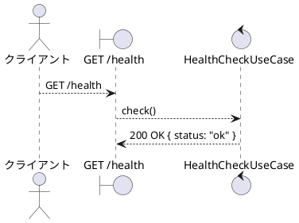
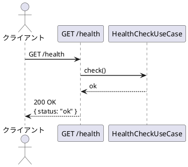

# BUC-S01 ヘルスチェック

## メタデータ

| 項目 | 値 |
|---|---|
| BUC ID | BUC-S01 |
| BUC名 | ヘルスチェック |
| アクター | — |
| スコープ | Must |
| 関連FR | FR-20 |
| 関連NFR | NFR-04 |
| 関連情報 | — |
| 関連条件 | — |
| 事後状態 | — |

---

## ユースケース記述

### 事前条件

- なし（認証不要）

### 基本フロー

1. クライアントはヘルスチェックエンドポイントにGETリクエストを送信する
2. システムは200レスポンスを返す

### 代替フロー

なし

### 例外フロー

なし

---

## ロバストネス図

---

## シーケンス図

---

## 監査ログ

本BUCでは監査ログの対象操作なし。

---

## 備考・設計上の決定事項

| 項目 | 決定内容 | 理由 |
|---|---|---|
| 認証不要 | ヘルスチェックはJWT認証なしでアクセス可能 | 死活監視ツール（ロードバランサー、Kubernetes等）が認証なしでアクセスする必要があるため |
| レスポンス形式 | `{ status: "ok" }` のJSON形式で返す | 機械可読な形式で死活状態を返す。NFR-04準拠 |
| 依存サービスのチェック | 本フェーズではアプリケーション自体の死活のみ確認する。DB・Redisの接続状態チェックはスコープ外 | ローカル開発フェーズではシンプルな死活確認で十分。依存サービスのヘルスチェック（deep health check）は運用フェーズで検討する |
