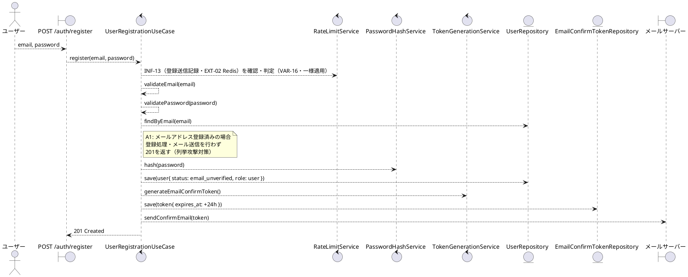
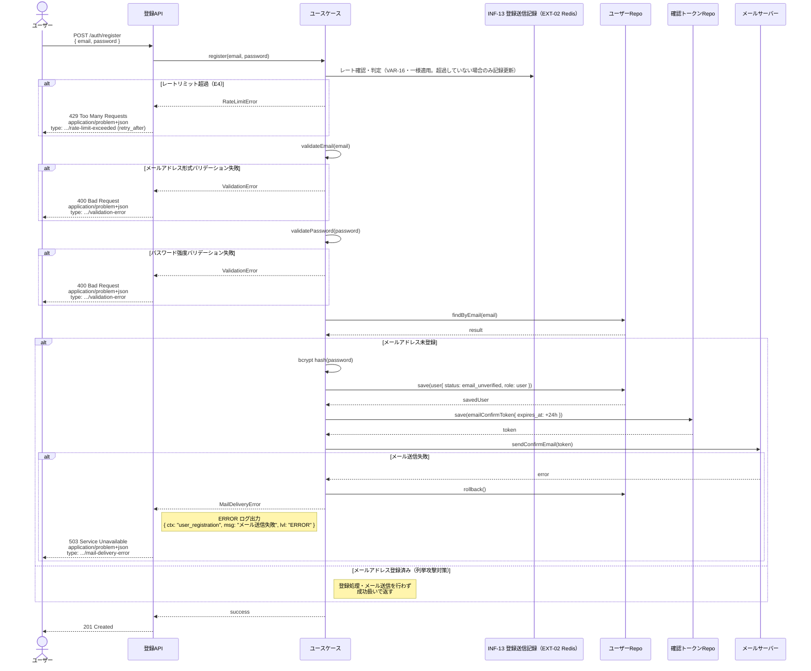

# BUC-U01 ユーザー登録

## メタデータ

| 項目 | 値 |
|---|---|
| BUC ID | BUC-U01 |
| BUC名 | ユーザー登録 |
| アクター | ACT-01（ユーザー） |
| スコープ | Must |
| 関連FR | FR-01, FR-02 |
| 関連情報 | INF-01（ユーザー情報）, INF-06（メール確認トークン）, INF-13（登録送信記録） |
| 関連条件 | CND-01（メールアドレスが未登録であること） |
| 事後状態 | STM-01.メール未確認 |

---

## ユースケース記述

### 事前条件

- メールアドレスが未登録であること

### 基本フロー

1. ユーザーはメールアドレスとパスワードを送信する
2. システムは登録送信記録（INF-13）を確認し、登録レートリミット（VAR-16: 同一メールアドレスにつき5分に1回）を超過していないことを判定する。**超過していない場合のみ記録を更新する**（固定ウィンドウ・超過時はTTLを延長しない）。判定・記録は**登録済み/未登録に関わらず一様に適用**する
3. システムはメールアドレスの形式（RFC5322準拠、最大254文字）を検証する
4. システムはパスワード強度（最小15文字、最大64文字、全ASCII文字・Unicode許容、文字種の混在強制なし）を検証する
5. システムはメールアドレスの重複を確認する
6. システムはパスワードをbcryptでハッシュ化する
7. システムはユーザーを `メール未確認` 状態で登録し、`user` ロールを付与する
8. システムはメール確認トークン（有効期限24時間、使い切り）を生成しDBに保存する
9. システムはメール確認トークンをメールサーバー経由で送信する
10. システムは201レスポンスを返す

### 代替フロー

**A1. メールアドレスが登録済みの場合（ステップ5）**

- a. システムはユーザー列挙攻撃対策のため登録処理を行わず、メール送信も行わない
- b. システムは201レスポンスを返す（未登録の場合と区別しない）

### 例外フロー

> 全ログにはNFR-09の必須フィールド（`ts`・`lvl`・`svc`・`ctx`・`trace_id`/`span_id`・`req_id`・`msg`）を含めること。以下の例示は差分フィールド（`ctx`・`msg`・`lvl`）のみを記載する。

**E1. メールアドレス形式バリデーションエラー（ステップ3）**

- a. システムは処理を中断する
- b. システムは400 (Bad Request)、`application/problem+json`、`type: https://example.com/probs/validation-error` を返す
- c. 監査ログ対象外。ただしビジネス例外としてWARNINGログを出力する（`{ ctx: "user_registration", msg: "メールアドレス形式不正", lvl: "WARNING" }`。NFR-08）

**E2. パスワード強度バリデーションエラー（ステップ4）**

- a. システムは処理を中断する
- b. システムは400 (Bad Request)、`application/problem+json`、`type: https://example.com/probs/validation-error` を返す
- c. 監査ログ対象外。ただしビジネス例外としてWARNINGログを出力する（`{ ctx: "user_registration", msg: "パスワード強度不足", lvl: "WARNING" }`。NFR-08）

**E3. メール送信失敗（ステップ9）**

- a. システムはユーザー登録およびトークン保存をロールバックする
- b. システムは503 (Service Unavailable)、`application/problem+json`、`type: https://example.com/probs/mail-delivery-error` を返す
- c. ERRORレベルでログを出力する（`{ ctx: "user_registration", msg: "メール送信失敗", lvl: "ERROR" }`。`user_id` は登録前のため含めない。メールアドレスはログに含めない）

**E4. 登録レートリミット超過（ステップ2・VAR-16）**

- a. システムは処理を中断する
- b. システムは429 (Too Many Requests)、`application/problem+json`、`type: https://example.com/probs/rate-limit-exceeded`、`retry_after` フィールドを含めて返す
- c. **登録済み/未登録に関わらず同一挙動とする**（A1の列挙攻撃対策を429の挙動差で迂回させない）
- d. 監査ログ対象外。ビジネス例外としてWARNINGログを出力する（`{ ctx: "user_registration", msg: "登録レートリミット超過", lvl: "WARNING" }`。NFR-08）

---

## ロバストネス図

---

## シーケンス図

---

## 監査ログ

本BUCでは監査ログの対象操作なし。

> 監査ログはBUC-U04（ログイン成功・ログイン失敗）から開始される。ユーザー登録・メール確認は対象外。

---

## 備考・設計上の決定事項

| 項目 | 決定内容 | 理由 |
|---|---|---|
| メールアドレス重複時のレスポンス | 登録済みの場合も201を返す（メール送信しない） | ユーザー列挙攻撃（User Enumeration Attack）対策。登録済み・未登録を区別するレスポンスは攻撃者によるアカウント存在確認に悪用される。 |
| パスワード文字種の混在強制なし | 長さのみを要件とする（15〜64文字） | NIST SP 800-63B Rev.4準拠。複雑性要件の排除によりユーザビリティと安全性を両立 |
| メール送信失敗時のロールバック | ユーザー登録・トークン保存をロールバック | 確認メールを受信できない `メール未確認` 状態のユーザーが永続することを防ぐ |
| `user` ロールのレスポンス非包含 | レスポンスにロール情報を含めない | UX上ロールを意識させない設計方針（VAR-08: 一般ユーザーロール） |