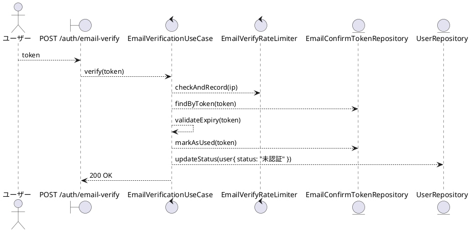
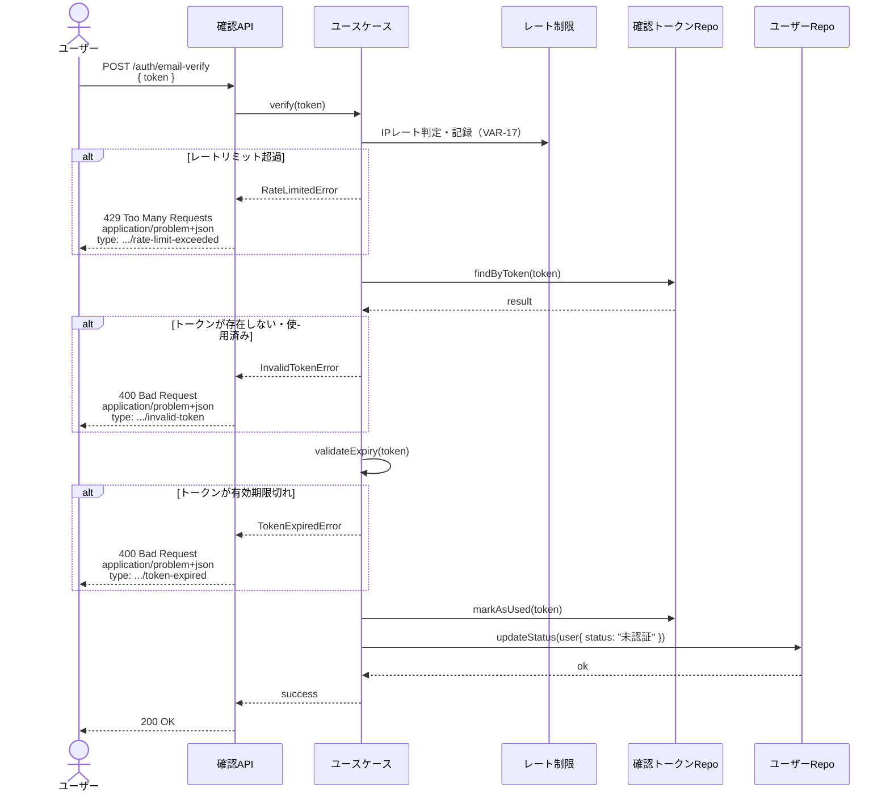

# BUC-U02 メールアドレス確認

## メタデータ

| 項目 | 値 |
|---|---|
| BUC ID | BUC-U02 |
| BUC名 | メールアドレス確認 |
| アクター | ACT-01（ユーザー） |
| スコープ | Must |
| 関連FR | FR-03 |
| 関連情報 | INF-01（ユーザー情報）, INF-06（メール確認トークン）, INF-14（メール確認試行記録） |
| 関連条件 | CND-09（メール確認トークンが有効期限内であること） |
| 事後状態 | STM-01.未認証 |

---

## ユースケース記述

### 事前条件

- メール確認トークンが有効期限内であること

### 基本フロー

1. ユーザーはメール確認トークンを送信する
2. システムは送信元IP単位のレートリミットを検証・記録する（VAR-17）
3. システムはトークンをDBで検索する
4. システムはトークンの有効期限を検証する
5. システムはトークンを使用済みに更新する（使い切り）
6. システムはユーザーのステータスを `未認証` に更新する
7. システムは200レスポンスを返す

### 代替フロー

なし

### 例外フロー

> 全ログにはNFR-09の必須フィールド（`ts`・`lvl`・`svc`・`ctx`・`trace_id`/`span_id`・`req_id`・`msg`）を含めること。以下の例示は差分フィールド（`ctx`・`msg`・`lvl`）のみを記載する。

**E1. トークンが存在しない、または使用済みの場合（ステップ3）**

- a. システムは処理を中断する
- b. システムは400 (Bad Request)、`application/problem+json`、`type: https://example.com/probs/invalid-token` を返す
- c. 監査ログ対象外。ただしビジネス例外としてWARNINGログを出力する（`{ ctx: "email_verification", msg: "無効なメール確認トークン", lvl: "WARNING" }`。NFR-08）

**E2. トークンが有効期限切れの場合（ステップ4）**

- a. システムは処理を中断する
- b. システムは400 (Bad Request)、`application/problem+json`、`type: https://example.com/probs/token-expired` を返す
- c. 監査ログ対象外。ただしビジネス例外としてWARNINGログを出力する（`{ ctx: "email_verification", msg: "メール確認トークン期限切れ", lvl: "WARNING" }`。NFR-08）

**E4. レートリミット超過の場合（ステップ2・VAR-17）**

- a. システムは処理を中断する
- b. システムは429 (Too Many Requests)、`application/problem+json`、`type: https://example.com/probs/rate-limit-exceeded`、`retry_after`（秒・TTL残）および `Retry-After` ヘッダを返す
- c. 監査ログ対象外。ただしビジネス例外としてWARNINGログを出力する（`{ ctx: "email_verification", msg: "メール確認レートリミット超過", lvl: "WARNING" }`。NFR-08）

---

## ロバストネス図

---

## シーケンス図

---

## 監査ログ

本BUCでは監査ログの対象操作なし。

---

## 備考・設計上の決定事項

| 項目 | 決定内容 | 理由 |
|---|---|---|
| トークン不存在・使用済みの統一エラー | 両ケースとも `invalid-token` で返す | トークンの状態詳細を返すことで攻撃者がトークン有効性を探索できるリスクを排除する |
| トークン有効期限 | 24時間 | VAR-06（メール確認トークン有効期限: 24時間）に定義 |
| トークンの使い切り | 検証成功後に即使用済みフラグを立てる | 同一トークンの再利用によるアカウント状態の不正操作を防ぐ |
| IP単位レートリミット | VAR-17（1分に10回・超過時は記録を更新しない・`retry_after`=TTL残秒） | 256bit乱数トークンの総当たりは非現実的だが、abuse・スキャン抑止の多層防御としてIP単位で制限する。キーのIPはHMAC-SHA256＋サーバ秘密鍵でハッシュ化（INF-14・個人データ配慮） |
| 例外フロー番号 | レートリミット超過は E4（E3は欠番） | UC-002/UC-003と例外番号のスロットを揃える（E4=レートリミット超過）。grepでの横断突合を優先 |