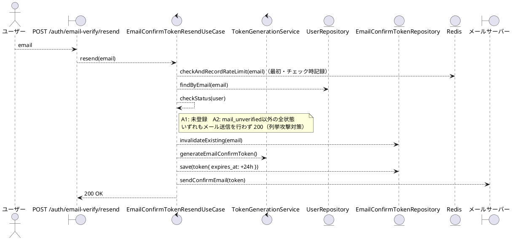
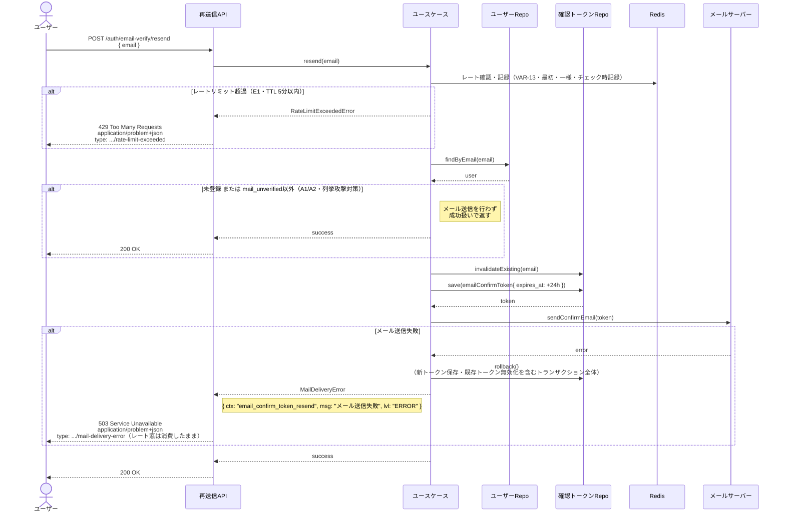

# BUC-U03 メール確認トークン再送信

## メタデータ

| 項目 | 値 |
|---|---|
| BUC ID | BUC-U03 |
| BUC名 | メール確認トークン再送信 |
| アクター | ACT-01（ユーザー） |
| スコープ | Must |
| 関連FR | FR-04 |
| 関連情報 | INF-01（ユーザー情報）, INF-06（メール確認トークン）, INF-11（メール確認トークン再送信記録） |
| 関連条件 | CND-10（再送信時は既存の有効なメール確認トークンを無効化してから新トークンを発行すること）。メール確認が未完了であること。レートリミット（VAR-13: 5分に1回）を超えていないこと |
| 事後状態 | STM-01.メール未確認 |

---

## ユースケース記述

### 事前条件

- メール確認が未完了であること
- レートリミット（5分に1回）を超えていないこと

### 基本フロー

1. ユーザーはメールアドレスを送信する
2. システムは同一メールのレートリミット（VAR-13）を**最初に**確認・記録する（一様適用＝以降の分岐に依らず記録が確定する。チェック時記録）
3. システムはメールアドレスの登録状態・確認状態を確認する
4. システムは既存の有効なメール確認トークンを無効化する（`used_at` を打つ・CND-10）
5. システムは新しいメール確認トークン（有効期限24時間、使い切り）を生成しDBに保存する
6. システムはメール確認トークンをメールサーバー経由で送信する
7. システムは200レスポンスを返す

> ステップ4〜6は単一トランザクション（送信失敗＝E2で全ロールバック）。ただしステップ2のレート記録はTx外で確定し、E2でもロールバックしない（＝窓を消費する）。

### 代替フロー

**A1. メールアドレスが未登録の場合（ステップ3・論理削除済みも未登録相当）**

- a. システムはメール送信を行わない
- b. システムは200レスポンスを返す（登録済みの場合と区別しない）

**A2. `mail_unverified` 以外のすべての状態の場合（ステップ3・確認済み/招待済み未受付/無効化済み/削除済みを包含）**

- a. システムはメール送信を行わない
- b. システムは200レスポンスを返す（未確認の場合と区別しない）

### 例外フロー

> 全ログにはNFR-09の必須フィールド（`ts`・`lvl`・`svc`・`ctx`・`trace_id`/`span_id`・`req_id`・`msg`）を含めること。以下の例示は差分フィールド（`ctx`・`msg`・`lvl`）のみを記載する。

**E1. レートリミット超過の場合（ステップ2）**

- a. システムは処理を中断する
- b. システムは429 (Too Many Requests)、`application/problem+json`、`type: https://example.com/probs/rate-limit-exceeded` を返す
- c. 監査ログ対象外。ただしビジネス例外としてWARNINGログを出力する（`{ ctx: "email_confirm_token_resend", msg: "メール確認トークン再送信レートリミット超過", lvl: "WARNING" }`。NFR-08）

**E2. メール送信失敗（ステップ6）**

- a. システムは新トークン保存および既存トークン無効化を含むトランザクション（ステップ4〜6）全体をロールバックする。**ただしステップ2のレート窓は消費したまま**（SMTP一時障害時は5分後に再試行可能・可用性より試行計数の一貫性を優先）
- b. システムは503 (Service Unavailable)、`application/problem+json`、`type: https://example.com/probs/mail-delivery-error` を返す
- c. ERRORレベルでログを出力する（`{ ctx: "email_confirm_token_resend", msg: "メール送信失敗", lvl: "ERROR" }`。メールアドレスはログに含めない）

---

## ロバストネス図

---

## シーケンス図

---

## 監査ログ

本BUCでは監査ログの対象操作なし。

---

## 備考・設計上の決定事項

| 項目 | 決定内容 | 理由 |
|---|---|---|
| 未登録・確認済みメールアドレスの場合のレスポンス | いずれも200を返す（メール送信しない） | ユーザー列挙攻撃対策。FR-04に明記 |
| 既存トークンの無効化 | 再送信前に既存の有効トークンを無効化する | 複数の有効トークンが並存することによる不整合を防ぐ |
| メール送信失敗時のロールバック | トークン生成・保存をロールバックする | 送信されないトークンがDBに残ることによる不整合を防ぐ |
| レートリミット管理 | RedisのTTL付きキーで管理（5分に1回）。パスワードリセットと同値だが独立した設定値 | NFR-12・VAR-13（メール確認トークン再送信レートリミット） |
| レート評価順・一様適用 | レートを**最初**に評価・記録し、登録状態に依らず一様。429/200の挙動差で「登録済み・未確認」を判別させない | FR-04の列挙攻撃対策をレートで迂回させないため |
| E2時のレート窓 | 送信失敗でもステップ2のレート窓は消費（ロールバックしない） | INF-11「リクエスト記録」の意味論（試行を数える）。可用性より計数一貫性を優先 |
| 応答タイミング差 | 沈黙200（トークン発行・送信をスキップ）と正常200の応答時間差は**POCでは非対応** | timing側チャネルはPOCスコープ外（無言の穴にしない明示） |