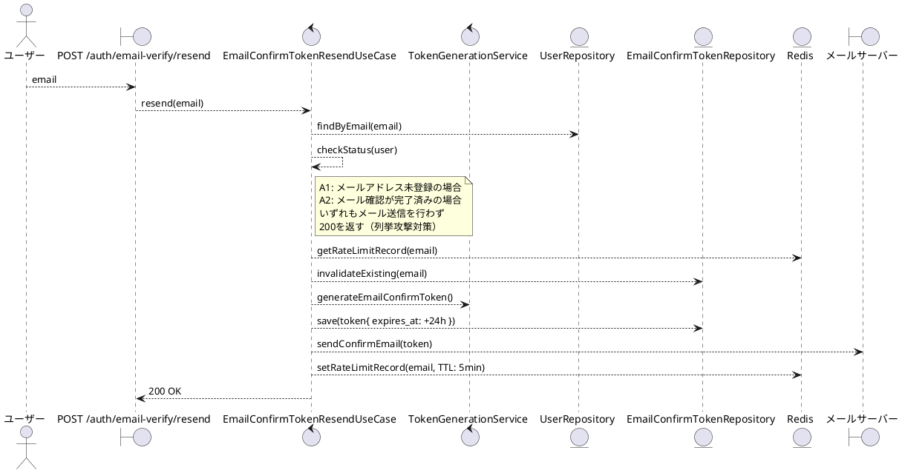
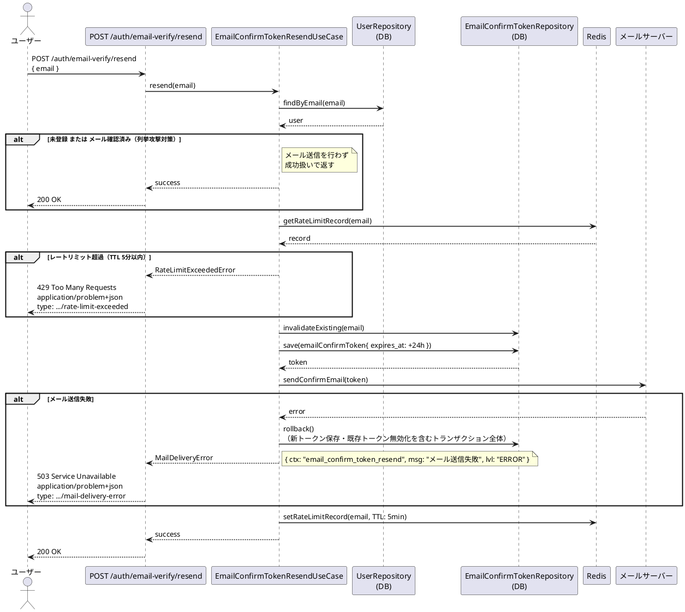

# BUC-U03 メール確認トークン再送信

## メタデータ

| 項目 | 値 |
|---|---|
| BUC ID | BUC-U03 |
| BUC名 | メール確認トークン再送信 |
| アクター | ACT-01（ユーザー） |
| スコープ | Must |
| 関連FR | FR-04 |
| 関連情報 | INF-01（ユーザー情報）, INF-06（メール確認トークン）, INF-11（メール確認トークン再送信記録） |
| 関連条件 | CND-10（再送信時は既存の有効なメール確認トークンを無効化してから新トークンを発行すること）。メール確認が未完了であること。レートリミット（VAR-13: 5分に1回）を超えていないこと |
| 事後状態 | STM-01.メール未確認 |

---

## ユースケース記述

### 事前条件

- メール確認が未完了であること
- レートリミット（5分に1回）を超えていないこと

### 基本フロー

1. ユーザーはメールアドレスを送信する
2. システムはメールアドレスの登録状態・確認状態を確認する
3. システムはRedisで同一メールアドレスへの最終送信時刻を確認する（TTL 5分）
4. システムは既存のメール確認トークンを無効化する
5. システムは新しいメール確認トークン（有効期限24時間、使い切り）を生成しDBに保存する
6. システムはメール確認トークンをメールサーバー経由で送信する
7. システムはRedisに送信時刻を記録する（TTL 5分）
8. システムは200レスポンスを返す

### 代替フロー

**A1. メールアドレスが未登録の場合（ステップ2）**

- a. システムはメール送信を行わない
- b. システムは200レスポンスを返す（登録済みの場合と区別しない）

**A2. メール確認が完了済みの場合（ステップ2）**

- a. システムはメール送信を行わない
- b. システムは200レスポンスを返す（未確認の場合と区別しない）

### 例外フロー

> 全ログにはNFR-09の必須フィールド（`ts`・`lvl`・`svc`・`ctx`・`trace_id`/`span_id`・`req_id`・`msg`）を含めること。以下の例示は差分フィールド（`ctx`・`msg`・`lvl`）のみを記載する。

**E1. レートリミット超過の場合（ステップ3）**

- a. システムは処理を中断する
- b. システムは429 (Too Many Requests)、`application/problem+json`、`type: https://example.com/probs/rate-limit-exceeded` を返す
- c. 監査ログ対象外。ただしビジネス例外としてWARNINGログを出力する（`{ ctx: "email_confirm_token_resend", msg: "メール確認トークン再送信レートリミット超過", lvl: "WARNING" }`。NFR-08）

**E2. メール送信失敗（ステップ6）**

- a. システムは新トークン保存および既存トークン無効化を含むトランザクション全体をロールバックする
- b. システムは503 (Service Unavailable)、`application/problem+json`、`type: https://example.com/probs/mail-delivery-error` を返す
- c. ERRORレベルでログを出力する（`{ ctx: "email_confirm_token_resend", msg: "メール送信失敗", lvl: "ERROR" }`。メールアドレスはログに含めない）

---

## ロバストネス図

---

## シーケンス図

---

## 監査ログ

本BUCでは監査ログの対象操作なし。

---

## 備考・設計上の決定事項

| 項目 | 決定内容 | 理由 |
|---|---|---|
| 未登録・確認済みメールアドレスの場合のレスポンス | いずれも200を返す（メール送信しない） | ユーザー列挙攻撃対策。FR-04に明記 |
| 既存トークンの無効化 | 再送信前に既存の有効トークンを無効化する | 複数の有効トークンが並存することによる不整合を防ぐ |
| メール送信失敗時のロールバック | トークン生成・保存をロールバックする | 送信されないトークンがDBに残ることによる不整合を防ぐ |
| レートリミット管理 | RedisのTTL付きキーで管理（5分に1回）。パスワードリセットと同値だが独立した設定値 | NFR-12・VAR-13（メール確認トークン再送信レートリミット） |