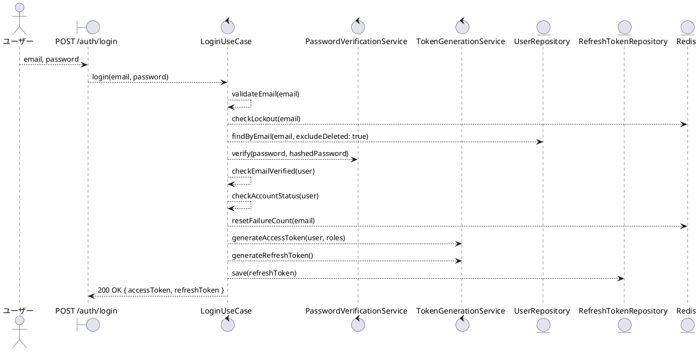
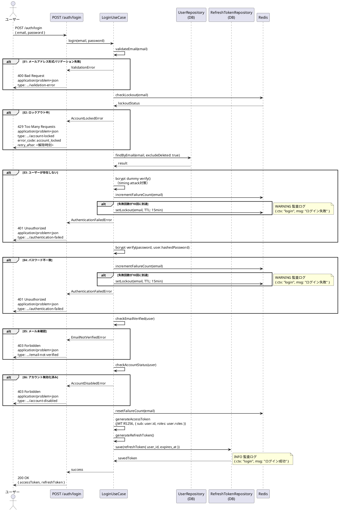

# BUC-U04 ログイン

## メタデータ

| 項目 | 値 |
|---|---|
| BUC ID | BUC-U04 |
| BUC名 | ログイン |
| アクター | ACT-01（ユーザー）・ACT-02（管理者） |
| スコープ | Must |
| 関連FR | FR-05 |
| 関連NFR | NFR-01, NFR-02, NFR-03, NFR-06, NFR-07, NFR-08, NFR-09, NFR-10 |
| 関連情報 | INF-01（ユーザー情報）, INF-02（ロール情報）, INF-08（ログイン失敗カウント）, INF-09（ロックアウト状態）, INF-03（アクセストークン）, INF-04（リフレッシュトークン） |
| 関連条件 | CND-02（登録済みメールアドレスに紐付く認証方式が存在しパスワードが一致すること）, CND-03（メール確認済みであること）, CND-04（無効化済み・削除済みでないこと）, CND-05（ロックアウト中でないこと） |
| 事後状態 | STM-02.認証済み |

---

## ユースケース記述

### 事前条件

- 登録済みメールアドレスに紐付くメール/パスワード認証方式が存在し、パスワードが一致すること
- メール確認済みであること
- アカウントが無効化済み・削除済みでないこと
- ロックアウト中でないこと

### 基本フロー

1. ユーザーはメールアドレスとパスワードを送信する
2. システムはメールアドレスの形式（RFC5322準拠、最大254文字）を検証する
3. システムはRedisでロックアウト状態を確認する
4. システムはメールアドレスに紐付くユーザー（削除済みを除く）をDBで検索する
5. システムはパスワードをbcryptで検証する
6. システムはメール確認済みであることを確認する
7. システムはアカウントが無効化済みでないことを確認する
8. システムはRedisのログイン失敗カウントをリセットする
9. システムはアクセストークン（JWT RS256、発行時点のロールをClaimsに含む）を生成する
10. システムはリフレッシュトークンを生成しDBに保存する
11. システムは監査ログ（ログイン成功、INFO）を記録する
12. システムは200レスポンスでアクセストークンとリフレッシュトークンを返す

### 代替フロー

なし

### 例外フロー

> 全ログにはNFR-09の必須フィールド（`ts`・`lvl`・`svc`・`ctx`・`trace_id`/`span_id`・`req_id`・`msg`）を含めること。以下の例示は差分フィールド（`ctx`・`msg`・`lvl`）のみを記載する。

**E1. メールアドレス形式バリデーションエラー（ステップ2）**

- a. システムは処理を中断する
- b. システムは400 (Bad Request)、`application/problem+json`、`type: https://example.com/probs/validation-error` を返す
- c. 監査ログ対象外。ただしビジネス例外としてWARNINGログを出力する（`{ ctx: "login", msg: "メールアドレス形式不正", lvl: "WARNING" }`。NFR-08）

**E2. ロックアウト中の場合（ステップ3）**

- a. システムは処理を中断する
- b. システムは429 (Too Many Requests)、`application/problem+json`、`type: https://example.com/probs/account-locked`、`error_code: account_locked`、`retry_after: <解除時刻>` を返す
- c. 監査ログ対象外。ただしビジネス例外としてWARNINGログを出力する（`{ ctx: "login", msg: "ロックアウト中のログイン試行", lvl: "WARNING" }`。NFR-08）

**E3. ユーザーが存在しない場合（ステップ4）**

- a. システムはtiming attack対策のためbcryptダミー検証を実行する
- b. システムはRedisのログイン失敗カウントをインクリメントする
- c. 失敗回数が10回に達した場合、システムはRedisにロックアウト状態を設定する（TTL 15分）
- d. システムは監査ログ（ログイン失敗、WARNING）を記録する（`{ ctx: "login", msg: "ログイン失敗", lvl: "WARNING" }`。`user_id` は含めない。メールアドレスはログに含めない）
- e. システムは401 (Unauthorized)、`application/problem+json`、`type: https://example.com/probs/authentication-failed` を返す

**E4. パスワード不一致の場合（ステップ5）**

- a. システムはRedisのログイン失敗カウントをインクリメントする
- b. 失敗回数が10回に達した場合、システムはRedisにロックアウト状態を設定する（TTL 15分）
- c. システムは監査ログ（ログイン失敗、WARNING）を記録する（`{ ctx: "login", msg: "ログイン失敗", lvl: "WARNING" }`。`user_id` を含める。メールアドレスはログに含めない）
- d. システムは401 (Unauthorized)、`application/problem+json`、`type: https://example.com/probs/authentication-failed` を返す

**E5. メール未確認の場合（ステップ6）**

- a. システムは処理を中断する
- b. システムは403 (Forbidden)、`application/problem+json`、`type: https://example.com/probs/email-not-verified` を返す
- c. 監査ログ対象外。ただしビジネス例外としてWARNINGログを出力する（`{ ctx: "login", msg: "メール未確認アカウントへのログイン試行", lvl: "WARNING" }`。NFR-08）

**E6. アカウント無効化済みの場合（ステップ7）**

- a. システムは処理を中断する
- b. システムは403 (Forbidden)、`application/problem+json`、`type: https://example.com/probs/account-disabled` を返す
- c. 監査ログ対象外。ただしビジネス例外としてWARNINGログを出力する（`{ ctx: "login", msg: "無効化済みアカウントへのログイン試行", lvl: "WARNING" }`。NFR-08）

---

## ロバストネス図

---

## シーケンス図

---

## 監査ログ

| イベント | レベル | ターゲット | 備考 |
|----------|--------|------------|------|
| ログイン成功 | INFO | user_id | 基本フロー完了時 |
| ログイン失敗 | WARNING | user_id（存在する場合） | E3（ユーザー不存在）・E4（パスワード不一致）。メールアドレスはログに含めない |

---

## 備考・設計上の決定事項

| 項目 | 決定内容 | 理由 |
|---|---|---|
| ユーザー不存在時のbcryptダミー検証 | ユーザーが見つからない場合もbcryptのダミー検証を実行する | timing attackによるユーザー列挙を防ぐ。bcryptの処理時間差でアカウント存在有無が推測されることを防止する |
| ユーザー不存在時のログイン失敗カウント加算 | 存在しないメールアドレスに対してもRedisの失敗カウントをインクリメントする | ロックアウト動作の差異によるユーザー列挙を防ぐ。未登録メールアドレスへの10回試行でもロックアウトが発動することで、存在有無を区別不能にする |
| 削除済みアカウントの扱い | DB検索時に削除済みアカウントを除外し、ユーザー不存在と同一扱いとする | 論理削除済みアカウントの存在を外部から確認できないようにするプライバシー保護 |
| 無効化済みアカウントへのレスポンス | パスワード検証成功後に403 (account-disabled) を返す | パスワード検証によって本人確認が完了しているため、アカウント状態を通知してUXを確保する。管理者への問い合わせを促すことが可能になる |
| メール未確認アカウントへのレスポンス | パスワード検証成功後に403 (email-not-verified) を返す | 本人確認済みのためアカウント状態を通知する。メール確認トークン再送信（BUC-U03）へのガイダンスが可能になる |
| 検証順序 | ロックアウト → ユーザー検索 → パスワード検証 → メール確認状態 → アカウント状態 の順で検証する | ロックアウトを最初にチェックしブルートフォースを防止する。パスワード検証をアカウント状態チェックの前に行い、認証なしでのアカウント状態漏洩を防ぐ |
| E3・E4のレスポンス統一 | ユーザー不存在・パスワード不一致ともに同一の401 (authentication-failed) を返す | 攻撃者がレスポンスの差異からアカウント存在有無を判別できないようにする |
