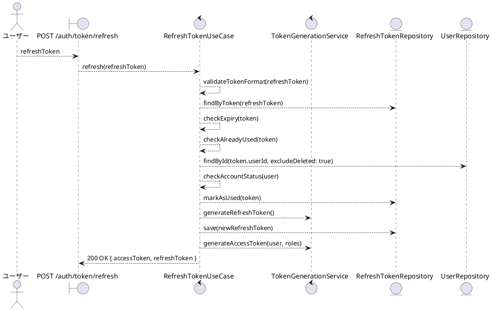
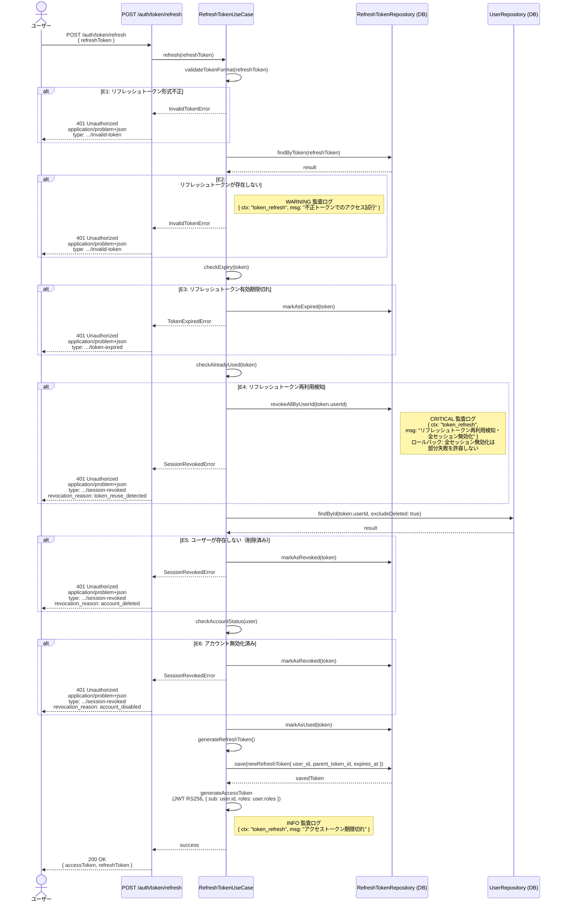

# BUC-U05 トークン再発行

## メタデータ

| 項目 | 値 |
|---|---|
| BUC ID | BUC-U05 |
| BUC名 | トークン再発行 |
| アクター | ACT-01（ユーザー）・ACT-02（管理者） |
| スコープ | Must |
| 関連FR | FR-06 |
| 関連NFR | NFR-02, NFR-06, NFR-07, NFR-08, NFR-09, NFR-10 |
| 関連情報 | INF-04（リフレッシュトークン）, INF-03（アクセストークン）, INF-02（ロール情報） |
| 関連条件 | CND-07（リフレッシュトークンが有効であること） |
| 事後状態 | STM-02.認証済み |

---

## ユースケース記述

### 事前条件

- リフレッシュトークンが有効であること

### 基本フロー

1. ユーザーはリフレッシュトークンを送信する
2. システムはリフレッシュトークンの形式を検証する
3. システムはDBでリフレッシュトークンを検索する
4. システムはリフレッシュトークンの有効期限を確認する
5. システムはリフレッシュトークンが未使用であることを確認する
6. システムはトークンに紐付くユーザー（削除済みを除く）を取得する
7. システムはアカウントが無効化済みでないことを確認する
8. システムは使用済みのリフレッシュトークンを無効化する
9. システムは新しいリフレッシュトークンを生成しDBに保存する（ローテーション）
10. システムは再発行時点のロールをClaimsに含めたアクセストークン（JWT RS256）を生成する
11. システムは監査ログ（アクセストークン期限切れ、INFO）を記録する
12. システムは200レスポンスで新しいアクセストークンとリフレッシュトークンを返す

### 代替フロー

なし

### 例外フロー

> 全ログにはNFR-09の必須フィールド（`ts`・`lvl`・`svc`・`ctx`・`trace_id`/`span_id`・`req_id`・`msg`）を含めること。以下の例示は差分フィールド（`ctx`・`msg`・`lvl`）のみを記載する。

**E1. リフレッシュトークン形式不正（ステップ2）**

- a. システムは処理を中断する
- b. システムは401 (Unauthorized)、`application/problem+json`、`type: https://example.com/probs/invalid-token` を返す
- c. 監査ログ対象外。ただしビジネス例外としてWARNINGログを出力する（`{ ctx: "token_refresh", msg: "リフレッシュトークン形式不正", lvl: "WARNING" }`。NFR-08）

**E2. リフレッシュトークンが存在しない場合（ステップ3）**

- a. システムは処理を中断する
- b. システムは401 (Unauthorized)、`application/problem+json`、`type: https://example.com/probs/invalid-token` を返す
- c. 監査ログとして不正トークンでのアクセス試行（WARNING）を記録する（`{ ctx: "token_refresh", msg: "不正トークンでのアクセス試行", lvl: "WARNING" }`。NFR-08）

**E3. リフレッシュトークン有効期限切れ（ステップ4）**

- a. システムはリフレッシュトークンを失効済みに更新する
- b. システムは401 (Unauthorized)、`application/problem+json`、`type: https://example.com/probs/token-expired` を返す
- c. 監査ログ対象外。ただしビジネス例外としてWARNINGログを出力する（`{ ctx: "token_refresh", msg: "リフレッシュトークン有効期限切れ", lvl: "WARNING" }`。NFR-08）

**E4. リフレッシュトークン再利用検知（ステップ5）**

- a. システムは当該ユーザーの全リフレッシュトークンを無効化する（全セッション無効化）
- b. システムは監査ログ（リフレッシュトークン再利用検知、CRITICAL）を記録する（`{ ctx: "token_refresh", msg: "リフレッシュトークン再利用検知・全セッション無効化", lvl: "CRITICAL" }`。NFR-08）
- c. システムは401 (Unauthorized)、`application/problem+json`、`type: https://example.com/probs/session-revoked`、`revocation_reason: token_reuse_detected` を返す
- ロールバックスコープ: 全セッション無効化は部分失敗を許容しない。無効化処理が失敗した場合は500を返し、手動対応を促す

**E5. ユーザーが存在しない（削除済み）場合（ステップ6）**

- a. システムはリフレッシュトークンを失効済みに更新する
- b. システムは401 (Unauthorized)、`application/problem+json`、`type: https://example.com/probs/session-revoked`、`revocation_reason: account_deleted` を返す
- c. ビジネス例外としてWARNINGログを出力する（`{ ctx: "token_refresh", msg: "削除済みアカウントのトークン再発行試行", lvl: "WARNING" }`。NFR-08）

**E6. アカウント無効化済みの場合（ステップ7）**

- a. システムはリフレッシュトークンを失効済みに更新する
- b. システムは401 (Unauthorized)、`application/problem+json`、`type: https://example.com/probs/session-revoked`、`revocation_reason: account_disabled` を返す
- c. ビジネス例外としてWARNINGログを出力する（`{ ctx: "token_refresh", msg: "無効化済みアカウントのトークン再発行試行", lvl: "WARNING" }`。NFR-08）

---

## ロバストネス図

---

## シーケンス図

---

## 監査ログ

| イベント | レベル | ターゲット | 備考 |
|----------|--------|------------|------|
| アクセストークン期限切れ | INFO | user_id | 基本フロー完了時（トークン再発行成功） |
| 不正トークンでのアクセス試行 | WARNING | — | E2（存在しないトークン） |
| リフレッシュトークン再利用検知（全セッション無効化） | CRITICAL | user_id | E4（再利用検知時。全セッション無効化を実行） |

---

## 備考・設計上の決定事項

| 項目 | 決定内容 | 理由 |
|---|---|---|
| リフレッシュトークンローテーション | 使用のたびに新トークンを発行し、旧トークンを使用済みに更新する | NFR-10準拠。トークン窃取時の被害を限定する |
| 再利用検知による全セッション無効化 | 使用済みトークンでの再利用を検知した場合、当該ユーザーの全リフレッシュトークンを無効化する | NFR-10準拠。トークン窃取の可能性が高いため、全セッションを安全側に倒して無効化する |
| parent_token_idの保持 | 新リフレッシュトークンに親トークンIDを記録する | トークンチェーンを追跡可能にし、再利用検知時にどのトークンファミリーが侵害されたかを特定するため |
| 再発行時点のロール反映 | アクセストークンのClaimsには再発行時点のDBのロールを含める | ロール変更後、次回トークン再発行時に新ロールが反映される。ロール変更時の全セッション無効化（BUC-A07）と併せて、権限の即時反映を実現する |
| 削除済み・無効化済みアカウントの検出 | トークン再発行時にアカウント状態を確認し、不正な状態であればリフレッシュトークンを失効させる | アカウント削除・無効化後にリフレッシュトークンが残存していた場合のフェイルセーフ。BUC-A04/A06で全セッション無効化済みだが、タイミングの隙間を防ぐ |
| E1・E2のレスポンス統一 | 形式不正・存在しないトークンともに同一の401 (invalid-token) を返す | トークンの存在有無を外部から判別させない |
