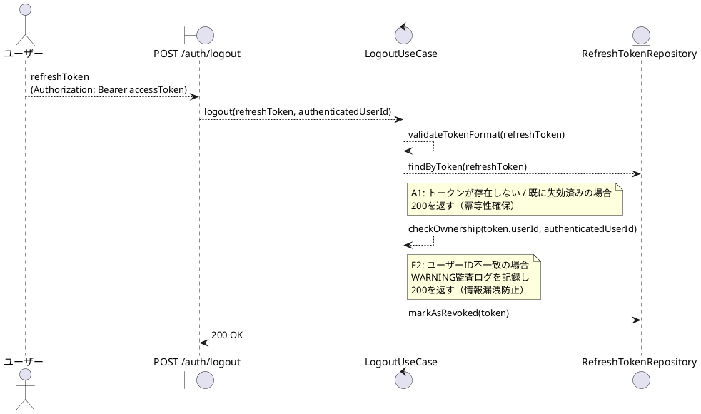
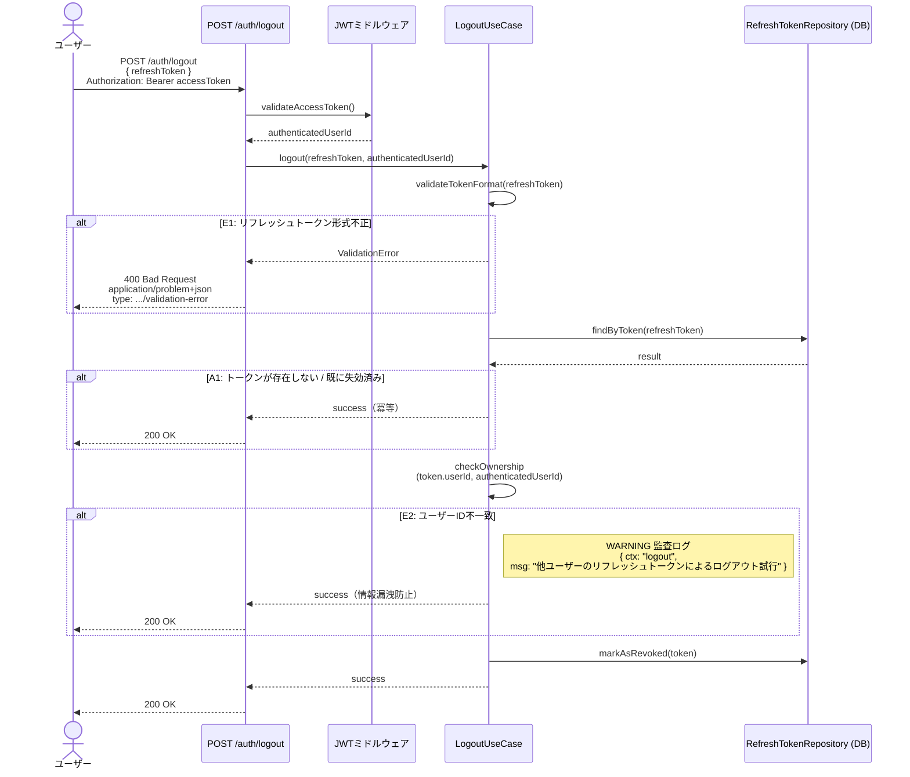

# BUC-U06 ログアウト

## メタデータ

| 項目 | 値 |
|---|---|
| BUC ID | BUC-U06 |
| BUC名 | ログアウト |
| アクター | ACT-01（ユーザー）・ACT-02（管理者） |
| スコープ | Must |
| 関連FR | FR-07 |
| 関連NFR | NFR-06, NFR-07, NFR-08, NFR-09 |
| 関連情報 | INF-03（アクセストークン）, INF-04（リフレッシュトークン） |
| 関連条件 | CND-06（アクセストークンが有効であること） |
| 事後状態 | STM-01.未認証 |

---

## ユースケース記述

### 事前条件

- アクセストークンが有効であること（JWTミドルウェアで検証済み）

### 基本フロー

1. ユーザーはリフレッシュトークンを送信する
2. システムはリフレッシュトークンの形式を検証する
3. システムはDBでリフレッシュトークンを検索する
4. システムはリフレッシュトークンのユーザーIDとアクセストークンのsubjectが一致することを確認する
5. システムはリフレッシュトークンを失効済みに更新する
6. システムは200レスポンスを返す

### 代替フロー

**A1. リフレッシュトークンが存在しない、または既に失効済みの場合（ステップ3）**

- a. システムは200レスポンスを返す（冪等性確保。トークンの存在有無・状態を外部に漏洩しない）

### 例外フロー

> 全ログにはNFR-09の必須フィールド（`ts`・`lvl`・`svc`・`ctx`・`trace_id`/`span_id`・`req_id`・`msg`）を含めること。以下の例示は差分フィールド（`ctx`・`msg`・`lvl`）のみを記載する。

**E1. リフレッシュトークン形式不正（ステップ2）**

- a. システムは処理を中断する
- b. システムは400 (Bad Request)、`application/problem+json`、`type: https://example.com/probs/validation-error` を返す
- c. 監査ログ対象外。ただしビジネス例外としてWARNINGログを出力する（`{ ctx: "logout", msg: "リフレッシュトークン形式不正", lvl: "WARNING" }`。NFR-08）

**E2. ユーザーID不一致（ステップ4）**

- a. システムは200レスポンスを返す（情報漏洩防止のため正常レスポンスと同一）
- b. 監査ログとして不正トークンでのアクセス試行（WARNING）を記録する（`{ ctx: "logout", msg: "他ユーザーのリフレッシュトークンによるログアウト試行", lvl: "WARNING" }`。NFR-08）

---

## ロバストネス図

---

## シーケンス図

---

## 監査ログ

| イベント | レベル | ターゲット | 備考 |
|----------|--------|------------|------|
| 不正トークンでのアクセス試行 | WARNING | authenticated_user_id | E2（他ユーザーのトークンによるログアウト試行） |

> ログアウト自体はNFR-07の監査ログ対象操作に含まれていない。UseCase開始/終了のINFOログ（NFR-08）は基盤レベルで出力される。

---

## 備考・設計上の決定事項

| 項目 | 決定内容 | 理由 |
|---|---|---|
| 冪等性の確保 | トークンが存在しない・既に失効済みの場合も200を返す | RFC 7009（Token Revocation）に準じた設計。クライアントのリトライ時に冪等に動作し、トークン状態を外部に漏洩しない |
| ユーザーID不一致時のレスポンス | 正常レスポンスと同一の200を返す | 他ユーザーのトークンを指定した場合にエラーを返すと、トークンの所有者情報が漏洩するため。WARNINGログで検知する |
| 単一トークン失効 | リクエストで送信されたリフレッシュトークンのみを失効させる | デバイス管理（Better）実装前のため、全セッション無効化ではなく単一トークン失効とする。FR-07（自発的ログアウトはRT1本のみ失効・全セッション一括はBUC-U10実装時）に準拠 |
| レスポンス形式 | 200 OK。レスポンスボディは最小限とする | FR-07「レスポンスに失効理由を含める」について、ログアウトは自発的操作であるため `revocation_reason` コードではなく成功応答で十分と判断する |
| アクセストークン検証 | JWTミドルウェアで事前検証し、ユースケースの事前条件として扱う | FR-19のJWT検証ミドルウェアを共通基盤として利用。ユースケース内では認証済みユーザーIDのみを受け取る |
