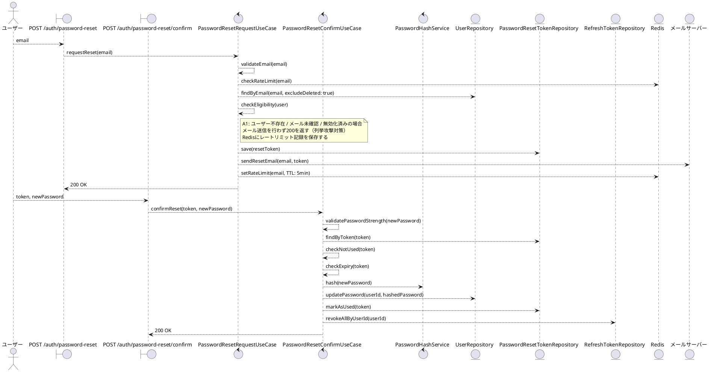
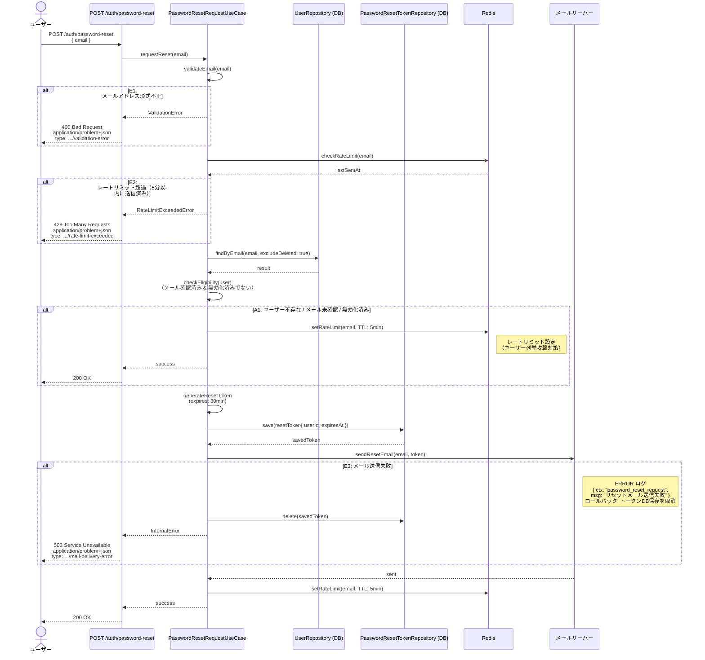
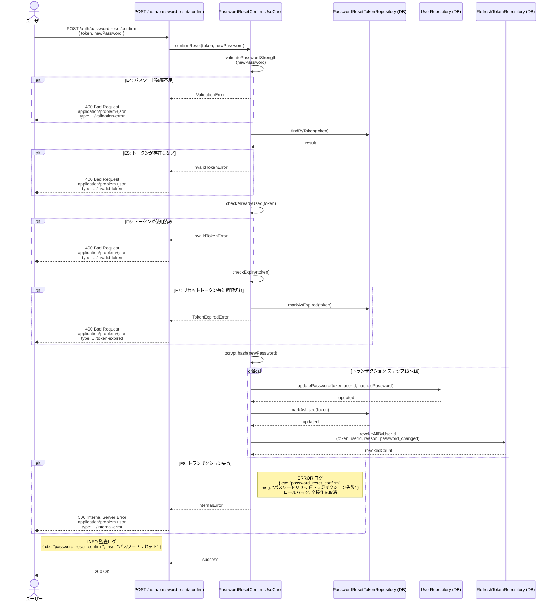

# BUC-U07 パスワードリセット

## メタデータ

| 項目 | 値 |
|---|---|
| BUC ID | BUC-U07 |
| BUC名 | パスワードリセット |
| アクター | ACT-01（ユーザー）・ACT-02（管理者） |
| スコープ | Must |
| 関連FR | FR-08, FR-09 |
| 関連NFR | NFR-01, NFR-06, NFR-07, NFR-08, NFR-09, NFR-11 |
| 関連情報 | INF-01（ユーザー情報）, INF-05（パスワードリセットトークン）, INF-04（リフレッシュトークン）, INF-10（パスワードリセット送信記録） |
| 関連条件 | —（完了（フェーズ2）の前提はCND-08: リセットトークンが有効期限内であること） |
| 事後状態 | フェーズ1完了後: STM-03.パスワードリセット中 ／ フェーズ2完了後: STM-01.未認証 |

---

## ユースケース記述

### 事前条件

- なし（未認証・認証済みいずれの状態からも実行可能）

### 基本フロー

**フェーズ1: リセット要求（FR-08）**

1. ユーザーはメールアドレスを送信する
2. システムはメールアドレスの形式（RFC5322準拠、最大254文字）を検証する
3. システムはRedisでパスワードリセット送信記録を確認する（レートリミット: 同一メールアドレスにつき5分に1回）
4. システムはメールアドレスに紐付くユーザー（削除済みを除く）をDBで検索する
5. システムはユーザーがメール確認済みかつ無効化済みでないことを確認する
6. システムはパスワードリセットトークン（有効期限30分）を生成しDBに保存する
7. システムはメールサーバーでリセットメールを送信する
8. システムはRedisにパスワードリセット送信記録を保存する（TTL 5分）
9. システムは200レスポンスを返す

**フェーズ2: リセット完了（FR-09）**

10. ユーザーはリセットトークンと新しいパスワードを送信する
11. システムはパスワードの強度を検証する（最小15文字、最大64文字）
12. システムはDBでリセットトークンを検索する
13. システムはリセットトークンが未使用であることを確認する
14. システムはリセットトークンの有効期限を確認する
15. システムは新しいパスワードをbcryptでハッシュ化する
16. システムはパスワードを更新する
17. システムはリセットトークンを使用済みに更新する
18. システムは当該ユーザーの全リフレッシュトークンを無効化する（失効理由: password_changed）

> ステップ16〜18は単一トランザクションで実行する

19. システムは監査ログ（パスワードリセット、INFO）を記録する
20. システムは200レスポンスを返す

### 代替フロー

**A1. ユーザーが存在しない、メール未確認、または無効化済みの場合（ステップ4-5）**

- a. システムはRedisにパスワードリセット送信記録を保存する（TTL 5分）
- b. システムは200レスポンスを返す（ユーザー列挙攻撃対策。FR-08準拠）

### 例外フロー

> 全ログにはNFR-09の必須フィールド（`ts`・`lvl`・`svc`・`ctx`・`trace_id`/`span_id`・`req_id`・`msg`）を含めること。以下の例示は差分フィールド（`ctx`・`msg`・`lvl`）のみを記載する。

**フェーズ1**

**E1. メールアドレス形式バリデーションエラー（ステップ2）**

- a. システムは処理を中断する
- b. システムは400 (Bad Request)、`application/problem+json`、`type: https://example.com/probs/validation-error` を返す
- c. 監査ログ対象外。ただしビジネス例外としてWARNINGログを出力する（`{ ctx: "password_reset_request", msg: "メールアドレス形式不正", lvl: "WARNING" }`。NFR-08）

**E2. レートリミット超過（ステップ3）**

- a. システムは処理を中断する
- b. システムは429 (Too Many Requests)、`application/problem+json`、`type: https://example.com/probs/rate-limit-exceeded` を返す
- c. 監査ログ対象外。ただしビジネス例外としてWARNINGログを出力する（`{ ctx: "password_reset_request", msg: "パスワードリセット送信レートリミット超過", lvl: "WARNING" }`。NFR-08）

**E3. メール送信失敗（ステップ7）**

- a. システムはパスワードリセットトークンのDB保存をロールバックする
- b. システムは503 (Service Unavailable)、`application/problem+json`、`type: https://example.com/probs/mail-delivery-error` を返す
- c. 外部依存失敗としてERRORログを出力する（`{ ctx: "password_reset_request", msg: "リセットメール送信失敗", lvl: "ERROR" }`。NFR-08）
- ロールバックスコープ: ステップ6のトークンDB保存を取り消す。Redisへの送信記録保存（ステップ8）は未実行のためロールバック不要

**フェーズ2**

**E4. パスワード強度不足（ステップ11）**

- a. システムは処理を中断する
- b. システムは400 (Bad Request)、`application/problem+json`、`type: https://example.com/probs/validation-error` を返す
- c. 監査ログ対象外。ただしビジネス例外としてWARNINGログを出力する（`{ ctx: "password_reset_confirm", msg: "パスワード強度不足", lvl: "WARNING" }`。NFR-08）

**E5. リセットトークンが存在しない場合（ステップ12）**

- a. システムは処理を中断する
- b. システムは400 (Bad Request)、`application/problem+json`、`type: https://example.com/probs/invalid-token` を返す
- c. 監査ログ対象外。ただしビジネス例外としてWARNINGログを出力する（`{ ctx: "password_reset_confirm", msg: "無効なリセットトークン", lvl: "WARNING" }`。NFR-08）

**E6. リセットトークンが使用済みの場合（ステップ13）**

- a. システムは処理を中断する
- b. システムは400 (Bad Request)、`application/problem+json`、`type: https://example.com/probs/invalid-token` を返す
- c. 監査ログ対象外。ただしビジネス例外としてWARNINGログを出力する（`{ ctx: "password_reset_confirm", msg: "無効なリセットトークン", lvl: "WARNING" }`。NFR-08）

**E7. リセットトークン有効期限切れ（ステップ14）**

- a. システムはリセットトークンを期限切れとして更新する
- b. システムは400 (Bad Request)、`application/problem+json`、`type: https://example.com/probs/token-expired` を返す
- c. 監査ログ対象外。ただしビジネス例外としてWARNINGログを出力する（`{ ctx: "password_reset_confirm", msg: "リセットトークン有効期限切れ", lvl: "WARNING" }`。NFR-08）

**E8. トランザクション失敗（ステップ16-18）**

- a. システムはトランザクション全体をロールバックする（パスワード更新・トークン使用済み更新・全セッション無効化のいずれも適用しない）
- b. システムは500 (Internal Server Error)、`application/problem+json`、`type: https://example.com/probs/internal-error` を返す
- c. 外部依存失敗としてERRORログを出力する（`{ ctx: "password_reset_confirm", msg: "パスワードリセットトランザクション失敗", lvl: "ERROR" }`。NFR-08）
- ロールバックスコープ: ステップ16〜18の全操作。パスワード・トークン状態・セッションのいずれも変更前の状態に戻す

---

## ロバストネス図

---

## シーケンス図

### フェーズ1: リセット要求

### フェーズ2: リセット完了

---

## 監査ログ

| イベント | レベル | ターゲット | 備考 |
|----------|--------|------------|------|
| パスワードリセット | INFO | user_id | フェーズ2完了時（パスワード更新・全セッション無効化完了） |

---

## 備考・設計上の決定事項

| 項目 | 決定内容 | 理由 |
|---|---|---|
| ユーザー列挙攻撃対策 | ユーザー不存在・メール未確認・無効化済みのいずれでも200を返し、メール送信しない | FR-08準拠。攻撃者がレスポンスの差異からアカウント存在有無を判別できないようにする |
| A1でのレートリミット設定 | ユーザー不存在時もRedisにレートリミット記録を保存する | レートリミット動作の差異によるユーザー列挙を防ぐ。未登録メールアドレスでも5分間の再送信制限が動作する |
| メール送信失敗時のロールバック | メール送信失敗時はDBに保存済みのリセットトークンを削除する | 送信されないトークンがDBに残ると、トークンは存在するがユーザーに届いていない不整合が発生するため |
| フェーズ2のトランザクション | パスワード更新・トークン使用済み更新・全セッション無効化を単一トランザクションで実行する | 部分更新による不整合を防ぐ。パスワードだけ変更されセッションが残る、またはトークンが未使用のまま残る事態を回避する |
| 全セッション無効化の失効理由 | `password_changed` を使用する | VAR-10（セッション失効理由コード）に準拠。パスワードリセットもパスワード変更の一形態であるため同一コードを適用する |
| リセット対象の状態制限 | メール確認済みかつ無効化済みでないユーザーのみリセット可能とする | states.md（STM-01/STM-02）の状態遷移図で、パスワードリセット要求は「STM-01.未認証」「STM-02.認証済み」状態からのみ許可されている。メール未確認・無効化済みはリセット不要・不可 |
