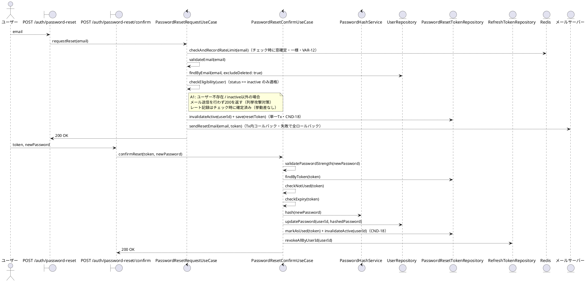
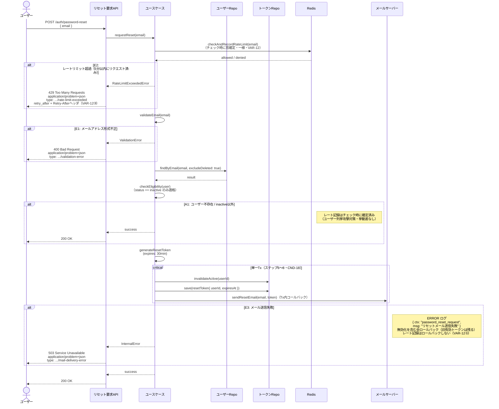
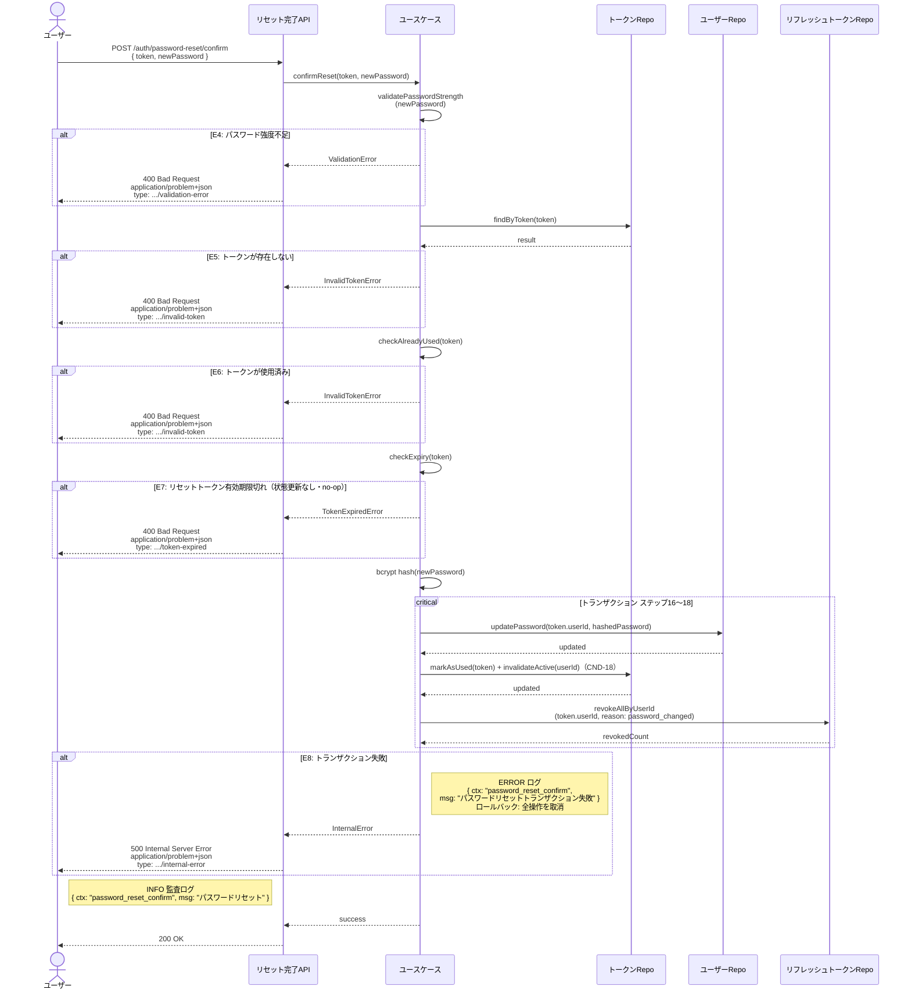

# BUC-U07 パスワードリセット

## メタデータ

| 項目 | 値 |
|---|---|
| BUC ID | BUC-U07 |
| BUC名 | パスワードリセット |
| アクター | ACT-01（ユーザー）・ACT-02（管理者） |
| スコープ | Must |
| 関連FR | FR-08, FR-09 |
| 関連NFR | NFR-01, NFR-06, NFR-07, NFR-08, NFR-09, NFR-11 |
| 関連情報 | INF-01（ユーザー情報）, INF-05（パスワードリセットトークン）, INF-04（リフレッシュトークン）, INF-10（パスワードリセット送信記録） |
| 関連条件 | CND-18（リセットトークンの有効は常に最大1本）。完了（フェーズ2）の前提はCND-08（リセットトークンが有効期限内であること） |
| 事後状態 | フェーズ1完了後: STM-03.パスワードリセット中 ／ フェーズ2完了後: STM-01.未認証 |

---

## ユースケース記述

### 事前条件

- なし（未認証・認証済みいずれの状態からも実行可能）

### 基本フロー

**フェーズ1: リセット要求（FR-08）**

1. ユーザーはメールアドレスを送信する
2. システムはRedisでパスワードリセット送信記録を確認し、同時に記録を確定する（レートリミット: 同一メールアドレスにつき5分に1回・チェック時に窓確定・存在/状態に関わらず一様適用・VAR-12）
3. システムはメールアドレスの形式（RFC5322準拠、最大254文字）を検証する
4. システムはメールアドレスに紐付くユーザー（削除済みを除く）をDBで検索する
5. システムはユーザーの状態が STM-01.未認証（inactive）であることを確認する（メール未確認・無効化済み・削除済みは不適格＝A1）
6. システムは既存の有効なパスワードリセットトークンを無効化する（CND-18）
7. システムはパスワードリセットトークン（有効期限30分）を生成しDBに保存する
8. システムはメールサーバーでリセットメールを送信する

> ステップ6〜8は単一トランザクションで実行する（メール送信はTx内コールバック。送信失敗=E3で無効化を含む全ロールバック）

9. システムは200レスポンスを返す

**フェーズ2: リセット完了（FR-09）**

10. ユーザーはリセットトークンと新しいパスワードを送信する
11. システムはパスワードの強度を検証する（最小15文字、最大64文字）
12. システムはDBでリセットトークンを検索する
13. システムはリセットトークンが未使用であることを確認する
14. システムはリセットトークンの有効期限を確認する
15. システムは新しいパスワードをbcryptでハッシュ化する
16. システムはパスワードを更新する
17. システムはリセットトークンを使用済みに更新し、当該ユーザーの他の有効なリセットトークンを一括無効化する（CND-18）
18. システムは当該ユーザーの全リフレッシュトークンを無効化する（失効理由: password_changed）

> ステップ16〜18は単一トランザクションで実行する

19. システムは監査ログ（パスワードリセット、INFO）を記録する
20. システムは200レスポンスを返す

### 代替フロー

**A1. ユーザーが存在しない、または状態が STM-01.未認証（inactive）以外の場合（ステップ4-5）**

- a. システムは200レスポンスを返す（ユーザー列挙攻撃対策。FR-08準拠。レート記録はステップ2で確定済みのため追加処理なし＝成功時と挙動差なし）

### 例外フロー

> 全ログにはNFR-09の必須フィールド（`ts`・`lvl`・`svc`・`ctx`・`trace_id`/`span_id`・`req_id`・`msg`）を含めること。以下の例示は差分フィールド（`ctx`・`msg`・`lvl`）のみを記載する。

**フェーズ1**

**E1. メールアドレス形式バリデーションエラー（ステップ3）**

- a. システムは処理を中断する
- b. システムは400 (Bad Request)、`application/problem+json`、`type: https://example.com/probs/validation-error` を返す
- c. 監査ログ対象外。ただしビジネス例外としてWARNINGログを出力する（`{ ctx: "password_reset_request", msg: "メールアドレス形式不正", lvl: "WARNING" }`。NFR-08）

**E2. レートリミット超過（ステップ2）**

- a. システムは処理を中断する（記録は更新しない＝固定ウィンドウ・TTL非延長・VAR-12②）
- b. システムは429 (Too Many Requests)、`application/problem+json`、`type: https://example.com/probs/rate-limit-exceeded`、`retry_after`（TTL残秒）＋HTTP `Retry-After`ヘッダ（VAR-12③）を返す
- c. 監査ログ対象外。ただしビジネス例外としてWARNINGログを出力する（`{ ctx: "password_reset_request", msg: "パスワードリセット要求レートリミット超過", lvl: "WARNING" }`。NFR-08）

**E3. メール送信失敗（ステップ8）**

- a. システムはトランザクション全体をロールバックする（既存トークンの無効化・新トークンの保存のいずれも適用しない＝旧有効トークンはそのまま残る）
- b. システムは503 (Service Unavailable)、`application/problem+json`、`type: https://example.com/probs/mail-delivery-error` を返す
- c. 外部依存失敗としてERRORログを出力する（`{ ctx: "password_reset_request", msg: "リセットメール送信失敗", lvl: "ERROR" }`。NFR-08）
- ロールバックスコープ: ステップ6〜7のDB操作を取り消す。レート記録（ステップ2）は確定済みのままロールバックしない（試行を数える・VAR-12①）

**フェーズ2**

**E4. パスワード強度不足（ステップ11）**

- a. システムは処理を中断する
- b. システムは400 (Bad Request)、`application/problem+json`、`type: https://example.com/probs/validation-error` を返す
- c. 監査ログ対象外。ただしビジネス例外としてWARNINGログを出力する（`{ ctx: "password_reset_confirm", msg: "パスワード強度不足", lvl: "WARNING" }`。NFR-08）

**E5. リセットトークンが存在しない場合（ステップ12）**

- a. システムは処理を中断する
- b. システムは400 (Bad Request)、`application/problem+json`、`type: https://example.com/probs/invalid-token` を返す
- c. 監査ログ対象外。ただしビジネス例外としてWARNINGログを出力する（`{ ctx: "password_reset_confirm", msg: "無効なリセットトークン", lvl: "WARNING" }`。NFR-08）

**E6. リセットトークンが使用済みの場合（ステップ13）**

- a. システムは処理を中断する
- b. システムは400 (Bad Request)、`application/problem+json`、`type: https://example.com/probs/invalid-token` を返す
- c. 監査ログ対象外。ただしビジネス例外としてWARNINGログを出力する（`{ ctx: "password_reset_confirm", msg: "無効なリセットトークン", lvl: "WARNING" }`。NFR-08）

**E7. リセットトークン有効期限切れ（ステップ14）**

- a. システムは期限切れを検出する（状態更新なし・`expires_at` 判定のみ。DB書き込みは行わず、使い切りは `used_at` が担う）
- b. システムは400 (Bad Request)、`application/problem+json`、`type: https://example.com/probs/token-expired` を返す
- c. 監査ログ対象外。ただしビジネス例外としてWARNINGログを出力する（`{ ctx: "password_reset_confirm", msg: "リセットトークン有効期限切れ", lvl: "WARNING" }`。NFR-08）

**E8. トランザクション失敗（ステップ16-18）**

- a. システムはトランザクション全体をロールバックする（パスワード更新・トークン使用済み更新・他トークン一括無効化・全セッション無効化のいずれも適用しない）
- b. システムは500 (Internal Server Error)、`application/problem+json`、`type: https://example.com/probs/internal-error` を返す
- c. 外部依存失敗としてERRORログを出力する（`{ ctx: "password_reset_confirm", msg: "パスワードリセットトランザクション失敗", lvl: "ERROR" }`。NFR-08）
- ロールバックスコープ: ステップ16〜18の全操作。パスワード・トークン状態・セッションのいずれも変更前の状態に戻す

---

## ロバストネス図

```plantuml
@startuml
skinparam componentStyle rectangle
skinparam backgroundColor White

actor "ユーザー" as ユーザー

boundary "POST /auth/password-reset" as リセット要求API
boundary "POST /auth/password-reset/confirm" as リセット完了API
control "PasswordResetRequestUseCase" as 要求ユースケース
control "PasswordResetConfirmUseCase" as 完了ユースケース
control "PasswordHashService" as ハッシュ化
entity "UserRepository" as ユーザーRepo
entity "PasswordResetTokenRepository" as トークンRepo
entity "RefreshTokenRepository" as リフレッシュトークンRepo
entity "Redis" as Redis
entity "メールサーバー" as メールサーバー

' フェーズ1: リセット要求
ユーザー --> リセット要求API : email

リセット要求API --> 要求ユースケース : requestReset(email)

要求ユースケース --> Redis : checkAndRecordRateLimit(email)（チェック時に窓確定・一様・VAR-12）
要求ユースケース --> 要求ユースケース : validateEmail(email)
要求ユースケース --> ユーザーRepo : findByEmail(email, excludeDeleted: true)
要求ユースケース --> 要求ユースケース : checkEligibility(user)（status == inactive のみ適格）

note right of 要求ユースケース
  A1: ユーザー不存在 / inactive以外の場合
  メール送信を行わず200を返す（列挙攻撃対策）
  レート記録はチェック時に確定済み（挙動差なし）
end note

要求ユースケース --> トークンRepo : invalidateActive(userId) + save(resetToken)（単一Tx・CND-18）
要求ユースケース --> メールサーバー : sendResetEmail(email, token)（Tx内コールバック・失敗で全ロールバック）

リセット要求API <-- 要求ユースケース : 200 OK

' フェーズ2: リセット完了
ユーザー --> リセット完了API : token, newPassword

リセット完了API --> 完了ユースケース : confirmReset(token, newPassword)

完了ユースケース --> 完了ユースケース : validatePasswordStrength(newPassword)
完了ユースケース --> トークンRepo : findByToken(token)
完了ユースケース --> 完了ユースケース : checkNotUsed(token)
完了ユースケース --> 完了ユースケース : checkExpiry(token)
完了ユースケース --> ハッシュ化 : hash(newPassword)
完了ユースケース --> ユーザーRepo : updatePassword(userId, hashedPassword)
完了ユースケース --> トークンRepo : markAsUsed(token) + invalidateActive(userId)（CND-18）
完了ユースケース --> リフレッシュトークンRepo : revokeAllByUserId(userId)

リセット完了API <-- 完了ユースケース : 200 OK

@enduml
```

---

## シーケンス図

### フェーズ1: リセット要求

```mermaid
sequenceDiagram
  actor User as ユーザー
  participant ResetRequestAPI as リセット要求API
  participant UseCase as ユースケース
  participant UserRepo as ユーザーRepo
  participant ResetRepo as トークンRepo
  participant Redis as Redis
  participant MailServer as メールサーバー
  User->>ResetRequestAPI: POST /auth/password-reset<br/>{ email }
  ResetRequestAPI->>UseCase: requestReset(email)
  UseCase->>Redis: checkAndRecordRateLimit(email)<br/>（チェック時に窓確定・一様・VAR-12）
  Redis-->>UseCase: allowed / denied
  alt E2: レートリミット超過（5分以内にリクエスト済み）
  UseCase-->>ResetRequestAPI: RateLimitExceededError
  ResetRequestAPI-->>User: 429 Too Many Requests<br/>application/problem+json<br/>type: .../rate-limit-exceeded<br/>retry_after + Retry-Afterヘッダ（VAR-12③）
  end
  UseCase->>UseCase: validateEmail(email)
  alt E1: メールアドレス形式不正
  UseCase-->>ResetRequestAPI: ValidationError
  ResetRequestAPI-->>User: 400 Bad Request<br/>application/problem+json<br/>type: .../validation-error
  end
  UseCase->>UserRepo: findByEmail(email, excludeDeleted: true)
  UserRepo-->>UseCase: result
  UseCase->>UseCase: checkEligibility(user)<br/>（status == inactive のみ適格）
  alt A1: ユーザー不存在 / inactive以外
  Note right of Redis: レート記録はチェック時に確定済み<br/>（ユーザー列挙攻撃対策・挙動差なし）
  UseCase-->>ResetRequestAPI: success
  ResetRequestAPI-->>User: 200 OK
  end
  UseCase->>UseCase: generateResetToken<br/>(expires: 30min)
  critical 単一Tx（ステップ6〜8・CND-18）
  UseCase->>ResetRepo: invalidateActive(userId)
  UseCase->>ResetRepo: save(resetToken{ userId, expiresAt })
  UseCase->>MailServer: sendResetEmail(email, token)（Tx内コールバック）
  end
  alt E3: メール送信失敗
  Note right of MailServer: ERROR ログ<br/>{ ctx: "password_reset_request",<br/>msg: "リセットメール送信失敗" }<br/>無効化を含む全ロールバック（旧有効トークンは残る）<br/>レート記録はロールバックしない（VAR-12①）
  UseCase-->>ResetRequestAPI: InternalError
  ResetRequestAPI-->>User: 503 Service Unavailable<br/>application/problem+json<br/>type: .../mail-delivery-error
  end
  UseCase-->>ResetRequestAPI: success
  ResetRequestAPI-->>User: 200 OK
```

### フェーズ2: リセット完了

```mermaid
sequenceDiagram
  actor User as ユーザー
  participant ResetConfirmAPI as リセット完了API
  participant UseCase as ユースケース
  participant ResetRepo as トークンRepo
  participant UserRepo as ユーザーRepo
  participant RefreshRepo as リフレッシュトークンRepo
  User->>ResetConfirmAPI: POST /auth/password-reset/confirm<br/>{ token, newPassword }
  ResetConfirmAPI->>UseCase: confirmReset(token, newPassword)
  UseCase->>UseCase: validatePasswordStrength<br/>(newPassword)
  alt E4: パスワード強度不足
  UseCase-->>ResetConfirmAPI: ValidationError
  ResetConfirmAPI-->>User: 400 Bad Request<br/>application/problem+json<br/>type: .../validation-error
  end
  UseCase->>ResetRepo: findByToken(token)
  ResetRepo-->>UseCase: result
  alt E5: トークンが存在しない
  UseCase-->>ResetConfirmAPI: InvalidTokenError
  ResetConfirmAPI-->>User: 400 Bad Request<br/>application/problem+json<br/>type: .../invalid-token
  end
  UseCase->>UseCase: checkAlreadyUsed(token)
  alt E6: トークンが使用済み
  UseCase-->>ResetConfirmAPI: InvalidTokenError
  ResetConfirmAPI-->>User: 400 Bad Request<br/>application/problem+json<br/>type: .../invalid-token
  end
  UseCase->>UseCase: checkExpiry(token)
  alt E7: リセットトークン有効期限切れ（状態更新なし・no-op）
  UseCase-->>ResetConfirmAPI: TokenExpiredError
  ResetConfirmAPI-->>User: 400 Bad Request<br/>application/problem+json<br/>type: .../token-expired
  end
  UseCase->>UseCase: bcrypt hash(newPassword)
  critical トランザクション ステップ16〜18
  UseCase->>UserRepo: updatePassword(token.userId, hashedPassword)
  UserRepo-->>UseCase: updated
  UseCase->>ResetRepo: markAsUsed(token) + invalidateActive(userId)（CND-18）
  ResetRepo-->>UseCase: updated
  UseCase->>RefreshRepo: revokeAllByUserId<br/>(token.userId, reason: password_changed)
  RefreshRepo-->>UseCase: revokedCount
  end
  alt E8: トランザクション失敗
  Note right of UseCase: ERROR ログ<br/>{ ctx: "password_reset_confirm",<br/>msg: "パスワードリセットトランザクション失敗" }<br/>ロールバック: 全操作を取消
  UseCase-->>ResetConfirmAPI: InternalError
  ResetConfirmAPI-->>User: 500 Internal Server Error<br/>application/problem+json<br/>type: .../internal-error
  end
  Note right of User: INFO 監査ログ<br/>{ ctx: "password_reset_confirm", msg: "パスワードリセット" }
  UseCase-->>ResetConfirmAPI: success
  ResetConfirmAPI-->>User: 200 OK
```

---

## 監査ログ

| イベント | レベル | ターゲット | 備考 |
|----------|--------|------------|------|
| パスワードリセット | INFO | user_id | フェーズ2完了時（パスワード更新・全セッション無効化完了） |

---

## 備考・設計上の決定事項

| 項目 | 決定内容 | 理由 |
|---|---|---|
| ユーザー列挙攻撃対策 | ユーザー不存在・状態が STM-01.未認証（inactive）以外（メール未確認・無効化済み・削除済み）のいずれでも200を返し、メール送信しない | FR-08準拠。攻撃者がレスポンスの差異からアカウント存在有無を判別できないようにする |
| A1でのレートリミット設定 | レート記録はチェック時（ステップ2）に存在・状態へ依らず一様に確定する（VAR-12） | レートリミット動作の差異によるユーザー列挙を防ぐ。未登録メールアドレスでも5分間の制限が同一挙動で動作する |
| メール送信失敗時のロールバック | メール送信はTx内コールバックで行い、失敗時は既存トークンの無効化・新トークンの保存を含む全ロールバックを行う（旧有効トークンは残る） | 送信されないトークンがDBに残る不整合と、送信失敗時にCND-18の無効化だけが確定してユーザーの有効トークンがゼロになる不整合の両方を防ぐ |
| 有効トークンの一意性 | 発行時は既存の有効トークンを無効化してから新発行し、完了時は消費と同一Txで他の有効トークンも一括無効化する（CND-18） | 複数有効トークンの併存（レート窓5分×TTL30分で最大6本）と、完了後の漏洩トークン再利用窓を塞ぐ。メール確認トークン（INF-06・CND-10）と同型 |
| フェーズ2のトランザクション | パスワード更新・トークン使用済み更新・他の有効リセットトークン一括無効化（CND-18）・全セッション無効化を単一トランザクションで実行する | 部分更新による不整合を防ぐ。パスワードだけ変更されセッションが残る、またはトークンが未使用のまま残る事態を回避する |
| 全セッション無効化の失効理由 | `password_changed` を使用する | VAR-10（セッション失効理由コード）に準拠。パスワードリセットもパスワード変更の一形態であるため同一コードを適用する |
| リセット対象の状態制限 | 状態が STM-01.未認証（inactive）のユーザーのみリセット可能とする（メール未確認・無効化済み・削除済みは不適格） | states.md（STM-01/STM-02/STM-03）で、パスワードリセット要求は「STM-01.未認証」（セッションはSTM-02.認証済みでも可）からのみ許可されている。招待済み未受付（INF-07の有効トークンで表す・STM-01の状態ではない）はアカウント不存在としてA1に合流し、UC-012（招待を受け付ける）経由でのみパスワード設定可能＝招待フローの迂回を防ぐ |
