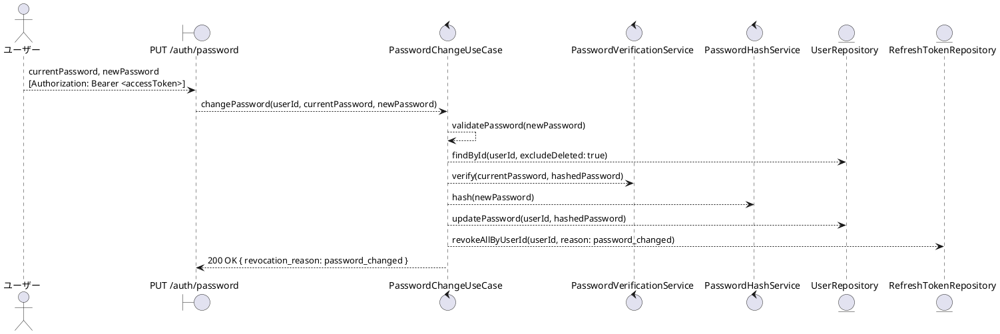
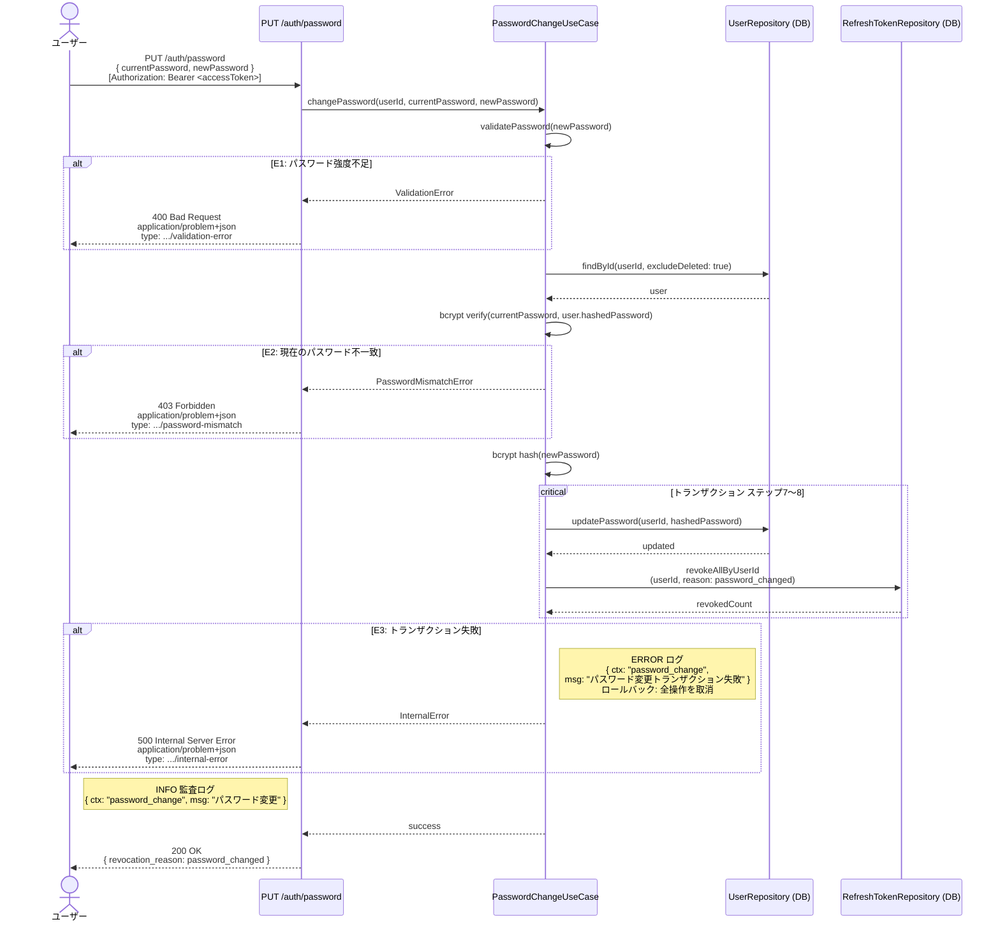

# BUC-U08 パスワード変更

## メタデータ

| 項目 | 値 |
|---|---|
| BUC ID | BUC-U08 |
| BUC名 | パスワード変更 |
| アクター | ACT-01（ユーザー）・ACT-02（管理者） |
| スコープ | Must |
| 関連FR | FR-10 |
| 関連NFR | NFR-01, NFR-06, NFR-07, NFR-08, NFR-09 |
| 関連情報 | INF-01（ユーザー情報）, INF-03（アクセストークン）, INF-04（リフレッシュトークン） |
| 関連条件 | CND-06（アクセストークンが有効であること）, CND-16（現在のパスワードが一致すること） |
| 事後状態 | STM-02.セッション失効 |

---

## ユースケース記述

### 事前条件

- アクセストークンが有効であること
- 現在のパスワードが一致すること

### 基本フロー

1. ユーザーは現在のパスワードと新しいパスワードを送信する
2. システムは新しいパスワードの強度（最小15文字、最大64文字、全ASCII文字・Unicode許容、文字種の混在強制なし）を検証する
3. システムはアクセストークンからユーザーIDを取得する
4. システムはユーザー（削除済みを除く）をDBで検索する
5. システムは現在のパスワードをbcryptで検証する
6. システムは新しいパスワードをbcryptでハッシュ化する
7. システムはパスワードを更新する
8. システムは当該ユーザーの全リフレッシュトークンを無効化する（失効理由: `password_changed`）

> ステップ7〜8は単一トランザクションで実行する

9. システムは監査ログ（パスワード変更、INFO）を記録する
10. システムは200レスポンスを返す（`revocation_reason: password_changed` を含める）

### 代替フロー

なし

### 例外フロー

> 全ログにはNFR-09の必須フィールド（`ts`・`lvl`・`svc`・`ctx`・`trace_id`/`span_id`・`req_id`・`msg`）を含めること。以下の例示は差分フィールド（`ctx`・`msg`・`lvl`）のみを記載する。

**E1. パスワード強度バリデーションエラー（ステップ2）**

- a. システムは処理を中断する
- b. システムは400 (Bad Request)、`application/problem+json`、`type: https://example.com/probs/validation-error` を返す
- c. 監査ログ対象外。ただしビジネス例外としてWARNINGログを出力する（`{ ctx: "password_change", msg: "パスワード強度不足", lvl: "WARNING" }`。NFR-08）

**E2. 現在のパスワード不一致（ステップ5）**

- a. システムは処理を中断する
- b. システムは403 (Forbidden)、`application/problem+json`、`type: https://example.com/probs/password-mismatch` を返す
- c. 監査ログ対象外。ただしビジネス例外としてWARNINGログを出力する（`{ ctx: "password_change", msg: "現在のパスワード不一致", lvl: "WARNING" }`。NFR-08）

**E3. トランザクション失敗（ステップ7〜8）**

- a. システムはトランザクション全体をロールバックする（パスワード更新・全セッション無効化のいずれも適用しない）
- b. システムは500 (Internal Server Error)、`application/problem+json`、`type: https://example.com/probs/internal-error` を返す
- c. 外部依存失敗としてERRORログを出力する（`{ ctx: "password_change", msg: "パスワード変更トランザクション失敗", lvl: "ERROR" }`。NFR-08）
- ロールバックスコープ: ステップ7〜8の全操作。パスワード・セッションのいずれも変更前の状態に戻す

---

## ロバストネス図

---

## シーケンス図

---

## 監査ログ

| イベント | レベル | ターゲット | 備考 |
|----------|--------|------------|------|
| パスワード変更 | INFO | user_id | 基本フロー完了時。全セッション無効化を含む |

---

## 備考・設計上の決定事項

| 項目 | 決定内容 | 理由 |
|---|---|---|
| 現在のパスワード検証 | パスワード変更前に現在のパスワードの一致を必須とする | セッション乗っ取り対策。アクセストークンが漏洩しても、パスワードを知らなければ変更不可（CND-16: 現在のパスワードが一致すること） |
| 現在のパスワード不一致のレスポンス | 403 Forbidden (`password-mismatch`) を返す | ユーザーは認証済み（JWT有効）だが、操作の実行にはパスワード再確認が必要で、その確認に失敗したため。401はJWT認証失敗に使用するため区別する |
| 全セッション無効化 | パスワード変更時に自身を含む全セッションを無効化する | パスワード変更後は全デバイスで再ログインを要求し、漏洩した可能性のある旧パスワードに基づくセッションを確実に無効化する |
| 失効理由のレスポンス包含 | 200レスポンスに `revocation_reason: password_changed` を含める | FR-10準拠。クライアントが失効理由を認識し、適切なUX（再ログイン誘導等）を提供できるようにする |
| 事後状態 | STM-02.セッション失効 | states.md（STM-02）の状態遷移図で、認証済み → セッション失効（全セッション無効化）と定義されている。ユーザーは再ログインが必要 |
