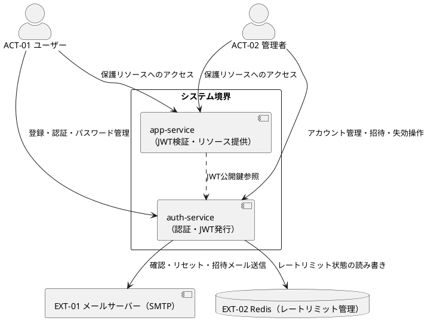

# overview — システム概要・スコープ・システムコンテキスト

## システム概要

メール/パスワード認証をベースとしたGoによる認証基盤。JWTを発行するauth-serviceと、JWTを検証するapp-serviceのモノレポ構成。管理者招待制によるロールベースのアクセス制御を持ち、セッション管理・レートリミット・監査ログを含む。ローカル開発をスコープとした第一フェーズとして構築する。

## 関連ドキュメント

| ドキュメント | 説明 |
|---|---|
| `.docs/design/overview-diagrams.md` | 全体図（ユースケース図・状態遷移図・APIエンドポイント・BUC間依存・外部システム依存）。BUC承認時に更新する |
| `.docs/design/buc/*.md` | 各BUCの詳細仕様（フロー・例外・ロバストネス図・シーケンス図） |
| `.docs/design/uc/` | ユースケース仕様・ドメインモデル・API仕様 |

## 確定スコープ

| 優先度 | 機能 | 関連BUC |
|---|---|---|
| Must | ユーザー登録（サインアップ） | BUC-U01 |
| Must | メール/パスワード認証 → JWT発行（auth-service） | BUC-U04 |
| Must | JWT検証ミドルウェア（app-service） | — |
| Must | ヘルスチェックAPI | BUC-S01 |
| Must | メールアドレス確認（メール確認トークン） | BUC-U02, BUC-U03 |
| Must | パスワードリセット（メール送信） | BUC-U07 |
| Must | パスワード変更・全セッション無効化 | BUC-U08 |
| Must | トークン強制失効 | BUC-A03 |
| Must | 管理者招待・招待受付 | BUC-A01, BUC-A02 |
| Must | 管理者アカウント無効化・再有効化・削除 | BUC-A04, BUC-A05, BUC-A06 |
| Must | ロール変更 | BUC-A07 |
| Must | 監査ログ（stdout出力） | — |
| Better | ソーシャルログイン（Google / Apple等） | — |
| Better | 2段階認証（SMS or TOTP） | — |
| Better | デバイス単位のセッション管理 | BUC-U09, BUC-U10 |

## システムコンテキスト図

