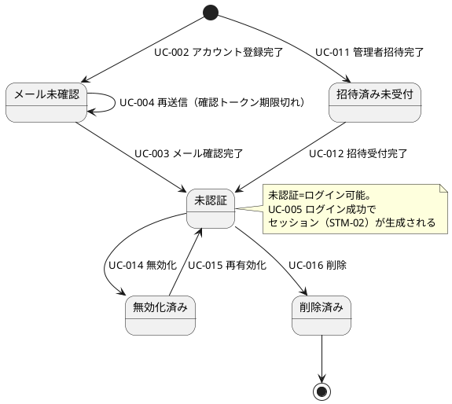
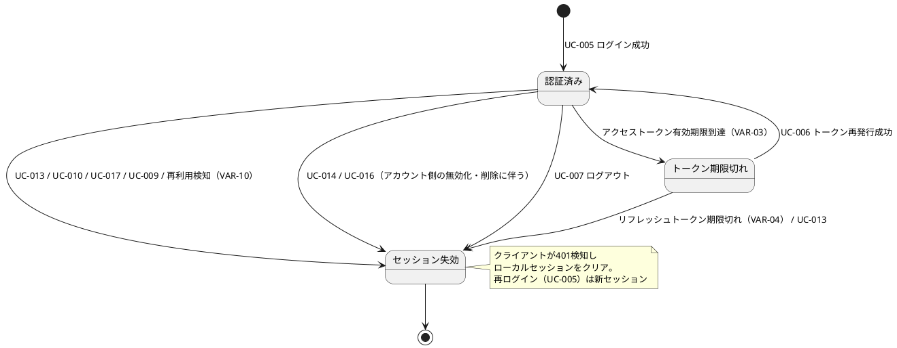
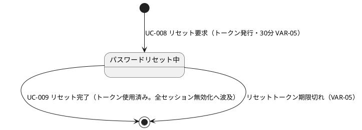

# states — 状態定義

> コンテキストは情報定義（information.md）と名前を揃える。状態一覧は遷移形式（1行=1遷移）で、**遷移は各状態モデル内で閉じる**（他モデルへの波及は説明列に記す）。遷移UCは buc.md で発番済みの UC を参照する。
> **終端の表記**: 遷移先状態「—」はそのモデルの終端（以降の遷移なし）。図では `[*]` への辺として表し、遷移UCがあればラベルに記す。

## 状態モデル

| ID | コンテキスト | 状態モデル | 対象情報 |
|---|---|---|---|
| STM-01 | アカウント | アカウント状態 | INF-01（ユーザー情報） |
| STM-02 | セッション | セッション状態 | INF-03（アクセストークン）・INF-04（リフレッシュトークン） |
| STM-03 | ワンタイムトークン | パスワードリセット状態 | INF-05（パスワードリセットトークン） |

## 状態一覧（遷移形式）

| コンテキスト | 状態モデル | 状態 | 遷移UC | 遷移先状態 | 説明 |
|---|---|---|---|---|---|
| アカウント | STM-01 | （初期） | UC-002（アカウントを登録する）の完了 | STM-01.メール未確認 | |
| アカウント | STM-01 | （初期） | UC-011（管理者を招待する）の完了 | STM-01.招待済み未受付 | |
| アカウント | STM-01 | メール未確認 | UC-003（メールアドレスを確認する）の完了 | STM-01.未認証 | 登録済みだがメール確認が未完了。ログイン不可 |
| アカウント | STM-01 | メール未確認 | 確認トークン期限切れ→UC-004（メール確認トークンを再送する） | STM-01.メール未確認 | |
| アカウント | STM-01 | 招待済み未受付 | UC-012（招待を受け付ける）の完了 | STM-01.未認証 | 管理者として招待済みだが招待受付が未完了。ログイン不可 |
| アカウント | STM-01 | 未認証 | UC-014（管理者アカウントを無効化する） | STM-01.無効化済み | 未認証=メール確認済みでログイン可能な状態。UC-005（ログインする）の成功でセッション（STM-02）が生成されるがアカウント状態は変わらない |
| アカウント | STM-01 | 未認証 | UC-016（アカウントを削除する） | STM-01.削除済み | |
| アカウント | STM-01 | 無効化済み | UC-015（管理者アカウントを再有効化する） | STM-01.未認証 | 管理者により無効化。ログイン不可、データは保持、再有効化可能 |
| アカウント | STM-01 | 削除済み | — | — | 論理削除済み。ログイン不可、データは保持（GDPR対応カラムをnull化）。現スコープでは復元BUCを定義しない（事実上不可逆） |
| セッション | STM-02 | （初期） | UC-005（ログインする）の成功 | STM-02.認証済み | ログイン成功でセッション生成（アクセストークン＋リフレッシュトークン発行） |
| セッション | STM-02 | 認証済み | アクセストークンの有効期限到達（VAR-03） | STM-02.トークン期限切れ | アクセストークンが有効な状態 |
| セッション | STM-02 | 認証済み | UC-013（トークンを強制失効する）・UC-010（パスワードを変更する）・UC-017（ロールを変更する）・UC-009（パスワードリセットを完了する）・リフレッシュトークン再利用検知（VAR-10） | STM-02.セッション失効 | 失効理由コードはVAR-10（セッション失効理由コード）を参照 |
| セッション | STM-02 | 認証済み | UC-014（管理者アカウントを無効化する）・UC-016（アカウントを削除する） | STM-02.セッション失効 | アカウント側の無効化・削除（STM-01）に伴う全セッション失効（VAR-10: `account_disabled`・`account_deleted`） |
| セッション | STM-02 | 認証済み | UC-007（ログアウトする） | STM-02.セッション失効 | リフレッシュトークンを失効済みに更新 |
| セッション | STM-02 | トークン期限切れ | UC-006（トークンを再発行する）の成功 | STM-02.認証済み | アクセストークン失効、リフレッシュトークンは有効 |
| セッション | STM-02 | トークン期限切れ | リフレッシュトークン期限切れ（VAR-04）・UC-013（トークンを強制失効する） | STM-02.セッション失効 | |
| セッション | STM-02 | セッション失効 | — | — | リフレッシュトークンも失効。クライアントがRT使用時に401受信後ローカルセッションをクリアし、再ログイン（UC-005）で新しいセッション（初期から）を生成する |
| ワンタイムトークン | STM-03 | （初期） | UC-008（パスワードリセットを要求する） | STM-03.パスワードリセット中 | リセットトークン発行（有効期限30分・VAR-05）。要求はアカウントが未認証（STM-01）・セッションが認証済み（STM-02）のどちらの状態からでも可能 |
| ワンタイムトークン | STM-03 | パスワードリセット中 | UC-009（パスワードリセットを完了する） | — | トークン使用済みで終了。完了に伴い全セッション無効化（STM-02: VAR-10 `password_changed`）へ波及 |
| ワンタイムトークン | STM-03 | パスワードリセット中 | リセットトークン期限切れ（VAR-05） | — | トークン失効で終了。再要求はUC-008から |

## 状態遷移図（PlantUML・状態モデル別）

### STM-01 アカウント状態

### STM-02 セッション状態

### STM-03 パスワードリセット状態

