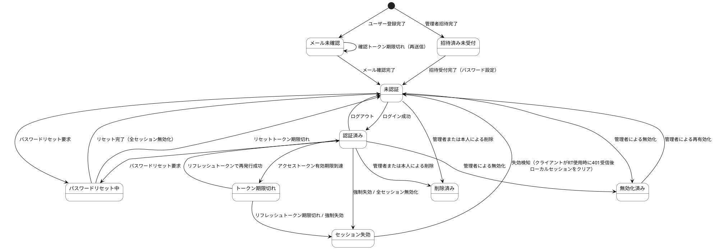

# states — 状態定義

## 状態モデル

| ID | 状態モデル | 対象情報 |
|---|---|---|
| STM-01 | アカウント状態 | INF-01（ユーザー情報） |
| STM-02 | セッション状態 | INF-03（アクセストークン）・INF-04（リフレッシュトークン） |
| STM-03 | パスワードリセット状態 | INF-05（パスワードリセットトークン） |

## 状態一覧

| 状態モデル | 状態 | 説明 | 遷移元トリガー |
|---|---|---|---|
| STM-01 | メール未確認 | 登録済みだがメール確認が未完了。ログイン不可 | ユーザー登録完了（BUC-U01） |
| STM-01 | 招待済み未受付 | 管理者として招待済みだが招待受付が未完了。ログイン不可 | 管理者招待完了（BUC-A01） |
| STM-01 | 未認証 | メール確認済み、ログイン前 | メール確認完了（BUC-U02）、招待受付完了（BUC-A02）、ログアウト（BUC-U06）、セッション失効、パスワードリセット完了（BUC-U07） |
| STM-02 | 認証済み | アクセストークンが有効 | ログイン成功（BUC-U04）、トークン再発行成功（BUC-U05） |
| STM-02 | トークン期限切れ | アクセストークン失効、リフレッシュトークンは有効 | アクセストークンの有効期限到達（VAR-03） |
| STM-02 | セッション失効 | リフレッシュトークンも失効、再ログイン必要 | リフレッシュトークン期限切れ（VAR-04）、強制失効（BUC-A03）、全セッション無効化 |
| STM-03 | パスワードリセット中 | リセットトークン発行済み、有効期限30分（VAR-05） | パスワードリセット要求（BUC-U07） |
| STM-01 | 無効化済み | 管理者により無効化。ログイン不可、データは保持、再有効化可能 | 管理者による無効化操作（BUC-A04） |
| STM-01 | 削除済み | 論理削除済み。ログイン不可、データは保持（GDPR対応カラムをnull化）。現スコープでは復元BUCを定義しない（事実上不可逆） | 管理者または本人による削除操作（BUC-A06） |

## 状態遷移図（PlantUML）

