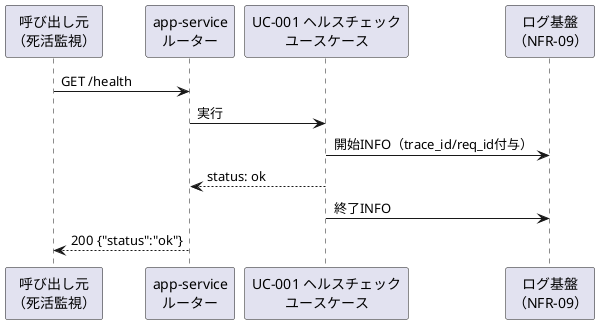

# UC-001 システムの死活を確認する

| メタ | 値 |
|---|---|
| UC ID | UC-001 |
| BUC ID | BUC-S01（ヘルスチェック。[buc.md](../buc.md)） |
| 主アクター | —（死活監視の呼び出し元。カタログ未定義のシステム主体） |
| 副アクター（任意） | — |

記法ノート（初見時に読む）

- 入出力は **UC—画面—アクター**（§2.1）、**UC—イベント—外部システム**（§2.2）、**UC—情報**（§2.3）の三経路で書き分ける。
- 状態遷移に関わるUCは [states.md](../states.md) の遷移トリガーと名前を揃える。
- 代替フローで見つかったビジネスルールは、仕様カタログ（[conditions.md](../conditions.md)・[variations.md](../variations.md)）へ**昇格**させる（上流優先。カタログ変更はチケットのP4関門を経る）。
- 事後条件・受け入れ条件の節は設けない。状態の変化は§2.4、扱う情報は§2.3が表現し、受け入れの実行可能な正本は**テストコード**（テスト名に本UCのIDを含め、`grep UC-NNN` で辿る）。
- 実装の正は**コード**。§7 はトレーサビリティ用の実装アンカー。

---

## 1. 概要

死活監視の呼び出し元（ロードバランサ・監視ツール・開発者）が、app-service が稼働していることを確認する（BUC-S01・FR-20・NFR-04）。

## 2. カタログとの突合

### 2.1 UC — 画面 — アクター（人が操作する）

| SCR-NN（無ければ「なし」） | 補足（画面名・URL断片） |
|---|---|
| なし | — |

### 2.2 UC — イベント — 外部システム（連携・非画面入口）

| イベント（HTTPメソッド + パス、ジョブ名 等） | EXT-NN（[external-systems.md](../external-systems.md)） |
|---|---|
| `GET /health`（死活監視の受口） | なし（呼び出し元はカタログ未定義のシステム主体） |

### 2.3 UC — 情報（システムが扱うデータ）

| INF-NN（名前） | 読み / 書き / 両方 |
|---|---|
| なし | — |

<b>2.4 状態遷移（該当時のみ開く）</b>

該当なし（BUC-S01 は状態を持たない）。

<b>2.5 条件・バリエーション（該当時のみ開く）</b>

該当なし。

## 3. 主成功シナリオ（基本コース）

1. [呼び出し元] `GET /health` をリクエストする
2. [システム] `200 OK`・`application/json` で `{"status":"ok"}` を返す
3. [システム] UseCase開始/終了のログをINFOで出力する（NFR-08。NFR-09必須フィールド付き）

## 4. 代替フロー・例外（代替コース）

| 条件（CND-NN。未昇格なら文章） | 振る舞い（エラーレスポンスは RFC 9457 形式・VAR-10/11 等を参照） |
|---|---|
| 未定義のパスへのアクセス | `404` を返す（本チケットの応答形式は標準のまま。RFC 9457（NFR-06）形式への統一は認証実装チケットで行う — T-003 Q-9決定） |
| `/health` への非対応メソッド（POST等） | `405` を返す（同上） |

## 5. シーケンス図

<b>6. 監査ログ（該当時のみ開く）</b>

NFR-07の監査ログ対象操作に該当なし。UseCase開始/終了の基盤ログ（NFR-08のINFO・NFR-09フィールド）のみ出力する。

<b>7. ロバストネス図（該当時のみ開く・予備設計）</b>

省略（エンティティを持たない最小UCのため。バウンダリ=ルーター／コントロール=ヘルスチェックユースケースの2要素のみ）。

## 8. 実装参照（突合用）

| 種別 | 参照 |
|---|---|
| HTTP（メソッド + パス） | `GET /health` |
| ルーティング | `backend/healthcheck/api/http/routes.go`（`RegisterRoutes`。`module.go` の `RegisterHttp` から配線） |
| Handler / UseCase / Job | Handler: `backend/healthcheck/api/http/handler.go` ／ UseCase: `backend/healthcheck/app/query/health.go` |
| テスト | `backend/tests/unit/healthcheck_test.go`（`UC-001` でgrep可） |
| 外部連携 | なし |
| 設定・フラグ | 公開ポート `APP_SERVICE_PORT`（環境変数・T-003 Q-11決定） |
