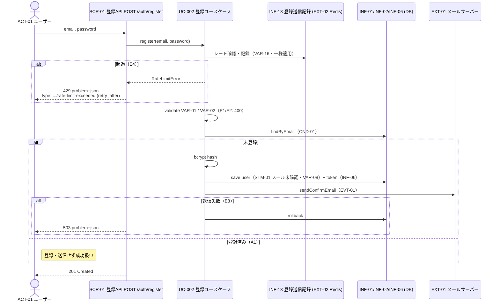

# UC-002 アカウントを登録する

| メタ | 値 |
|---|---|
| UC ID | UC-002（発番は `.docs/design/buc.md`） |
| BUC ID | BUC-U01（[buc.md](../buc.md) の該当行） |
| 主アクター | ACT-01（ユーザー） |
| 副アクター（任意） | — |

記法ノート（初見時に読む）

- 入出力は **UC—画面—アクター**（§2.1）、**UC—イベント—外部システム**（§2.2）、**UC—情報**（§2.3）の三経路で書き分ける。
- 状態遷移に関わるUCは [states.md](../states.md) の遷移トリガーと名前を揃える。
- 代替フローで見つかったビジネスルールは、仕様カタログ（[conditions.md](../conditions.md)・[variations.md](../variations.md)）へ**昇格**させる（上流優先。カタログ変更はチケットのP4関門を経る）。
- 事後条件・受け入れ条件の節は設けない。状態の変化は§2.4、扱う情報は§2.3が表現し、受け入れの実行可能な正本は**テストコード**（テスト名に本UCのIDを含め、`grep UC-002` で辿る）。
- 実装の正は**コード**。§8 はトレーサビリティ用の実装アンカー。

---

## 1. 概要

未登録の利用者（ACT-01）が、メールアドレスとパスワードでアカウントを作成する。システムは検証・重複確認・ハッシュ化のうえ `メール未確認` 状態で登録し、メール確認トークンを送信する。登録済みメールアドレスに対しても同一のレスポンス（201）を返し、アカウントの存在を漏らさない（列挙攻撃対策）。

## 2. カタログとの突合

### 2.1 UC — 画面 — アクター（人が操作する）

| SCR-NN（無ければ「なし」） | 補足（画面名・URL断片） |
|---|---|
| SCR-01（登録API） | `POST /auth/register`。本システムはUI無しのAPIサーバーのため画面=APIエンドポイント（buc.md冒頭注記） |

### 2.2 UC — イベント — 外部システム（連携・非画面入口）

| イベント（HTTPメソッド + パス、ジョブ名 等） | EXT-NN（[external-systems.md](../external-systems.md)） |
|---|---|
| EVT-01（メール確認トークン送信）— SMTP送信 | EXT-01（メールサーバー。ローカルはMailpit） |
| レート制限の一時記録（INF-13） | EXT-02（Redis） |

### 2.3 UC — 情報（システムが扱うデータ）

| INF-NN（名前） | 読み / 書き / 両方 |
|---|---|
| INF-01（ユーザー情報） | 両方（重複確認の読み・登録の書き） |
| INF-02（ロール情報） | 書き（VAR-08: `user` を付与） |
| INF-06（メール確認トークン） | 書き（生成・保存。VAR-06: 24時間・使い切り） |
| INF-13（登録送信記録） | 両方（レート確認の読み・記録の書き。Redis TTL 5分） |

### 2.4 状態遷移（該当時のみ開く）

| 状態モデル | 遷移（`STM-NN.遷移元` → `STM-NN.遷移先`） |
|---|---|
| STM-01（アカウント状態） | （初期） → STM-01.メール未確認（本UCの完了がトリガー。states.md 状態一覧の該当行） |

### 2.5 条件・バリエーション（該当時のみ開く）

| CND-NN / VAR-NN | 本UCとの関係の一言 |
|---|---|
| CND-01（メールアドレスが未登録であること） | 登録実行の前提（不成立でもレスポンスは変えない — A1） |
| VAR-01（メールアドレス形式） | ステップ2の検証規則 |
| VAR-02（パスワード強度） | ステップ3の検証規則 |
| VAR-06（メール確認トークン有効期限） | トークン生成の規則（24時間・使い切り） |
| VAR-08（一般ユーザーロール） | 付与するロール（`user`・レスポンス非包含） |
| VAR-16（登録レートリミット） | 同一メールアドレス5分に1回。**登録済み/未登録に関わらず一様に記録・判定**（判別不能性の維持） |

## 3. 主成功シナリオ（基本コース）

1. [アクター] メールアドレスとパスワードを送信する（SCR-01: `POST /auth/register`）
2. [システム] 登録送信記録（INF-13）を確認し、VAR-16（登録レートリミット）を超過していないことを判定する。超過していない場合のみ記録を更新する（固定ウィンドウ）。判定・記録は登録済み/未登録に関わらず一様に行う
3. [システム] メールアドレスの形式（VAR-01）を検証する
4. [システム] パスワード強度（VAR-02）を検証する
5. [システム] メールアドレスの重複を確認する（CND-01）
6. [システム] パスワードをbcryptでハッシュ化する
7. [システム] ユーザーを `メール未確認`（STM-01）状態で登録し、`user` ロール（VAR-08）を付与する
8. [システム] メール確認トークン（INF-06・VAR-06: 24時間・使い切り）を生成しDBに保存する
9. [システム] メール確認トークンをメールサーバー（EXT-01）経由で送信する（EVT-01）
10. [システム] 201レスポンスを返す

> ステップ7〜8は単一トランザクション。ステップ9の失敗時はロールバック（E3）。

## 4. 代替フロー・例外（代替コース）

| 条件（CND-NN。未昇格なら文章） | 振る舞い（エラーレスポンスは RFC 9457 形式・VAR-10/11 等を参照) |
|---|---|
| A1: メールアドレスが登録済み（ステップ5・CND-01不成立） | 登録処理・メール送信を行わず**201を返す**（未登録の場合と区別しない。列挙攻撃対策）。レート記録（ステップ2）は実施済みのため挙動差は生じない |
| E1: メールアドレス形式エラー（ステップ3・VAR-01違反） | 400 Bad Request・`application/problem+json`・`type: .../validation-error`。WARNINGログ（NFR-08） |
| E2: パスワード強度エラー（ステップ4・VAR-02違反） | 400 Bad Request・`application/problem+json`・`type: .../validation-error`。WARNINGログ（NFR-08） |
| E3: メール送信失敗（ステップ9） | ユーザー登録・トークン保存をロールバックし、503 Service Unavailable・`type: .../mail-delivery-error`。ERRORログ（メールアドレス・user_id はログに含めない） |
| E4: レートリミット超過（ステップ2・VAR-16） | 429 Too Many Requests・`application/problem+json`・`type: .../rate-limit-exceeded`・`retry_after` を含める。**登録済み/未登録に関わらず同一挙動**（A1の判別不能性を429で迂回させない）。WARNINGログ |

## 5. シーケンス図

<b>6. 監査ログ（該当時のみ開く）</b>

本UCは監査ログ（NFR-07）の対象操作なし（監査ログはログインから開始 — BUC-U01詳細の記載どおり）。NFR-08/NFR-09の業務ログ（UseCase INFO・E1/E2/E4 WARNING・E3 ERROR）は出力する。

<b>7. ロバストネス図（該当時のみ開く・予備設計)</b>

BUC-U01詳細のロバストネス図を基礎とする。本UCでの差分: レート制限コントロール（INF-13/EXT-02）がバウンダリ直後に入る点・エラー応答がRFC 9457形式である点。

## 8. 実装参照（突合用）

| 種別 | 参照 |
|---|---|
| HTTP（メソッド + パス） | `POST /auth/register`（SCR-01） |
| ルーティング | `backend/auth/api/http/openapi.yaml`（仕様の正本）→ `go generate` で `openapi.gen.go` に生成。配線は `backend/auth/module.go`（`RegisterHttp` → `apihttp.Register`） |
| Handler / UseCase / Job | Handler: `backend/auth/api/http/handler.go`（strict-server実装）／ UseCase: `backend/auth/app/command/register_account.go`（`RegisterAccountHandler.Handle`）／ Domain: `backend/auth/domain/registration.go`／ Repository: `backend/auth/adapters/db/users_repo.go`（sqlc生成: `dbmodels/`）／ RateLimiter: `backend/auth/adapters/ratelimit/redis.go`／ Mailer: `backend/auth/adapters/mail/smtp.go` |
| テスト | `backend/tests/unit/auth_register_test.go`（`UC-002` でgrep可）／ `backend/tests/component/auth_register_test.go`（実DB・実Redis・スタブMailer） |
| 外部連携 | EXT-01（メールサーバー・`adapters/mail/smtp.go`）・EXT-02（Redis・`adapters/ratelimit/redis.go`） |
| 設定・フラグ | `AUTH_SERVICE_PORT`・`POSTGRES_URL`・`REDIS_ADDR`・`SMTP_HOST`/`SMTP_PORT`/`SMTP_FROM`（`docker-compose.yaml`・`cmd/auth/main.go`） |
| DBスキーマ | `backend/auth/adapters/db/SCHEMA.md`（`auth.users`・`auth.user_roles`・`auth.email_confirmation_tokens`） |
