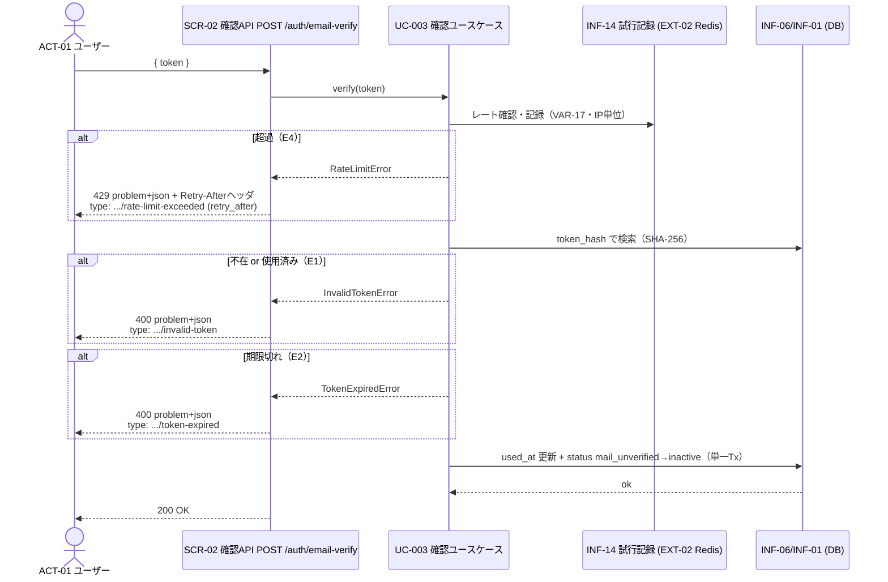

# UC-003 メールアドレスを確認する

| メタ | 値 |
|---|---|
| UC ID | UC-003（発番は `.docs/design/buc.md`） |
| BUC ID | BUC-U02（[buc.md](../buc.md) の該当行） |
| 主アクター | ACT-01（ユーザー） |
| 副アクター（任意） | — |

記法ノート（初見時に読む）

- 入出力は **UC—画面—アクター**（§2.1）、**UC—イベント—外部システム**（§2.2）、**UC—情報**（§2.3）の三経路で書き分ける。
- 状態遷移に関わるUCは [states.md](../states.md) の遷移トリガーと名前を揃える。
- 代替フローで見つかったビジネスルールは、仕様カタログ（[conditions.md](../conditions.md)・[variations.md](../variations.md)）へ**昇格**させる（上流優先。カタログ変更はチケットのP4関門を経る）。
- 事後条件・受け入れ条件の節は設けない。状態の変化は§2.4、扱う情報は§2.3が表現し、受け入れの実行可能な正本は**テストコード**（テスト名に本UCのIDを含め、`grep UC-003` で辿る）。
- 実装の正は**コード**。§8 はトレーサビリティ用の実装アンカー。

---

## 1. 概要

`mail_unverified`（メール未確認）状態のユーザー（ACT-01）が、登録時（UC-002）に受け取ったメール確認トークンを送信し、アカウントを `inactive`（未認証・ログイン可能な状態）へ遷移させる。トークンは使い切り。トークンの状態（不在・使用済み・期限切れ）を攻撃者が探索できないよう、エラー応答を最小の情報に絞る。

## 2. カタログとの突合

### 2.1 UC — 画面 — アクター（人が操作する）

| SCR-NN（無ければ「なし」） | 補足（画面名・URL断片） |
|---|---|
| SCR-02（確認API） | `POST /auth/email-verify`。画面=APIエンドポイント（buc.md冒頭注記）。トークンはJSONボディ `{ "token": "<平文>" }` で受ける（URL露出回避・T-006 Q-2） |

### 2.2 UC — イベント — 外部システム（連携・非画面入口）

| イベント（HTTPメソッド + パス、ジョブ名 等） | EXT-NN（[external-systems.md](../external-systems.md)） |
|---|---|
| レート制限の一時記録（INF-14） | EXT-02（Redis） |

> メール送信（EXT-01）は発生しない（確認は受領のみ）。

### 2.3 UC — 情報（システムが扱うデータ）

| INF-NN（名前） | 読み / 書き / 両方 |
|---|---|
| INF-06（メール確認トークン） | 両方（`token_hash` で照合・`used_at` を更新） |
| INF-01（ユーザー情報） | 書き（`status` を `mail_unverified`→`inactive`） |
| INF-14（メール確認試行記録） | 両方（IP単位のレート確認・記録。Redis TTL・キーのIPはHMAC-SHA256ハッシュ） |

### 2.4 状態遷移（該当時のみ開く）

| 状態モデル | 遷移（`STM-NN.遷移元` → `STM-NN.遷移先`） |
|---|---|
| STM-01（アカウント状態） | STM-01.メール未確認（`mail_unverified`） → STM-01.未認証（`inactive`）。states.md 状態一覧「メール未確認 → UC-003 の完了 → 未認証」に対応 |

### 2.5 条件・バリエーション（該当時のみ開く）

| CND-NN / VAR-NN | 本UCとの関係の一言 |
|---|---|
| CND-09（メール確認トークンが有効期限内であること） | 検証の前提（不成立＝E2） |
| VAR-06（メール確認トークン有効期限） | 24時間。`expires_at` の判定基準 |
| VAR-17（メール確認レートリミット・IP単位） | IP単位のレート制限（1分に10回。総当たり・abuse抑止の多層防御） |

## 3. 主成功シナリオ（基本コース）

1. [アクター] メール確認トークン（平文）を送信する（SCR-02: `POST /auth/email-verify`）
2. [システム] 送信元IPの試行記録（INF-14）を確認し、VAR-17（メール確認レートリミット）を超過していないことを判定・記録する
3. [システム] 平文トークンをSHA-256でハッシュ化し、`token_hash` で検索する
4. [システム] トークンが使用済みでない（`used_at` が null）ことを確認する
5. [システム] トークンの有効期限（`expires_at`・CND-09）を検証する
6. [システム] トークンを使用済みに更新（`used_at` に現在時刻）し、ユーザーのステータスを `mail_unverified` → `inactive` に更新する
7. [システム] 200レスポンスを返す

> ステップ6は単一トランザクション。監査ログ対象外（NFR-07）。NFR-08/09の業務ログは出力。

## 4. 代替フロー・例外（代替コース）

評価は基本フローのステップ順（**E4=レートが最初**）。**E1a/E1b/E2間は状態秘匿性のため以下の順で判定する**（不在・使用済みを期限判定より先に倒し、「トークンが実在した」ことを漏らさない）。

| 条件（CND-NN。未昇格なら文章） | 振る舞い（エラーレスポンスは RFC 9457 形式） |
|---|---|
| E4: レートリミット超過（ステップ2・VAR-17） | 429 Too Many Requests・`type: .../rate-limit-exceeded`・`retry_after`（秒・TTL残）および **`Retry-After` ヘッダ**（共通実装 `ProblemErrorHandler` が付与）。WARNINGログ |
| E1a: トークンが存在しない（ステップ3・ハッシュ一致なし） | 400 Bad Request・`application/problem+json`・`type: .../invalid-token`。WARNINGログ（`ctx: "email_verification"`） |
| E1b: トークンが使用済み（ステップ4・`used_at` 非null） | **E1aと同一の400 `invalid-token`**（状態を区別しない。既に確認完了したユーザーの再送も同じ）。WARNINGログ |
| E2: トークンが有効期限切れ（ステップ5・`expires_at` 超過・CND-09不成立） | 400 Bad Request・`type: .../token-expired`。WARNINGログ。**E1（不在・使用済み）判定を通過した後にのみ評価する** |

## 5. シーケンス図

<b>6. 監査ログ（該当時のみ開く）</b>

本UCは監査ログ（NFR-07）の対象操作なし（BUC-U02どおり）。E1/E2/E4 は NFR-08 の WARNING（ビジネス例外）を出力する。

<b>7. ロバストネス図（該当時のみ開く・予備設計)</b>

BUC-U02詳細のロバストネス図を基礎とする。本UCでの差分: レート制限コントロール（INF-14/EXT-02）がバウンダリ直後に入る点・エラー応答がRFC 9457形式である点。

## 8. 実装参照（突合用）

| 種別 | 参照 |
|---|---|
| HTTP（メソッド + パス） | `POST /auth/email-verify`（SCR-02） |
| ルーティング | `backend/auth/api/http/openapi.yaml` → 生成。配線は `backend/auth/module.go`（P5で実パス確定） |
| Handler / UseCase / Job | `backend/auth/api/http/handler.go`／ `backend/auth/app/command/`（verify系。P5で実パス確定） |
| テスト | `backend/tests/unit/`・`backend/tests/component/`（`UC-003` でgrep可。P5で実パス確定） |
| 外部連携 | EXT-02（Redis・IPレート記録） |
| 設定・フラグ | `AUTH_SERVICE_PORT`・`POSTGRES_URL`・`REDIS_ADDR`（P5で確定） |
| DBスキーマ | `backend/auth/adapters/db/SCHEMA.md`（`auth.email_confirmation_tokens`・`auth.users`） |
