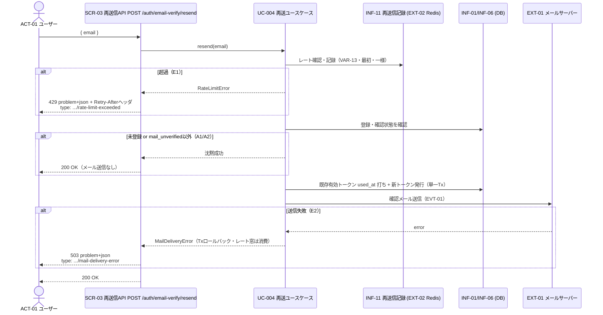

# UC-004 メール確認トークンを再送する

| メタ | 値 |
|---|---|
| UC ID | UC-004（発番は `.docs/design/buc.md`） |
| BUC ID | BUC-U03（[buc.md](../buc.md) の該当行） |
| 主アクター | ACT-01（ユーザー） |
| 副アクター（任意） | — |

記法ノート（初見時に読む）

- 入出力は UC—画面—アクター（§2.1）・UC—イベント—外部システム（§2.2）・UC—情報（§2.3）の三経路で書き分ける。
- 状態遷移に関わるUCは states.md の遷移トリガーと名前を揃える。
- 実装の正はコード。§8 はトレーサビリティ用の実装アンカー。

---

## 1. 概要

メール確認が未完了（`mail_unverified`）のユーザー（ACT-01）が、確認トークンの再送を要求する。システムは既存の有効トークンを無効化して新トークン（24時間・使い切り）を発行・送信する。トークンの状態やアカウントの存在を攻撃者に漏らさないため、**未登録・確認済みでも一律200**（メール送信なし）を返す（FR-04）。レート制限（VAR-13）は総当たり抑止と挙動差秘匿のため**最初に評価・記録**する。

## 2. カタログとの突合

### 2.1 UC — 画面 — アクター（人が操作する）

| SCR-NN | 補足 |
|---|---|
| SCR-03（再送信API） | `POST /auth/email-verify/resend`。JSONボディ `{ "email": "<address>" }`（T-005/T-006と一貫したPOST+JSON） |

### 2.2 UC — イベント — 外部システム（連携・非画面入口）

| イベント | EXT-NN |
|---|---|
| EVT-01（メール確認トークン送信） | EXT-01（メールサーバー） |
| レート制限の一時記録（INF-11） | EXT-02（Redis） |

### 2.3 UC — 情報（システムが扱うデータ）

| INF-NN（名前） | 読み / 書き / 両方 |
|---|---|
| INF-01（ユーザー情報） | 読み（存在・`status` 確認。書きはしない＝STM-01不変） |
| INF-06（メール確認トークン） | 両方（既存有効トークンの `used_at` 打ち無効化＋新トークン発行・CND-10） |
| INF-11（メール確認トークン再送信記録） | 両方（メールキーのレート確認・記録。チェック時記録・TTL 5分） |

### 2.4 状態遷移（該当時のみ開く）

| 状態モデル | 遷移 |
|---|---|
| STM-01（アカウント状態） | **遷移なし**（`mail_unverified` のまま。確認完了はUC-003側） |

### 2.5 条件・バリエーション（該当時のみ開く）

| CND-NN / VAR-NN | 本UCとの関係 |
|---|---|
| CND-10（既存有効トークンの無効化） | 新発行前に既存有効トークンの `used_at` を打つ（使い切りと同一機構・単一Tx） |
| VAR-06（メール確認トークン有効期限） | 新トークンは24時間・使い切り |
| VAR-13（メール確認トークン再送信レートリミット） | 同一メール5分に1回・IP単位のVAR-17と異なりメールキー・**一様適用**・**最初に評価/記録**・retry_after=TTL残秒＋Retry-Afterヘッダ・fail-open |

## 3. 主成功シナリオ（基本コース）

1. [アクター] メールアドレスを送信する（SCR-03: `POST /auth/email-verify/resend`）
2. [システム] メールキーのレートリミット（VAR-13）を確認・記録する（**最初**・一様適用＝以降の分岐に関わらず記録が確定する。E1）
3. [システム] メールアドレスの登録・確認状態を確認する
4. [システム] 既存の有効なメール確認トークン（`used_at IS NULL`）の `used_at` を打って無効化する（CND-10）
5. [システム] 新トークン（24時間・使い切り・INF-06）を生成・保存する
6. [システム] 確認メールを送信する（EVT-01・EXT-01）
7. [システム] 200レスポンスを返す

> ステップ4〜6は単一トランザクション（送信失敗＝E2で全ロールバック。ただしステップ2のレート記録はTx外でロールバックしない＝窓消費）。監査ログ対象外。NFR-08/09業務ログ。

## 4. 代替フロー・例外（代替コース）

**評価順はステップ順（E1=レートが最初）。** 状態による分岐（未登録・確認済み）は**一律200・メール送信なし**で秘匿する。

| 条件 | 振る舞い |
|---|---|
| E1: レートリミット超過（ステップ2・VAR-13） | 429・`type: .../rate-limit-exceeded`・`retry_after`（秒・TTL残）＋`Retry-After`ヘッダ。WARNINGログ（`ctx: "email_confirm_token_resend"`）。**登録済み/未登録・確認済み/未確認に関わらず一様に判定・記録**（挙動差で状態を漏らさない） |
| A1: 未登録メールアドレス（ステップ3） | **200**（メール送信なし・登録済みと区別しない・FR-04）。論理削除済みも未登録相当 |
| A2: 確認済み（`mail_unverified` 以外の全状態） | **200**（メール送信なし・未確認と区別しない・FR-04）。招待済み未受付・無効化済み・削除済みを包含 |
| E2: メール送信失敗（ステップ6） | 503・`type: .../mail-delivery-error`。**トークン無効化＋新発行をロールバック**（単一Tx）。ERRORログ。**ただしレート窓（ステップ2）は消費したまま**＝SMTP一時障害時は5分後に再試行可能（可用性より試行計数の一貫性を優先＝T-007と同判断・R2-2） |

> 応答タイミング差（沈黙200はトークン発行・送信をスキップするため速い）はPOC非対応（BUC-U03備考・R2-2/P2#8）。

## 5. シーケンス図

<b>6. 監査ログ（該当時のみ開く）</b>

本UCは監査ログ（NFR-07）の対象操作なし（BUC-U03どおり）。E1=WARNING・E2=ERROR のNFR-08ログを出す。

## 8. 実装参照（突合用・P5で実パス確定）

| 種別 | 参照 |
|---|---|
| HTTP | `POST /auth/email-verify/resend`（SCR-03） |
| ルーティング | `backend/auth/api/http/openapi.yaml` → 生成・`module.go` 配線（P5で確定） |
| Handler / UseCase | `handler.go`（`ResendEmailVerification`）・`app/command/resend_email_verification.go`（P5で確定） |
| RateLimiter | `adapters/ratelimit/`（メールキー・`FixedWindowLimiter`・fail-open。P5で確定） |
| テスト | `backend/tests/unit/`・`backend/tests/component/`（`UC-004` でgrep可） |
