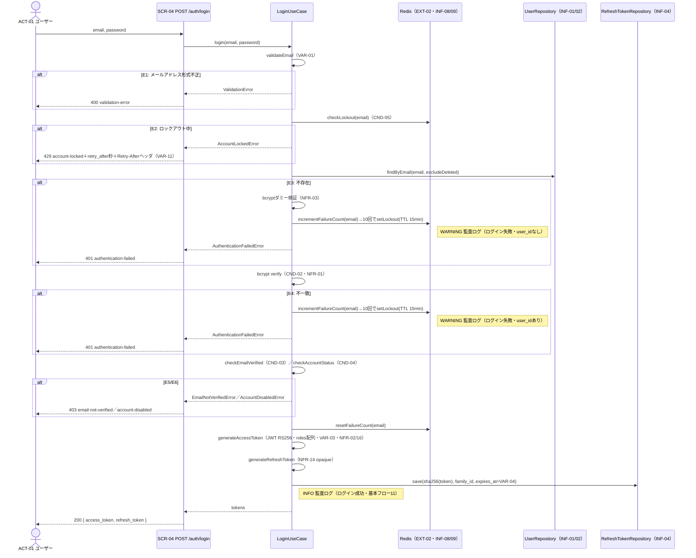

# UC-005 ログインする

| メタ | 値 |
|---|---|
| UC ID | UC-005（発番は `.docs/design/buc.md`。ファイル名はIDのみ（`UC-005.md`）） |
| BUC ID | BUC-U04（[buc.md](../buc.md) の該当行） |
| 主アクター | ACT-01（ユーザー） |
| 副アクター（任意） | ACT-02（管理者） |

記法ノート（初見時に読む）

- 入出力は **UC—画面—アクター**（§2.1）、**UC—イベント—外部システム**（§2.2）、**UC—情報**（§2.3）の三経路で書き分ける。
- 状態遷移に関わるUCは [states.md](../states.md) の遷移トリガーと名前を揃える。
- 代替フローで見つかったビジネスルールは、仕様カタログ（[conditions.md](../conditions.md)・[variations.md](../variations.md)）へ**昇格**させる（上流優先。カタログ変更はチケットのP4関門を経る）。
- 事後条件・受け入れ条件の節は設けない。状態の変化は§2.4、扱う情報は§2.3が表現し、受け入れの実行可能な正本は**テストコード**（テスト名に本UCのIDを含め、`grep UC-005` で辿る）。
- 実装の正は**コード**。§8 はトレーサビリティ用の実装アンカー。

---

## 1. 概要

登録・メール確認済みのユーザーが、メールアドレスとパスワードで認証を受け、アクセストークン（JWT RS256）とリフレッシュトークンを取得してセッション（STM-02（セッション状態））を開始する。

## 2. カタログとの突合

### 2.1 UC — 画面 — アクター（人が操作する）

| SCR-NN | 補足（画面名・URL断片） |
|---|---|
| SCR-04（ログインAPI） | `POST /auth/login` |

### 2.2 UC — イベント — 外部システム（連携・非画面入口）

なし（EXT-02（Redis）はINF-08/09の管理基盤であり入口イベントではない）。

### 2.3 UC — 情報（システムが扱うデータ）

| INF-NN（名前） | 読み / 書き / 両方 |
|---|---|
| INF-01（ユーザー情報） | 読み（削除済み除外検索・status確認） |
| INF-02（ロール情報） | 読み（rolesクレームへ格納・NFR-16） |
| INF-03（アクセストークン） | 書き（発行のみ・ステートレス） |
| INF-04（リフレッシュトークン） | 書き（NFR-14準拠・SHA-256ハッシュのみDB保存） |
| INF-08（ログイン失敗カウント） | 両方（失敗で加算・成功でリセット・TTL 15分） |
| INF-09（ロックアウト状態） | 両方（事前確認・10回到達で設定・TTL 15分） |

<b>2.4 状態遷移（該当時のみ開く）</b>

| 状態モデル | 遷移（`STM-NN.遷移元` → `STM-NN.遷移先`） |
|---|---|
| STM-02（セッション状態） | `STM-02.（初期）` → `STM-02.認証済み`（本UC成功時。アカウント状態STM-01は変わらない） |

<b>2.5 条件・バリエーション（該当時のみ開く）</b>

| CND-NN / VAR-NN | 本UCとの関係の一言 |
|---|---|
| CND-02（パスワードが一致すること） | 基本フロー5・E4 |
| CND-03（メール確認済みであること） | 基本フロー6・E5 |
| CND-04（無効化済み・削除済みでないこと） | 基本フロー4（削除済み除外）・7・E6 |
| CND-05（ロックアウト中でないこと） | 基本フロー3・E2 |
| VAR-01（メールアドレス形式） | 基本フロー2・E1 |
| VAR-03（アクセストークン有効期限=15分） | 基本フロー9 |
| VAR-04（リフレッシュトークン有効期限=30日） | 基本フロー10 |
| VAR-11（ロックアウトエラーコード・retry_after=解除までの秒数・Retry-Afterヘッダ同値） | E2 |

## 3. 主成功シナリオ（基本コース）

1. [アクター] メールアドレスとパスワードを送信する
2. [システム] メールアドレスの形式（VAR-01: RFC5322準拠・最大254文字）を検証する
3. [システム] Redisでロックアウト状態（INF-09）を確認する（CND-05）
4. [システム] メールアドレスに紐付くユーザー（削除済みを除く）をDBで検索する（INF-01）
5. [システム] パスワードをbcryptで検証する（CND-02・コストはNFR-01=12）
6. [システム] メール確認済みであることを確認する（CND-03）
7. [システム] アカウントが無効化済みでないことを確認する（CND-04）
8. [システム] Redisのログイン失敗カウント（INF-08）をリセットする
9. [システム] アクセストークン（JWT RS256〔NFR-02〕・有効期限VAR-03・発行時点のロールを `roles` 文字列配列クレームに格納〔NFR-16〕）を生成する
10. [システム] リフレッシュトークン（NFR-14: `crypto/rand` 32バイト・base64url）を生成し、SHA-256ハッシュをDBに保存する（INF-04・有効期限VAR-04）
11. [システム] 監査ログ（ログイン成功・INFO）を記録する
12. [システム] 200レスポンスでアクセストークンとリフレッシュトークンを返す

## 4. 代替フロー・例外（代替コース）

| 条件 | 振る舞い（RFC 9457形式） |
|---|---|
| E1: メールアドレス形式不正（ステップ2） | 400 `validation-error`。監査ログ対象外・ビジネス例外WARNING（`ctx: "login"`・`msg: "メールアドレス形式不正"`・NFR-08） |
| E2: ロックアウト中（ステップ3・CND-05不成立） | 429 `account-locked`・`error_code: account_locked`（VAR-11）・`retry_after: <解除までの秒数>`・HTTP `Retry-After` ヘッダ同値。監査ログ対象外・ビジネス例外WARNING（`msg: "ロックアウト中のログイン試行"`） |
| E3: ユーザー不存在（ステップ4） | bcryptダミー検証（timing attack対策・NFR-03）→失敗カウント加算（10回到達でロックアウト設定・TTL 15分）→監査ログ（ログイン失敗・WARNING・`user_id` なし）→401 `authentication-failed` |
| E4: パスワード不一致（ステップ5・CND-02不成立） | 失敗カウント加算（10回到達でロックアウト設定）→監査ログ（ログイン失敗・WARNING・`user_id` あり）→401 `authentication-failed`（**E3と区別不能な同一レスポンス**・ユーザー列挙防止） |
| E5: メール未確認（ステップ6・CND-03不成立） | 403 `email-not-verified`。監査ログ対象外・ビジネス例外WARNING（`msg: "メール未確認アカウントへのログイン試行"`） |
| E6: 無効化済み（ステップ7・CND-04不成立） | 403 `account-disabled`。監査ログ対象外・ビジネス例外WARNING（`msg: "無効化済みアカウントへのログイン試行"`） |

> 検証順序（ロックアウト→検索→パスワード→メール確認→アカウント状態）と失敗カウントの均一加算（ユーザー存在有無に関わらず）は BUC-U04 備考の設計決定に従う。**メールアドレスはログに含めない**。

## 5. シーケンス図

<b>6. 監査ログ（該当時のみ開く）</b>

| イベント | レベル |
|---|---|
| ログイン成功（基本フロー11・ターゲット: user_id） | INFO |
| ログイン失敗（E3: user_idなし／E4: user_idあり。メールアドレスは含めない） | WARNING |

（E1/E2/E5/E6は監査ログ対象外・ビジネス例外WARNINGのみ。NFR-07/08）

<b>7. ロバストネス図（該当時のみ開く・予備設計）</b>

BUC-U04（ログイン）のロバストネス図を正とする（本UCは1:1対応のため再掲しない）。

## 8. 実装参照（突合用）

| 種別 | 参照 |
|---|---|
| HTTP（メソッド + パス） | `POST /auth/login` |
| ルーティング | `backend/auth/api/http/openapi.yaml`＋生成ルート（P5で実パス確定） |
| Handler / UseCase / Job | Handler: `backend/auth/api/http/handler.go`／UseCase: `backend/auth/app/command/login.go`（予定・P5で確定）／Domain: `backend/auth/domain/`（トークン生成・P5で確定）／Repository: `backend/auth/adapters/db/`（refresh_tokens・P5で確定）／Lockout: `backend/auth/adapters/ratelimit/`＋`backend/common/ratelimit/`（P5で確定） |
| テスト | `backend/tests/unit/`・`backend/tests/component/`（UC-005でgrep可・P5で確定） |
| 外部連携 | EXT-02（Redis・INF-08/09） |
| 設定・フラグ | `JWT_PRIVATE_KEY_PATH`（予定・P5で確定）・`POSTGRES_URL`・`REDIS_ADDR` |
