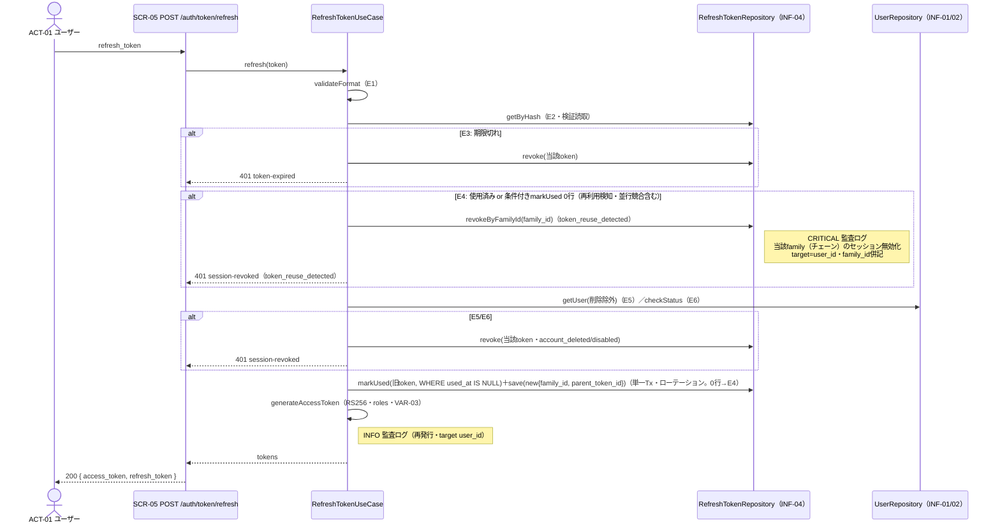

# UC-006 トークンを再発行する

| メタ | 値 |
|---|---|
| UC ID | UC-006（発番は `.docs/design/buc.md`。ファイル名はIDのみ（`UC-006.md`）） |
| BUC ID | BUC-U05（[buc.md](../buc.md) の該当行） |
| 主アクター | ACT-01（ユーザー） |
| 副アクター（任意） | ACT-02（管理者） |

記法ノート（初見時に読む）

- 入出力は **UC—画面—アクター**（§2.1）、**UC—イベント—外部システム**（§2.2）、**UC—情報**（§2.3）の三経路で書き分ける。
- 状態遷移に関わるUCは [states.md](../states.md) の遷移トリガーと名前を揃える。
- 代替フローで見つかったビジネスルールは、仕様カタログ（[conditions.md](../conditions.md)・[variations.md](../variations.md)）へ**昇格**させる（上流優先。カタログ変更はチケットのP4関門を経る）。
- 事後条件・受け入れ条件の節は設けない。状態の変化は§2.4、扱う情報は§2.3が表現し、受け入れの実行可能な正本は**テストコード**（テスト名に本UCのIDを含め、`grep UC-006` で辿る）。
- 実装の正は**コード**。§8 はトレーサビリティ用の実装アンカー。

---

## 1. 概要

有効なリフレッシュトークンを持つユーザーが、それを提示して新しいアクセストークン（JWT RS256）とリフレッシュトークンを取得する（ローテーション）。使用済みトークンの再提示は窃取の兆候として当該ローテーションチェーン（`family_id`）を一括失効させる（再利用検知）。

## 2. カタログとの突合

### 2.1 UC — 画面 — アクター（人が操作する）

| SCR-NN | 補足（画面名・URL断片） |
|---|---|
| SCR-05（トークン再発行API） | `POST /auth/token/refresh` |

### 2.2 UC — イベント — 外部システム（連携・非画面入口）

なし。

### 2.3 UC — 情報（システムが扱うデータ）

| INF-NN（名前） | 読み / 書き / 両方 |
|---|---|
| INF-04（リフレッシュトークン） | 両方（SHA-256照合で検索・used_at記録・新トークン挿入・再利用検知時はfamily一括revoke） |
| INF-01（ユーザー情報） | 読み（token→user・削除済み除外・status確認） |
| INF-02（ロール情報） | 読み（再発行時点のロールをrolesクレームへ・NFR-16） |
| INF-03（アクセストークン） | 書き（発行のみ・ステートレス） |

<b>2.4 状態遷移（該当時のみ開く）</b>

| 状態モデル | 遷移（`STM-NN.遷移元` → `STM-NN.遷移先`） |
|---|---|
| STM-02（セッション状態） | `STM-02.認証済み`（or `トークン期限切れ`） → `STM-02.認証済み`（ローテーションで新トークン発行・成功時）／再利用検知時は `STM-02.セッション失効`（`revocation_reason: token_reuse_detected`・当該family） |

<b>2.5 条件・バリエーション（該当時のみ開く）</b>

| CND-NN / VAR-NN | 本UCとの関係の一言 |
|---|---|
| CND-07（リフレッシュトークンが有効であること） | 事前条件・E3（期限）/E4（未使用） |
| CND-04（無効化済み・削除済みでないこと） | E5（削除）/E6（無効化） |
| VAR-04（リフレッシュトークン有効期限=30日） | 新トークンの期限 |
| VAR-03（アクセストークン有効期限=15分） | 新アクセストークンの期限 |
| VAR-10（セッション失効理由コード） | E4=token_reuse_detected／E5=account_deleted／E6=account_disabled |

## 3. 主成功シナリオ（基本コース）

1. [アクター] リフレッシュトークンを送信する
2. [システム] リフレッシュトークンの形式を検証する（E1）
3. [システム] DBでリフレッシュトークンを検索する（SHA-256ハッシュ照合・INF-04・E2）
4. [システム] リフレッシュトークンの有効期限を確認する（E3）
5. [システム] リフレッシュトークンが未使用（`used_at IS NULL`）であることを確認する（E4: 使用済み＝再利用検知）
6. [システム] トークンに紐付くユーザー（削除済みを除く）を取得する（INF-01・E5）
7. [システム] アカウントが無効化済みでないことを確認する（CND-04・E6）
8. [システム] 使用済みリフレッシュトークンを無効化する（`used_at=now()` を **`WHERE used_at IS NULL` 条件付きで** 記録。0行更新＝並行リクエストに先を越された＝再利用相当としてE4へ倒す）
9. [システム] 同一 `family_id`・新 `parent_token_id` で新しいリフレッシュトークン（opaque・NFR-14）を生成しDBに保存する（ローテーション。有効期限VAR-04）
10. [システム] 再発行時点のロール（INF-02）をClaimsに含むアクセストークン（JWT RS256・NFR-02・有効期限VAR-03・rolesは文字列配列〔NFR-16〕）を生成する
11. [システム] 監査ログ（アクセストークン期限切れ・再発行・INFO）を記録する
12. [システム] 200レスポンスで新しいアクセストークンとリフレッシュトークンを返す

> ステップ8-9（旧used_at更新＋新挿入）は単一トランザクション（Q-3・`common.UpdateInTx`）。同時リフレッシュの直列化は行施錠（FOR UPDATE）ではなく、ステップ8の **条件付きUPDATE（`used_at IS NULL` check-and-set）** で担保する。並行2リクエストのうち一方のみが1行更新に成功し、他方は0行更新となって再利用検知（family一括失効）へ倒れる。検証読取（ステップ3）とローテーションTxは別トランザクションのため、読取側の行ロックには依存しない（Q-5の当初FOR UPDATE案から是正・T-014 c4-BJ#1）。

## 4. 代替フロー・例外（代替コース）

| 条件 | 振る舞い（RFC 9457形式） |
|---|---|
| E1: リフレッシュトークン形式不正（ステップ2） | 401 `invalid-token`。監査ログ対象外・ビジネス例外WARNING（`ctx: "token_refresh"`・`msg: "リフレッシュトークン形式不正"`・NFR-08） |
| E2: トークンが存在しない（ステップ3） | 401 `invalid-token`。監査ログWARNING（`msg: "不正トークンでのアクセス試行"`） |
| E3: 有効期限切れ（ステップ4） | 当該トークンを失効済みに更新（`revoked_at`）→401 `token-expired`。ビジネス例外WARNING（`msg: "リフレッシュトークン有効期限切れ"`）。※`revocation_reason` はVAR-10に期限切れコードが無く、レスポンスにも含めない（BUC-U05 E3-b）。DB `revocation_reason` はnull（BJ P2#4） |
| E4: 再利用検知（ステップ5・使用済みトークンの再提示） | **同一 `family_id` の全レコードを一括失効**（`revocation_reason: token_reuse_detected`・単一Tx・部分失敗不可・失敗時500）→監査ログ **CRITICAL**（`msg: "リフレッシュトークン再利用検知・当該family（チェーン）のセッション無効化"`・target=user_id・log contextに `family_id`）→401 `session-revoked`＋`revocation_reason: token_reuse_detected` |
| E5: ユーザー不存在（削除済み・ステップ6） | 当該トークンを失効済みに更新（`revocation_reason: account_deleted`）→401 `session-revoked`＋`revocation_reason: account_deleted`。ビジネス例外WARNING（`msg: "削除済みアカウントのトークン再発行試行"`） |
| E6: アカウント無効化済み（ステップ7・CND-04不成立） | 当該トークンを失効済みに更新（`revocation_reason: account_disabled`）→401 `session-revoked`＋`revocation_reason: account_disabled`。ビジネス例外WARNING（`msg: "無効化済みアカウントのトークン再発行試行"`） |

> **評価順の注記（BJ P2#5）**: 有効期限(E3)→未使用(E4)の順（BUC-U05基本フロー4→5）。期限切れかつ使用済みのトークン再提示は先にE3で返り、E4のfamily失効に到達しない（盗難RTの期限後再利用は当該トークン失効のみ）。BUC-U05の評価順どおりの意図的設計。E5/E6は当該トークンのみ失効（family一括はE4のみ）。**リフレッシュトークン平文はログに含めない**。

## 5. シーケンス図

<b>6. 監査ログ（該当時のみ開く）</b>

| イベント | レベル |
|---|---|
| トークン再発行成功（基本フロー11・target user_id） | INFO |
| 不正トークンでのアクセス試行（E2） | WARNING |
| リフレッシュトークン再利用検知・当該family無効化（E4・target user_id・family_id併記） | CRITICAL |

（E1/E3/E5/E6はビジネス例外WARNING。NFR-07/08。NFR-08のCRITICAL定義は本来「未捕捉例外」だが、再利用検知はBUC-U05踏襲でCRITICAL＝上流既知の分類ずれ）

<b>7. ロバストネス図（該当時のみ開く・予備設計）</b>

BUC-U05（トークン再発行）のロバストネス図を正とする（本UCは1:1対応のため再掲しない）。

## 8. 実装参照（突合用）

| 種別 | 参照 |
|---|---|
| HTTP（メソッド + パス） | `POST /auth/token/refresh`（P5で実装・openapi.yaml operationId `refreshToken` 予定） |
| ルーティング / Handler | `backend/auth/api/http/handler.go`（`RefreshToken`・P5で確定） |
| UseCase | `backend/auth/app/command/refresh_token.go`（`RefreshTokenHandler.Handle`・検証順序・E1〜E6・ローテーション・再利用検知・P5で確定） |
| Domain | `backend/auth/domain/token.go`（既存: GenerateAccessToken/GenerateRefreshToken/HashRefreshToken を再利用） |
| Repository | `backend/auth/adapters/db/refresh_tokens_repo.go`（`RefreshTokenRepository`具象: GetRefreshTokenForUpdate〔読取=GetRefreshTokenByHash〕・RotateRefreshToken〔条件付きMarkRefreshTokenUsed＋InsertRefreshToken・単一Tx〕・RevokeRefreshToken・RevokeRefreshTokenFamily・GetUserForRefresh・P5で確定） |
| テスト | `backend/tests/unit/`・`backend/tests/component/`（`grep UC-006`・P5で確定） |
| 設定・フラグ | `JWT_PRIVATE_KEY_PATH`（既存）・`POSTGRES_URL` |
