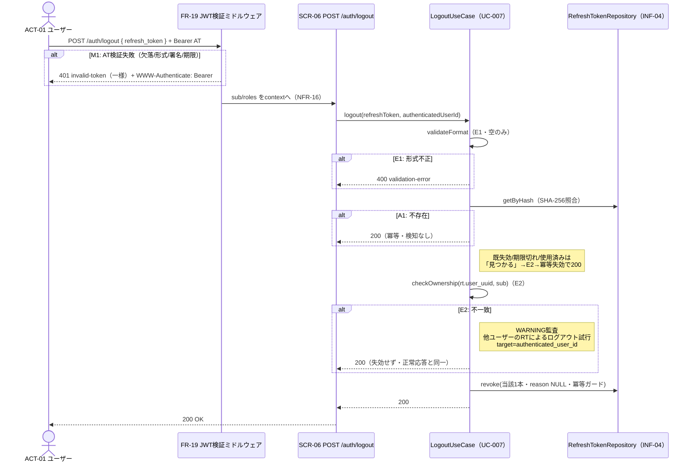

# UC-007 ログアウトする

| メタ | 値 |
|---|---|
| UC ID | UC-007（発番は `.docs/design/buc.md`。ファイル名はIDのみ（`UC-007.md`）） |
| BUC ID | BUC-U06（[buc.md](../buc.md) L44） |
| 主アクター | ACT-01（ユーザー） |
| 副アクター（任意） | ACT-02（管理者） |

記法ノート（初見時に読む）

- 入出力は **UC—画面—アクター**（§2.1）、**UC—イベント—外部システム**（§2.2）、**UC—情報**（§2.3）の三経路で書き分ける。
- 状態遷移に関わるUCは [states.md](../states.md) の遷移トリガーと名前を揃える。
- 代替フローで見つかったビジネスルールは、仕様カタログ（[conditions.md](../conditions.md)・[variations.md](../variations.md)）へ**昇格**させる（上流優先。カタログ変更はチケットの承認関門を経る）。
- 事後条件・受け入れ条件の節は設けない。状態の変化は§2.4、扱う情報は§2.3が表現し、受け入れの実行可能な正本は**テストコード**（テスト名に本UCのIDを含め、`grep UC-007` で辿る）。
- 実装の正は**コード**。§8 はトレーサビリティ用の実装アンカー。

---

## 1. 概要

認証済みユーザーが、自分のリフレッシュトークン（INF-04）を提示してセッションを自発的に終了する。提示された1本のみを失効させ（FR-07・全セッション一括はBUC-U10スコープ外）、トークンの存在有無・状態に関わらず冪等に200を返す（RFC 7009準拠の設計判断・BUC-U06備考）。本UCはFR-19（JWT検証ミドルウェア）の初実現を伴う（CND-06の前提検証）。

## 2. カタログとの突合

### 2.1 UC — 画面 — アクター（人が操作する）

| SCR-NN | 補足（画面名・URL断片） |
|---|---|
| SCR-06（ログアウトAPI） | `POST /auth/logout`（`Authorization: Bearer <アクセストークン>` 必須・openapi.yaml に `bearerAuth` securityScheme を新設） |

### 2.2 UC — イベント — 外部システム（連携・非画面入口）

なし。

### 2.3 UC — 情報（システムが扱うデータ）

| INF-NN（名前） | 読み / 書き / 両方 |
|---|---|
| INF-03（アクセストークン） | 読み（FR-19ミドルウェアで検証・`sub`/`roles` 取り出し。ブラックリスト化はしない＝有効期限まで有効のまま） |
| INF-04（リフレッシュトークン） | 両方（SHA-256照合で検索・所有権確認・`revoked_at` 記録〔reason NULL〕） |

<b>2.4 状態遷移（該当時のみ開く）</b>

| 状態モデル | 遷移（`STM-NN.遷移元` → `STM-NN.遷移先`） |
|---|---|
| STM-02（セッション状態） | `STM-02.認証済み` → `STM-02.セッション失効`（states.md L31・UC-007。アカウント状態STM-01は不変） |

> BUC-U06.md メタ・buc.md フロー表の事後状態は「STM-02.セッション失効」で統一済み（T-015 Q-3/Q3-2で是正）。

<b>2.5 条件・バリエーション（該当時のみ開く）</b>

| CND-NN / VAR-NN | 本UCとの関係の一言 |
|---|---|
| CND-06（アクセストークンが有効であること） | 事前条件。FR-19ミドルウェアで検証し、ユースケースは認証済みユーザーID（`sub`）のみを受け取る |
| VAR-15（RFC 9457 type URIベースドメイン） | M1の401 `invalid-token`・E1の400 `validation-error` の type ベース |
| VAR-03（アクセストークン有効期限） | M1（期限切れAT）の判定基準 |
| CND-17（いずれか1つのロールが条件を満たせばアクセスを許可すること） | 本UCでは未使用。FR-19ミドルウェアが `roles`（NFR-16形式）をcontextへ格納するのは後続の保護リソースがこの評価に使うため（§3ステップ2参照） |

## 3. 主成功シナリオ（基本コース）

1. [アクター] アクセストークン（`Authorization: Bearer`）を添えてリフレッシュトークンを送信する
2. [システム] FR-19ミドルウェアがアクセストークンを検証する（RS256強制・署名・exp。`sub`/`roles` をcontextへ格納。M1）
3. [システム] リフレッシュトークンの形式を検証する（空は不正・E1）
4. [システム] DBでリフレッシュトークンを検索する（SHA-256ハッシュ照合・INF-04。**不存在のみA1**＝200短絡。既失効・期限切れ・使用済みは「見つかる」ため次ステップへ進む）
5. [システム] リフレッシュトークンの `user_uuid` とアクセストークンの `sub` が一致することを確認する（E2。既失効等の状態に関わらず確認する＝不一致なら失効せずWARNING監査）
6. [システム] 当該リフレッシュトークン**1本のみ**を失効済みに更新する（`revoked_at=now()`・`revocation_reason` NULL・`WHERE revoked_at IS NULL` 冪等ガード。FR-07。**使用済み・期限切れも同様に失効させる**〔Q-2＝一律の冪等失効〕・既失効は更新0行のまま成功扱い）
7. [システム] 200レスポンスを返す（ボディ最小限・BUC-U06備考）

> **再利用検知（NFR-10）はいかなる状態のトークン提示でも発火しない**（失効要求はトークンの使用ではない・FR-07に経路限定を明記済み＝Q-5確定。使用経路=UC-006（トークンを再発行する）に限る）。

## 4. 代替フロー・例外（代替コース）

| 条件 | 振る舞い（RFC 9457形式） |
|---|---|
| M1: アクセストークン検証失敗（ステップ2・AT欠落／形式不正／署名不正／期限切れ） | **401** `application/problem+json`（`type: <VAR-15>/invalid-token`）で**一様に返す**（失敗種別を応答で区別しない＝情報漏洩防止）。`WWW-Authenticate: Bearer` ヘッダ付与。ログ: 署名不正=NFR-07監査WARNING（`msg: "JWT署名不正・改ざん検知"`）／フォーマット不正=NFR-07監査WARNING（`msg: "JWTフォーマット不正"`）／**欠落・期限切れ=監査対象外のビジネス例外WARNING**（`ctx: "jwt_verify"`・NFR-08。期限切れは正常遷移でも発生するがPOCではWARNING統一＝R2-1確定） |
| E1: リフレッシュトークン形式不正（ステップ3・空文字列） | **400** `validation-error`。ビジネス例外WARNING（`ctx: "logout"`・`msg: "リフレッシュトークン形式不正"`・監査対象外・NFR-08）。**判定基準はUC-006 E1と同一（空のみ）**。UC-006 E1が401なのに本UCが400である根拠: UC-006ではRT自体が資格情報だが、本UCの資格情報はAT（M1で検証済み）であり**RTは入力ペイロード**＝入力バリデーション違反として400（P2-BJ#6確定） |
| A1: トークンが存在しない（ステップ4） | **200**（冪等・トークンの存在有無を外部に漏洩しない・RFC 7009準拠）。※既失効・期限切れ・使用済みは「見つかる」ためA1でなくステップ5→6の冪等失効経路で200（既失効は冪等ガードで更新0行）。いずれの経路でも**family一括失効・再利用検知はしない** |
| E2: ユーザーID不一致（ステップ5） | **200**（情報漏洩防止のため正常応答と同一）。**失効は行わない**。監査ログWARNING（`ctx: "logout"`・`msg: "他ユーザーのリフレッシュトークンによるログアウト試行"`・log contextの `user_id`=authenticated_user_id〔操作主体側を記録・トークン所有者側のUUIDは記録しない＝所有情報の漏洩防止〕・NFR-08） |

## 5. シーケンス図

<b>6. 監査ログ（該当時のみ開く）</b>

| イベント | レベル |
|---|---|
| 不正トークンでのアクセス試行（E2・他ユーザーのRTによるログアウト試行・`user_id`=authenticated_user_id〔操作主体側〕） | WARNING |
| JWT署名不正・改ざん検知（M1・NFR-07表） | WARNING |
| JWTフォーマット不正（M1・NFR-07表） | WARNING |

（ログアウト自体はNFR-07の監査ログ対象外。M1の欠落・期限切れ／E1は監査対象外のビジネス例外WARNING。UseCase開始/終了INFOは基盤どおり・NFR-08）

## 8. 実装参照（突合用）

| 種別 | 参照 |
|---|---|
| HTTP（メソッド + パス） | `POST /auth/logout`（openapi.yaml operationId `logout`・200/400/401・`bearerAuth` securityScheme・P5で確定） |
| ミドルウェア（FR-19） | `backend/common/`（JWT検証: RS256強制・sub/roles context格納・401一様・P5で確定） |
| ルーティング / Handler | `backend/auth/api/http/handler.go`（`Logout`・P5で確定） |
| UseCase | `backend/auth/app/command/logout.go`（`LogoutHandler.Handle`・E1/A1/E2・冪等失効・P5で確定） |
| Domain | `backend/auth/domain/token.go`（既存: `HashRefreshToken` を再利用。検証ヘルパはP5で確定） |
| Repository | `backend/auth/adapters/db/`（既存: `RevokeRefreshToken`〔`WHERE revoked_at IS NULL` 冪等ガード・reason NULL可〕・`GetRefreshTokenByHash` を再利用・P5で確定） |
| テスト | `backend/tests/unit/`・`backend/tests/component/`（`grep UC-007`・P5で確定） |
| 設定・フラグ | `JWT_PRIVATE_KEY_PATH`（既存・検証は公開鍵側を使用）・`POSTGRES_URL` |
