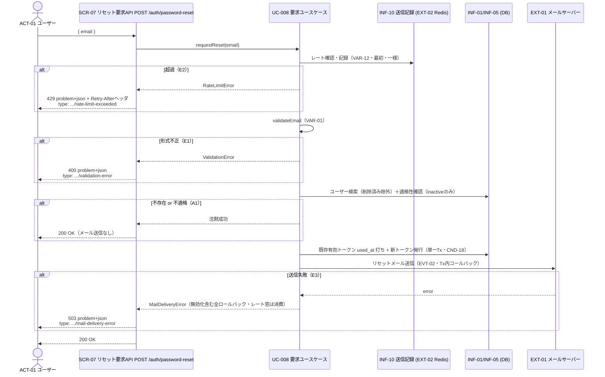

# UC-008 パスワードリセットを要求する

| メタ | 値 |
|---|---|
| UC ID | UC-008（発番は `.docs/design/buc.md`） |
| BUC ID | BUC-U07（[buc.md](../buc.md) の該当行） |
| 主アクター | ACT-01（ユーザー） |
| 副アクター（任意） | ACT-02（管理者。同一経路を利用・BUC-U07） |

記法ノート（初見時に読む）

- 入出力は UC—画面—アクター（§2.1）・UC—イベント—外部システム（§2.2）・UC—情報（§2.3）の三経路で書き分ける。
- 状態遷移に関わるUCは states.md の遷移トリガーと名前を揃える。
- 実装の正はコード。§8 はトレーサビリティ用の実装アンカー。

---

## 1. 概要

パスワードを忘れたユーザー（ACT-01）が、メールアドレスを提示してリセットトークン（INF-05・30分・使い切り）の発行とメール送信を要求する。アカウントの存在・状態を攻撃者に漏らさないため、**不存在・不適格でも一律200**（メール送信なし）を返す（FR-08）。レート制限（VAR-12）は総当たり抑止と挙動差秘匿のため**最初に評価・記録**する（UC-004（メール確認トークンを再送する）と同型・T-018 Q-3確定）。

## 2. カタログとの突合

### 2.1 UC — 画面 — アクター（人が操作する）

| SCR-NN | 補足 |
|---|---|
| SCR-07（リセット要求API） | `POST /auth/password-reset`。JSONボディ `{ "email": "<address>" }`。認証不要（FR-19ミドルウェア適用外・BUC-U07事前条件なし） |

### 2.2 UC — イベント — 外部システム（連携・非画面入口）

| イベント | EXT-NN |
|---|---|
| EVT-02（パスワードリセットトークン送信） | EXT-01（メールサーバー） |
| レート制限の一時記録（INF-10） | EXT-02（Redis） |

### 2.3 UC — 情報（システムが扱うデータ）

| INF-NN（名前） | 読み / 書き / 両方 |
|---|---|
| INF-01（ユーザー情報） | 読み（存在・`status` 確認。書きはしない＝STM-01不変） |
| INF-05（パスワードリセットトークン） | 両方（既存有効トークンの `used_at` 打ち無効化＋新トークン発行・単一Tx・T-018 Q-5確定） |
| INF-10（パスワードリセット送信記録） | 両方（メールキーのレート確認・記録。チェック時記録・TTL 5分・T-018 Q-3確定） |

<b>2.4 状態遷移（該当時のみ開く）</b>

| 状態モデル | 遷移 |
|---|---|
| STM-03（パスワードリセット状態） | `STM-03.（初期）` → `STM-03.パスワードリセット中`（states.md・UC-008（パスワードリセットを要求する）・トークン発行） |
| STM-01（アカウント状態） | **遷移なし**（読みのみ） |

<b>2.5 条件・バリエーション（該当時のみ開く）</b>

| CND-NN / VAR-NN | 本UCとの関係の一言 |
|---|---|
| VAR-01（メールアドレス形式） | RFC5322準拠・最大254文字（E1） |
| VAR-05（パスワードリセットトークン有効期限） | 新トークンは30分・使い切り |
| VAR-12（パスワードリセットレートリミット） | 同一メール5分に1回・メールキー・**一様適用**・**最初に評価/記録**・`retry_after`=TTL残秒＋`Retry-After`ヘッダ・fail-open（VAR-13同型） |
| CND-18（リセットトークンの有効は常に最大1本） | 発行時に既存有効トークンを無効化してから新発行（CND-10同型・T-018 Q-5確定） |

## 3. 主成功シナリオ（基本コース）

1. [アクター] メールアドレスを送信する（SCR-07: `POST /auth/password-reset`）
2. [システム] メールキーのレートリミット（VAR-12）を確認・記録する（**最初**・一様適用＝以降の分岐に関わらず記録が確定する。E2）
3. [システム] メールアドレスの形式を検証する（VAR-01・E1）
4. [システム] メールアドレスに紐付くユーザーを検索する（削除済み除外・INF-01）
5. [システム] 適格性を確認する: `status == inactive`（`STM-01.未認証`）のみ適格（states.md準拠・T-018 Q-7確定。不存在・不適格はA1）
6. [システム] 既存の有効なリセットトークン（`used_at IS NULL`）の `used_at` を打って無効化する（CND-18）
7. [システム] 新トークン（30分・使い切り・INF-05・opaque＋SHA-256〔NFR-15〕・平文はメールのみ）を生成・保存する
8. [システム] リセットメールを送信する（EVT-02・EXT-01・平文トークンを含む）
9. [システム] 200レスポンスを返す（ボディ最小限・A1と同一応答）

> ステップ6〜8は単一トランザクション（送信はTx内コールバック＝UC-004 `ReissueEmailConfirmationToken` 同型。送信失敗＝E3で無効化を含む全ロールバック・旧有効トークンが残る。ただしステップ2のレート記録はTx外でロールバックしない＝窓消費。T-018 Q-3/Q-6確定）。監査ログ対象外。NFR-08/09業務ログ。

## 4. 代替フロー・例外（代替コース）

**評価順はステップ順（E2=レートが最初）。** 状態による分岐（不存在・不適格）は**一律200・メール送信なし**で秘匿する。

| 条件 | 振る舞い |
|---|---|
| E2: レートリミット超過（ステップ2・VAR-12） | 429・`type: .../rate-limit-exceeded`・`retry_after`（秒・TTL残）＋`Retry-After`ヘッダ。WARNINGログ（`ctx: "password_reset_request"`・`msg: "パスワードリセット要求レートリミット超過"`）。**存在・状態に関わらず一様に判定・記録**（挙動差で状態を漏らさない） |
| E1: メールアドレス形式不正（ステップ3・VAR-01違反） | 400・`type: .../validation-error`。WARNINGログ（`ctx: "password_reset_request"`・`msg: "メールアドレス形式不正"`）。**パース不能な入力はopenapi `format: email` のバインド検証が全エンドポイント一律400で先に弾く**（UC-002/UC-004と同一挙動・状態を漏らさない一様応答。ステップ2〜3の評価順はバインドを通過した入力に適用） |
| A1: ユーザー不存在・不適格（ステップ4-5。不存在＝削除済み含む／`mail_unverified`・`disabled`） | **200**（メール送信なし・トークン発行なし・成功時と区別しない・FR-08）。レート記録はステップ2で確定済みのため追加処理なし |
| E3: メール送信失敗（ステップ8） | 503・`type: .../mail-delivery-error`。**既存トークン無効化＋新発行を全ロールバック**（単一Tx・旧有効トークンはそのまま残る）。ERRORログ（`msg: "リセットメール送信失敗"`）。**ただしレート窓（ステップ2）は消費したまま**＝SMTP一時障害時は5分後に再試行可能（UC-004 E2と同判断） |

## 5. シーケンス図

<b>6. 監査ログ（該当時のみ開く）</b>

本UCは監査ログ（NFR-07）の対象操作なし（BUC-U07どおり・監査INFOはUC-009（パスワードリセットを完了する）側）。E1/E2=WARNING・E3=ERROR のNFR-08ログを出す。**リセットトークン平文はログに含めない**（NFR-09）。

## 8. 実装参照（突合用）

| 種別 | 参照 |
|---|---|
| HTTP | `POST /auth/password-reset`（SCR-07・`backend/auth/api/http/openapi.yaml` operationId `requestPasswordReset`・200/400/429〔Retry-Afterヘッダ宣言付き〕/503・securityなし） |
| ルーティング / Handler | `backend/auth/api/http/handler.go`（`(*Handler).RequestPasswordReset`・429は`WithRetryAfter`切り上げ）。配線: `backend/auth/module.go`（`NewRequestPasswordResetHandler(users, deps.ResetLimiter, deps.Mailer)`）・`backend/cmd/auth/main.go` |
| UseCase | `backend/auth/app/command/request_password_reset.go`（`(*RequestPasswordResetHandler).Handle`・レート最初→VAR-01→適格性`StatusInactive`のみ→発行Tx内送信） |
| Domain | `backend/auth/domain/password_reset.go`（`NewPasswordResetToken`・`PasswordResetTokenTTL`=30分・`PasswordResetRateLimitWindow`=5分・opaque＋SHA-256） |
| RateLimiter | `backend/auth/adapters/ratelimit/passwordreset.go`（`NewPasswordResetLimiter`・`password_reset:` キーの `FixedWindowLimiter`・fail-open） |
| Repository | `backend/auth/adapters/db/password_reset_tokens_repo.go`（`IssuePasswordResetToken`・無効化＋保存＋送信コールバックの単一Tx）。migration `0004_password_reset_tokens`・sqlc: `queries/password_reset_tokens.sql` |
| Mailer | `backend/auth/app/command/register_account.go`（`Mailer.SendPasswordResetEmail`）・実装 `backend/auth/adapters/mail/smtp.go` |
| テスト | unit: `backend/tests/unit/auth_password_reset_request_test.go`・`auth_password_reset_token_test.go`／component: `backend/tests/component/password_reset_repo_test.go`・`password_reset_realserver_test.go`（`grep UC-008`） |
