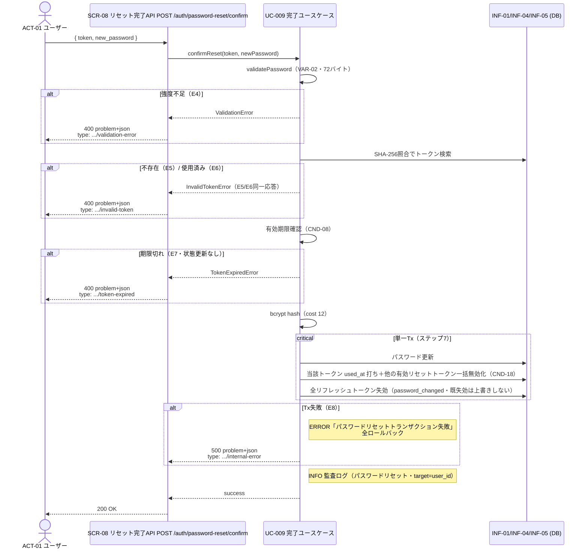

# UC-009 パスワードリセットを完了する

| メタ | 値 |
|---|---|
| UC ID | UC-009（発番は `.docs/design/buc.md`） |
| BUC ID | BUC-U07（[buc.md](../buc.md) の該当行） |
| 主アクター | ACT-01（ユーザー） |
| 副アクター（任意） | ACT-02（管理者。同一経路を利用・BUC-U07） |

記法ノート（初見時に読む）

- 入出力は UC—画面—アクター（§2.1）・UC—イベント—外部システム（§2.2）・UC—情報（§2.3）の三経路で書き分ける。
- 状態遷移に関わるUCは states.md の遷移トリガーと名前を揃える。
- 実装の正はコード。§8 はトレーサビリティ用の実装アンカー。

---

## 1. 概要

リセットメールを受け取ったユーザー（ACT-01）が、リセットトークン（INF-05）と新パスワードを提示してパスワードを再設定する。トークン検証（不存在・使用済み・期限切れ）を経て、**パスワード更新・当該トークン使用済み化・他の有効リセットトークン一括無効化・全リフレッシュトークン失効（`password_changed`）を単一トランザクション**で実行する（FR-09・T-018 Q-5確定）。認証不要（未認証経路・FR-19ミドルウェア適用外）。

## 2. カタログとの突合

### 2.1 UC — 画面 — アクター（人が操作する）

| SCR-NN | 補足 |
|---|---|
| SCR-08（リセット完了API） | `POST /auth/password-reset/confirm`。JSONボディ `{ "token": "<平文トークン>", "new_password": "<新パスワード>" }`。認証不要（securityなし） |

### 2.2 UC — イベント — 外部システム（連携・非画面入口）

なし。

### 2.3 UC — 情報（システムが扱うデータ）

| INF-NN（名前） | 読み / 書き / 両方 |
|---|---|
| INF-05（パスワードリセットトークン） | 両方（SHA-256照合で検索・当該トークン `used_at` 打ち＋他の有効トークン一括無効化・Q-5） |
| INF-01（ユーザー情報） | 両方（トークンの `user_uuid` からユーザー特定・`password_hash` 更新） |
| INF-04（リフレッシュトークン） | 書き（当該ユーザーの全レコードを `revoked_at`＋`revocation_reason: password_changed` で失効・既失効は上書きしない） |

<b>2.4 状態遷移（該当時のみ開く）</b>

| 状態モデル | 遷移 |
|---|---|
| STM-03（パスワードリセット状態） | `STM-03.パスワードリセット中` → 終了（トークン使用済み・states.md・UC-009（パスワードリセットを完了する）。他の有効トークンも一括無効化で終了＝states.md第3終端経路・CND-18） |
| STM-02（セッション状態） | `STM-02.認証済み` → `STM-02.セッション失効`（全リフレッシュトークン失効・`password_changed`・states.md） |
| STM-01（アカウント状態） | **遷移なし**（`inactive` のまま＝事後 `STM-01.未認証`・BUC-U07） |

<b>2.5 条件・バリエーション（該当時のみ開く）</b>

| CND-NN / VAR-NN | 本UCとの関係の一言 |
|---|---|
| CND-08（リセットトークンが有効期限内であること） | 完了の前提（E7・`expires_at` 判定のみ＝状態更新なしno-op・T-018 Q-2確定） |
| VAR-02（パスワード強度） | 新パスワードの検証基準（15〜64文字・UTF-8で72バイト以下・E4） |
| VAR-05（パスワードリセットトークン有効期限） | 30分（CND-08の判定基準） |
| VAR-10（セッション失効理由コード） | `password_changed`（パスワードリセットもパスワード変更の一形態・BUC-U07備考） |
| CND-18（リセットトークンの有効は常に最大1本） | 完了Txで当該ユーザーの他の有効トークンも一括無効化（完了後の別トークン再利用を封じる・T-018 Q-5確定） |

## 3. 主成功シナリオ（基本コース）

1. [アクター] リセットトークンと新しいパスワードを送信する（SCR-08: `POST /auth/password-reset/confirm`）
2. [システム] 新しいパスワードの強度を検証する（VAR-02・72バイト条項含む・E4）
3. [システム] トークンをSHA-256ハッシュ照合でDB検索する（INF-05。不存在はE5）
4. [システム] トークンが未使用であることを確認する（`used_at IS NULL`。使用済みはE6）
5. [システム] トークンの有効期限を確認する（CND-08・VAR-05。期限切れはE7・状態更新なし）
6. [システム] 新しいパスワードをbcryptでハッシュ化する（`domain.PasswordBcryptCost`=12）
7. [システム] **単一トランザクション**で、パスワードを更新し、当該トークンを使用済みに更新し、当該ユーザーの**他の有効リセットトークンを一括無効化**（CND-18）し、当該ユーザーの**全リフレッシュトークン**を失効する（`revocation_reason: password_changed`・`WHERE revoked_at IS NULL` 冪等ガード・E8）
8. [システム] 監査ログ（パスワードリセット・INFO・target=user_id・NFR-07）を記録する
9. [システム] 200レスポンスを返す（ボディ最小限）

> 発行済みアクセストークンは失効しない（stateless・自然失効・T-015/T-016と一貫＝指示書§2非対象）。

## 4. 代替フロー・例外（代替コース）

**評価順はステップ順。** E5とE6は応答・ログとも同一（トークンの状態を攻撃者に区別させない・BUC-U07）。

| 条件 | 振る舞い（RFC 9457形式） |
|---|---|
| E4: 新パスワード強度不足（ステップ2・VAR-02違反） | **400** `validation-error`。WARNINGログ（`ctx: "password_reset_confirm"`・`msg: "パスワード強度不足"`・NFR-08・監査対象外） |
| E5: トークン不存在（ステップ3） | **400** `invalid-token`。WARNINGログ（`msg: "無効なリセットトークン"`） |
| E6: トークン使用済み（ステップ4。一括無効化されたトークンの提示も本経路に合流） | **400** `invalid-token`・**E5と応答・msg同一**（状態を区別しない） |
| E7: トークン期限切れ（ステップ5・CND-08違反） | **400** `token-expired`。**DB書き込みなし（no-op・`expires_at` 判定のみ・Q-2確定）**。WARNINGログ（`msg: "リセットトークン有効期限切れ"`） |
| E8: トランザクション失敗（ステップ7） | **500** `internal-error`。全ロールバック（パスワード・トークン状態・セッションとも変更前へ）。ERRORログ（`msg: "パスワードリセットトランザクション失敗"`・NFR-08） |

## 5. シーケンス図

<b>6. 監査ログ（該当時のみ開く）</b>

| イベント | レベル |
|---|---|
| パスワードリセット（基本フロー完了時・target=user_id・全セッション無効化を含む） | INFO |

（E4〜E7は監査対象外のビジネス例外WARNING・E8はERROR。NFR-08。**トークン平文・パスワード平文・ハッシュはログに含めない**＝NFR-09）

## 8. 実装参照（突合用）

| 種別 | 参照 |
|---|---|
| HTTP | `POST /auth/password-reset/confirm`（SCR-08・`backend/auth/api/http/openapi.yaml` operationId `confirmPasswordReset`・200/400/500・securityなし） |
| ルーティング / Handler | `backend/auth/api/http/handler.go`（`(*Handler).ConfirmPasswordReset`・空トークンは400必須検査・未分類は500 `internal-error` 型）。配線: `backend/auth/module.go`（`NewConfirmPasswordResetHandler(users)`） |
| UseCase | `backend/auth/app/command/confirm_password_reset.go`（`(*ConfirmPasswordResetHandler).Handle`・E4→E5/E6同一→E7 no-op→hash→完了Tx・consume競合はE6相当・`ErrInvalidResetToken`/`ErrResetTokenExpired`） |
| Domain | `backend/auth/domain/password_reset.go`（`HashPasswordResetToken`・`PasswordResetTokenRecord.Used/Expired`）・`registration.go`（`ValidatePassword`・`PasswordBcryptCost`=12） |
| Repository | `backend/auth/adapters/db/password_reset_tokens_repo.go`（`ConfirmPasswordReset`・消費＋一括無効化＋パスワード更新＋`RevokeRefreshTokensByUser`の単一Tx）。sqlc: `queries/password_reset_tokens.sql`・`queries/users.sql`・`queries/refresh_tokens.sql` |
| 失効理由定数 | `backend/auth/app/command/revocation_reason.go`（`RevocationReasonPasswordChanged`） |
| テスト | unit: `backend/tests/unit/auth_password_reset_confirm_test.go`／component: `backend/tests/component/password_reset_repo_test.go`・`password_reset_realserver_test.go`（`grep UC-009`） |
