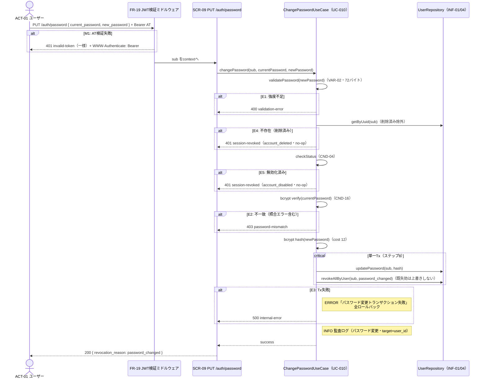

# UC-010 パスワードを変更する

| メタ | 値 |
|---|---|
| UC ID | UC-010（発番は `.docs/design/buc.md`。ファイル名はIDのみ（`UC-010.md`）） |
| BUC ID | BUC-U08（[buc.md](../buc.md) 該当行） |
| 主アクター | ACT-01（ユーザー） |
| 副アクター（任意） | ACT-02（管理者） |

記法ノート（初見時に読む）

- 入出力は **UC—画面—アクター**（§2.1）、**UC—イベント—外部システム**（§2.2）、**UC—情報**（§2.3）の三経路で書き分ける。
- 状態遷移に関わるUCは [states.md](../states.md) の遷移トリガーと名前を揃える。
- 代替フローで見つかったビジネスルールは、仕様カタログ（[conditions.md](../conditions.md)・[variations.md](../variations.md)）へ**昇格**させる（上流優先。カタログ変更はチケットの承認関門を経る）。
- 事後条件・受け入れ条件の節は設けない。状態の変化は§2.4、扱う情報は§2.3が表現し、受け入れの実行可能な正本は**テストコード**（テスト名に本UCのIDを含め、`grep UC-010` で辿る）。
- 実装の正は**コード**。§8 はトレーサビリティ用の実装アンカー。

---

## 1. 概要

認証済みユーザーが、現在のパスワードを再確認（CND-16）のうえパスワードを変更し、当該ユーザーの**全リフレッシュトークン**を一括失効する（`VAR-10: password_changed`・FR-10）。漏洩した可能性のある旧パスワード由来のセッションを全デバイスで無効化し、再ログインを要求する（BUC-U08備考）。CND-06の前提検証はFR-19（JWT検証ミドルウェア・T-015実現済み）を再利用する。

## 2. カタログとの突合

### 2.1 UC — 画面 — アクター（人が操作する）

| SCR-NN | 補足（画面名・URL断片） |
|---|---|
| SCR-09（パスワード変更API） | `PUT /auth/password`（`Authorization: Bearer <アクセストークン>` 必須・`bearerAuth` 宣言） |

### 2.2 UC — イベント — 外部システム（連携・非画面入口）

なし。

### 2.3 UC — 情報（システムが扱うデータ）

| INF-NN（名前） | 読み / 書き / 両方 |
|---|---|
| INF-01（ユーザー情報） | 両方（subで検索・削除済み除外・status確認・`password_hash` 照合と更新） |
| INF-03（アクセストークン） | 読み（FR-19ミドルウェアで検証・`sub` 取り出し。即時無効化はしない＝自然失効） |
| INF-04（リフレッシュトークン） | 書き（当該ユーザーの全レコードを `revoked_at`＋`revocation_reason: password_changed` で失効・既失効は上書きしない） |

<b>2.4 状態遷移（該当時のみ開く）</b>

| 状態モデル | 遷移（`STM-NN.遷移元` → `STM-NN.遷移先`） |
|---|---|
| STM-02（セッション状態） | `STM-02.認証済み` → `STM-02.セッション失効`（states.md・UC-010（パスワードを変更する）・`password_changed`。アカウント状態STM-01は不変） |

<b>2.5 条件・バリエーション（該当時のみ開く）</b>

| CND-NN / VAR-NN | 本UCとの関係の一言 |
|---|---|
| CND-06（アクセストークンが有効であること） | 事前条件。FR-19ミドルウェアで検証（失敗は401一様=M1） |
| CND-16（現在のパスワードが一致すること） | 操作の前提。セッション乗っ取り対策（AT漏洩だけでは変更不可） |
| CND-04（アカウントが無効化済み・削除済みでないこと） | フロー4-5の判定（E4/E5） |
| VAR-02（パスワード強度） | 新パスワードの検証基準（15〜64文字・Unicode許容・混在強制なし・UTF-8で72バイト以下） |
| VAR-10（セッション失効理由コード） | `password_changed`（全失効・応答にも包含）／E4/E5の `account_deleted`/`account_disabled` |
| VAR-03（アクセストークン有効期限） | 非対象判断の根拠（ATは最長15分で自然失効） |
| VAR-15（RFC 9457 type URIベースドメイン） | 401 `invalid-token`（M1）・400 `validation-error`・403 `password-mismatch`・401 `session-revoked`・500 `internal-error` の type ベース |

## 3. 主成功シナリオ（基本コース）

1. [アクター] アクセストークン（`Authorization: Bearer`）を添えて現在のパスワードと新しいパスワードを送信する
2. [システム] FR-19ミドルウェアがアクセストークンを検証し `sub` をcontextへ格納する（M1）
3. [システム] 新しいパスワードの強度を検証する（VAR-02・72バイト条項含む・E1）
4. [システム] `sub` でユーザーを検索する（削除済みを除く・INF-01。不存在はE4）
5. [システム] アカウントが無効化済みでないことを確認する（CND-04・E5）
6. [システム] 現在のパスワードをbcryptで照合する（CND-16・E2。**currentPasswordは形式検証せず**、72バイト超等の照合エラーも不一致=E2へ倒す〔資格情報の検証失敗・安全側〕）
7. [システム] 新しいパスワードをbcryptでハッシュ化する（`domain.PasswordBcryptCost`=12）
8. [システム] **単一トランザクション**でパスワードを更新し、当該ユーザーの**全リフレッシュトークン**を失効する（`revocation_reason: password_changed`・family横断のuser単位・`WHERE revoked_at IS NULL` 冪等ガードで既失効の先行理由を上書きしない・E3）
9. [システム] 監査ログ（パスワード変更・INFO・target=user_id・NFR-07）を記録する
10. [システム] 200レスポンスを返す（body: `revocation_reason: password_changed`・FR-10）

> 現在と同一の新パスワードも通常フローで許容する（T-016 Q-2確定＝実質的な全セッション失効操作として正当）。発行済みアクセストークンは失効しない（自然失効・T-016 Q-3確定）。
> ステップ2（AT検証）と3（強度検証）の順序はBUC-U08基本フロー2-3と逆になる（ミドルウェア構造上ATの検証が常に先行するため。BUC側の例外写像はE1=強度検証で不変）。

## 4. 代替フロー・例外（代替コース）

| 条件 | 振る舞い（RFC 9457形式） |
|---|---|
| M1: アクセストークン検証失敗（ステップ2・FR-19） | **401** `invalid-token` 一様＋`WWW-Authenticate: Bearer`（UC-007（ログアウトする）M1と同一・FR-19既定。ログ4種もFR-19既定どおり） |
| E1: 新パスワード強度不足（ステップ3・VAR-02違反〔文字数・72バイト〕） | **400** `validation-error`。ビジネス例外WARNING（`ctx: "password_change"`・`msg: "パスワード強度不足"`・NFR-08・監査対象外） |
| E4: ユーザー不存在＝削除済み（ステップ4） | **401** `session-revoked`＋`revocation_reason: account_deleted`（UC-006（トークンを再発行する）E5先例の応答形式。**トークン状態は変更しないno-op**）。ビジネス例外WARNING（`msg: "削除済みアカウントの操作試行"`・NFR-08・監査対象外） |
| E5: アカウント無効化済み（ステップ5・CND-04違反） | **401** `session-revoked`＋`revocation_reason: account_disabled`（同上・no-op）。ビジネス例外WARNING（`msg: "無効化済みアカウントの操作試行"`） |
| E2: 現在のパスワード不一致（ステップ6・CND-16違反） | **403** `password-mismatch`（認証済みだが操作にはパスワード再確認が必要・401はJWT認証失敗と区別＝BUC-U08備考）。ビジネス例外WARNING（`msg: "現在のパスワード不一致"`）。**試行回数制限なし**（NFR-03非連動・POC受容=T-016 Q-4確定） |
| E3: トランザクション失敗（ステップ8） | **500** `internal-error`。全ロールバック（パスワード・セッションとも変更前へ）。ERRORログ（`msg: "パスワード変更トランザクション失敗"`・fail-closed・NFR-08） |

## 5. シーケンス図

<b>6. 監査ログ（該当時のみ開く）</b>

| イベント | レベル |
|---|---|
| パスワード変更（基本フロー完了時・target=user_id・全セッション無効化を含む） | INFO |

（M1のログ4種はFR-19既定。E1/E2/E4/E5は監査対象外のビジネス例外WARNING・E3はERROR。NFR-08。**現在/新パスワード平文・ハッシュはログに含めない**＝NFR-09）

## 8. 実装参照（突合用）

| 種別 | 参照 |
|---|---|
| HTTP（メソッド + パス） | `PUT /auth/password`（`backend/auth/api/http/openapi.yaml` operationId `changePassword`・200=`PasswordChangeResponse{revocation_reason}`のみ/400/401〔WWW-Authenticateヘッダ宣言付き〕/403/500・`bearerAuth`） |
| ミドルウェア（FR-19） | `backend/common/http/jwtauth.go`（既存 `JWTAuth` 流用）。ルート適用: `backend/auth/api/http/handler.go` の `protectedRouter`（POST/PUTオーバーライド・保護マップ）＋トリップワイヤ（`backend/tests/unit/auth_logout_http_test.go`・メソッド対応） |
| ルーティング / Handler | `backend/auth/api/http/handler.go`（`(*Handler).ChangePassword`・E3ほか未分類は500 `internal-error` 型）。配線: `backend/auth/module.go`（`NewChangePasswordHandler(users)`） |
| UseCase | `backend/auth/app/command/change_password.go`（`(*ChangePasswordHandler).Handle`・E1→E4→E5→E2→hash→Tx・`RevocationReasonPasswordChanged` 定数・`domain.VerifyPassword` 共通照合） |
| Domain | `backend/auth/domain/registration.go`（`ValidatePassword`〔72バイト検証〕・`PasswordBcryptCost`=12）・`backend/auth/domain/token.go`（`VerifyPassword`） |
| Repository | `backend/auth/adapters/db/users_repo.go`（`GetUserCredentials`〔`GetUserByUuid`流用〕・`ChangePassword`〔単一Tx: `UpdateUserPassword` :execrows＋`RevokeRefreshTokensByUser`〕）。クエリ: `queries/users.sql`・`queries/refresh_tokens.sql` |
| テスト | unit: `backend/tests/unit/auth_change_password_test.go`・`auth_change_password_http_test.go`／component: `backend/tests/component/password_change_repo_test.go`・`password_change_realserver_test.go`（`grep UC-010`） |
| 設定・フラグ | `JWT_PRIVATE_KEY_PATH`（既存）・`POSTGRES_URL` |
