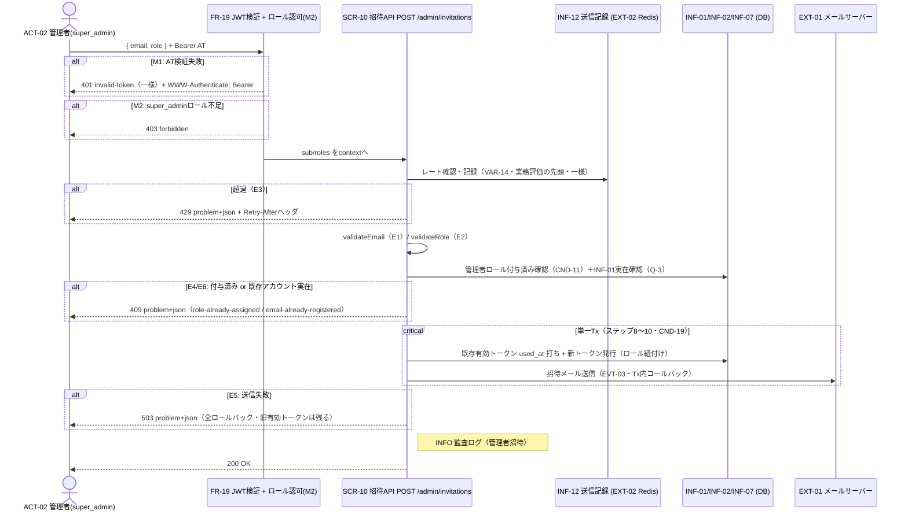

# UC-011 管理者を招待する

| メタ | 値 |
|---|---|
| UC ID | UC-011（発番は `.docs/design/buc.md`） |
| BUC ID | BUC-A01（[buc.md](../buc.md) の該当行） |
| 主アクター | ACT-02（管理者・`super_admin` のみ） |
| 副アクター（任意） | — |

記法ノート（初見時に読む）

- 入出力は UC—画面—アクター（§2.1）・UC—イベント—外部システム（§2.2）・UC—情報（§2.3）の三経路で書き分ける。
- 状態遷移に関わるUCは states.md の遷移トリガーと名前を揃える。
- 実装の正はコード。§8 はトレーサビリティ用の実装アンカー。

---

## 1. 概要

`super_admin` 管理者（ACT-02）が、メールアドレスと付与ロール（VAR-09）を指定して招待トークン（INF-07・24時間・使い切り・ロールはDBレコード紐付け）を発行しメール送信する（FR-11）。再招待時は既存の有効トークンを無効化してから新発行（FR-12・CND-19: 有効トークン常に最大1本）。**初のロール認可**（M2: `super_admin` 以外は403・CND-17 OR評価）と、既存アカウント実在時の招待遮断（T-019 Q-3確定・アカウント乗っ取り経路の封止）を含む。事後の「招待済み未受付」は**INF-07の有効未使用トークンの存在で表す**（STM-01遷移なし・T-019 Q-2=B案）。

## 2. カタログとの突合

### 2.1 UC — 画面 — アクター（人が操作する）

| SCR-NN | 補足 |
|---|---|
| SCR-10（招待API） | `POST /admin/invitations`。JSONボディ `{ "email": "<address>", "role": "<VAR-09のいずれか>" }`。`Authorization: Bearer` 必須（`bearerAuth`＋`super_admin` ロール要件） |

### 2.2 UC — イベント — 外部システム（連携・非画面入口）

| イベント | EXT-NN |
|---|---|
| EVT-03（招待トークン送信） | EXT-01（メールサーバー） |
| レート制限の一時記録（INF-12） | EXT-02（Redis） |

### 2.3 UC — 情報（システムが扱うデータ）

| INF-NN（名前） | 読み / 書き / 両方 |
|---|---|
| INF-01（ユーザー情報） | 読み（同一メールの実在確認・実在時は招待不可＝Q-3。書きはしない） |
| INF-02（ロール情報） | 読み（招待対象への管理者ロール付与済み確認・CND-11） |
| INF-07（招待トークン） | 両方（既存有効トークンの `used_at` 打ち無効化＋新トークン発行・単一Tx・FR-12） |
| INF-12（招待トークン送信記録） | 両方（メールキーのレート確認・記録。チェック時記録・TTL 5分） |

<b>2.4 状態遷移（該当時のみ開く）</b>

| 状態モデル | 遷移 |
|---|---|
| STM-01（アカウント状態） | **遷移なし**（ユーザーレコードを作らない・Q-2=B案。「招待済み未受付」はINF-07の有効未使用トークンの存在で表す） |

<b>2.5 条件・バリエーション（該当時のみ開く）</b>

| CND-NN / VAR-NN | 本UCとの関係の一言 |
|---|---|
| CND-11（管理者ロール未付与かつユーザーアカウント不存在） | 前提確認（E4=ロール付与済み409・E6=既存アカウント409） |
| CND-17（いずれか1つのロールが条件を満たせば許可・OR評価） | M2のロール認可判定 |
| VAR-01（メールアドレス形式） | E1の判定基準 |
| VAR-07（招待トークン有効期限） | 24時間・使い切り |
| VAR-09（管理者ロール） | 指定可能ロール（`super_admin`・`operator`・`system_admin`）・E2の判定基準 |
| VAR-14（招待トークン送信レートリミット） | 同一メール5分に1回・メールキー・**一様適用・最初に評価/記録**・`retry_after`=TTL残秒＋`Retry-After`ヘッダ・fail-open（VAR-12/13同型） |
| CND-19（招待トークンの有効は常に最大1本） | 発行時に既存有効トークンを無効化（FR-12）・受付完了時も一括無効化（CND-18同型） |

## 3. 主成功シナリオ（基本コース）

1. [アクター] アクセストークンを添えて招待対象メールアドレスと付与ロールを送信する（SCR-10: `POST /admin/invitations`）
2. [システム] FR-19ミドルウェアがアクセストークンを検証し `sub`/`roles` をcontextへ格納する（M1）
3. [システム] `roles` が `super_admin` を含むことを確認する（M2・CND-17 OR評価）
4. [システム] メールキーのレートリミット（VAR-14）を確認・記録する（**業務評価の先頭**・一様適用＝以降の分岐に関わらず記録が確定する。E3）
5. [システム] メールアドレスの形式を検証する（VAR-01・E1）
6. [システム] 指定ロールが有効な管理者ロール（VAR-09）であることを検証する（E2）
7. [システム] 招待対象メールアドレスに管理者ロールが未付与であること（CND-11・E4）と、INF-01に同一メールのレコードが実在しないこと（Q-3・E6）を確認する
8. [システム] 既存の有効な招待トークン（`used_at IS NULL`）の `used_at` を打って無効化する（FR-12・CND-19）
9. [システム] 新トークン（24時間・使い切り・INF-07・opaque＋SHA-256〔NFR-15〕・平文はメールのみ・付与ロールはDBレコード紐付け）を生成・保存する
10. [システム] 招待メールを送信する（EVT-03・EXT-01・平文トークンを含む）
11. [システム] 監査ログ（管理者招待・INFO・NFR-07）を記録し、200レスポンスを返す

> ステップ8〜10は単一トランザクション（送信はTx内コールバック・UC-008と同型。送信失敗＝E5で無効化を含む全ロールバック。ただしステップ4のレート記録はTx外でロールバックしない＝窓消費）。

## 4. 代替フロー・例外（代替コース）

**評価順はステップ順（M1→M2→E3=レートが業務評価の先頭）。**

| 条件 | 振る舞い |
|---|---|
| M1: アクセストークン検証失敗（ステップ2・FR-19） | **401** `invalid-token` 一様＋`WWW-Authenticate: Bearer`（FR-19既定） |
| M2: `super_admin` ロール不足（ステップ3） | **403** `forbidden`（401=認証失敗と区別・UC-010 E2の使い分け先例と同型）。WARNINGログ（`ctx: "admin_invitation"`） |
| E3: レートリミット超過（ステップ4・VAR-14） | 429・`type: .../rate-limit-exceeded`・`retry_after`（秒・TTL残）＋`Retry-After`ヘッダ。WARNINGログ（`msg: "招待リクエストレートリミット超過"`） |
| E1: メールアドレス形式不正（ステップ5） | 400・`type: .../validation-error`。WARNINGログ（`msg: "メールアドレス形式不正"`）。パース不能入力はopenapi `format: email` のバインド検証が一律400で先に弾く（横断注記・variations.md） |
| E2: 無効なロール指定（ステップ6） | 400・`type: .../validation-error`。WARNINGログ（`msg: "無効なロール指定"`） |
| E4: 管理者ロール付与済み（ステップ7・CND-11違反） | 409・`type: .../role-already-assigned`。WARNINGログ（`msg: "管理者ロール付与済み"`） |
| E6: INF-01に同一メールのレコード実在（ステップ7・BUC-A01 E6・CND-11） | 409・`type: .../email-already-registered`（E4同型・BUC-A01 E6-b確定）。WARNINGログ。既存ユーザーの管理者化はBUC-A07（ロール変更）の正規経路へ |
| E5: メール送信失敗（ステップ10） | 503・`type: .../mail-delivery-error`。**既存トークン無効化＋新発行を全ロールバック**（旧有効トークンは残る）。ERRORログ（`msg: "招待メール送信失敗"`）。レート窓は消費したまま |

## 5. シーケンス図

<b>6. 監査ログ（該当時のみ開く）</b>

| イベント | レベル |
|---|---|
| 管理者招待（基本フロー完了時・NFR-07） | INFO |

（M1はFR-19既定・M2/E1〜E4/E6はビジネス例外WARNING・E5はERROR。NFR-08。**招待トークン平文はログに含めない**＝NFR-09）

## 8. 実装参照（突合用）

| 種別 | 参照 |
|---|---|
| HTTP | `POST /admin/invitations`（SCR-10・`backend/auth/api/http/openapi.yaml` operationId `inviteAdmin`・200/400/401〔WWW-Authenticate宣言付き〕/403/409/429〔Retry-After宣言付き〕/503・`bearerAuth`＋super_adminロール要件） |
| ミドルウェア | FR-19: `backend/common/http/jwtauth.go`（流用）＋ロール認可M2: `backend/common/http/roleauth.go`（`RequireRoles("admin_invitation", domain.RoleSuperAdmin)`・CND-17 OR評価・403）。適用: `backend/auth/api/http/handler.go` の protectedRouter保護マップ |
| ルーティング / Handler | `backend/auth/api/http/handler.go`（`(*Handler).InviteAdmin`・429は`WithRetryAfter`切り上げ）。配線: `backend/auth/module.go`（`NewInviteAdminHandler(users, deps.InviteLimiter, deps.Mailer)`）・`backend/cmd/auth/main.go` |
| UseCase | `backend/auth/app/command/invite_admin.go`（`(*InviteAdminHandler).Handle`・レート最初→VAR-01→VAR-09→CND-11〔E4/E6〕→発行Tx内送信・監査INFOは`invitation_token_id`） |
| Domain | `backend/auth/domain/invitation.go`（`NewInvitationToken`・`InvitationTokenTTL`=24h・`InvitationRateLimitWindow`=5分・`ValidateAdminRole`/`IsAdminRole`・VAR-09定数） |
| RateLimiter | `backend/auth/adapters/ratelimit/invitation.go`（`NewInvitationLimiter`・`invitation:` キーの `FixedWindowLimiter`・fail-open） |
| Repository | `backend/auth/adapters/db/invitation_tokens_repo.go`（`IssueInvitationToken`=無効化＋保存＋送信コールバックの単一Tx・`FindUserRolesByEmail`）。migration `0006_invitation_tokens`・sqlc: `queries/invitation_tokens.sql` |
| Mailer | `backend/auth/app/command/register_account.go`（`Mailer.SendInvitationEmail`）・実装 `backend/auth/adapters/mail/smtp.go` |
| テスト | unit: `backend/tests/unit/auth_invite_admin_test.go`・`auth_invitation_token_test.go`・`role_auth_test.go`／component: `backend/tests/component/invitation_repo_test.go`・`invitation_realserver_test.go`（`grep UC-011`） |
