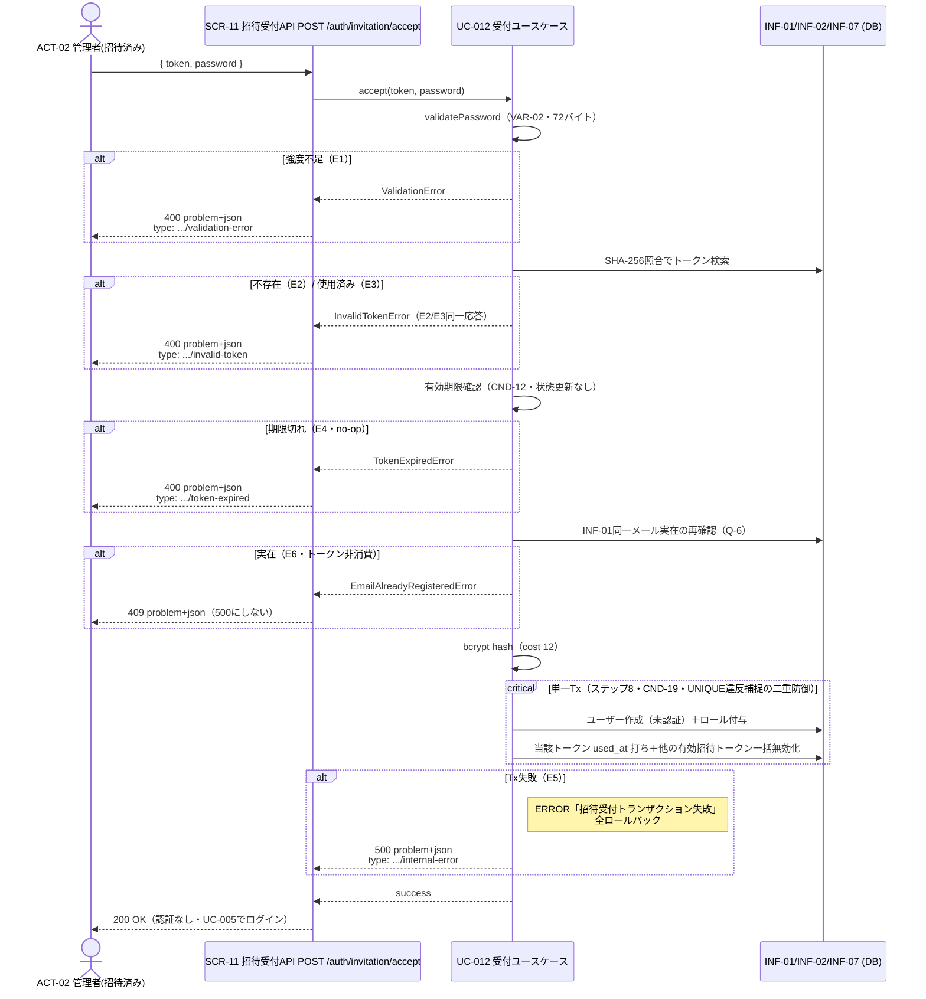

# UC-012 招待を受け付ける

| メタ | 値 |
|---|---|
| UC ID | UC-012（発番は `.docs/design/buc.md`） |
| BUC ID | BUC-A02（[buc.md](../buc.md) の該当行） |
| 主アクター | ACT-02（管理者・招待済み） |
| 副アクター（任意） | — |

記法ノート（初見時に読む）

- 入出力は UC—画面—アクター（§2.1）・UC—イベント—外部システム（§2.2）・UC—情報（§2.3）の三経路で書き分ける。
- 状態遷移に関わるUCは states.md の遷移トリガーと名前を揃える。
- 実装の正はコード。§8 はトレーサビリティ用の実装アンカー。

---

## 1. 概要

招待メールを受け取った管理者候補（ACT-02・招待済み）が、招待トークン（INF-07）と新パスワードを提示して管理者アカウントを作成する（FR-13）。トークン検証（不存在・使用済み・期限切れ）と**INF-01同一メール実在の再確認**（T-019 Q-6確定・招待発行〜受付間の自己登録レース対策）を経て、**ユーザー作成（`未認証`）＋ロール付与＋トークン消費＋他有効トークン一括無効化を単一トランザクション**で実行する。認証は行わない（受付後にUC-005（ログインする）でログイン）。認証不要（未認証経路・FR-19適用外）。

## 2. カタログとの突合

### 2.1 UC — 画面 — アクター（人が操作する）

| SCR-NN | 補足 |
|---|---|
| SCR-11（招待受付API） | `POST /auth/invitation/accept`。JSONボディ `{ "token": "<平文トークン>", "password": "<新パスワード>" }`。認証不要（securityなし） |

### 2.2 UC — イベント — 外部システム（連携・非画面入口）

なし。

### 2.3 UC — 情報（システムが扱うデータ）

| INF-NN（名前） | 読み / 書き / 両方 |
|---|---|
| INF-07（招待トークン) | 両方（SHA-256照合で検索・当該トークン `used_at` 打ち＋同一メール宛の他有効トークン一括無効化・紐付けロールの読取） |
| INF-01（ユーザー情報） | 両方（同一メール実在の再確認〔Q-6〕・`未認証` 状態で新規作成〔Q-2=B案〕） |
| INF-02（ロール情報） | 書き（招待トークンに紐付くロールを付与） |

<b>2.4 状態遷移（該当時のみ開く）</b>

| 状態モデル | 遷移 |
|---|---|
| STM-01（アカウント状態） | `STM-01.（初期）` → `STM-01.未認証`（UC-012（招待を受け付ける）完了・states.md） |

<b>2.5 条件・バリエーション（該当時のみ開く）</b>

| CND-NN / VAR-NN | 本UCとの関係の一言 |
|---|---|
| CND-12（招待トークンが有効期限内であること） | 受付の前提（E4・`expires_at` 判定のみ＝状態更新なしno-op・T-019 Q-5②確定） |
| VAR-02（パスワード強度） | 新パスワードの検証基準（15〜64文字・UTF-8で72バイト以下・E1） |
| VAR-07（招待トークン有効期限） | 24時間（CND-12の判定基準） |
| CND-19（招待トークンの有効は常に最大1本） | 受付完了Txで同一メール宛の他有効トークンも一括無効化（CND-18同型） |

## 3. 主成功シナリオ（基本コース）

1. [アクター] 招待トークンと新しいパスワードを送信する（SCR-11: `POST /auth/invitation/accept`）
2. [システム] 新しいパスワードの強度を検証する（VAR-02・72バイト条項含む・E1）
3. [システム] トークンをSHA-256ハッシュ照合でDB検索する（INF-07。不存在はE2）
4. [システム] トークンが未使用であることを確認する（`used_at IS NULL`。使用済みはE3）
5. [システム] トークンの有効期限を確認する（CND-12・VAR-07。期限切れはE4・状態更新なし）
6. [システム] INF-01に同一メールのレコードが実在しないことを再確認する（Q-6・実在はE6。招待発行〜受付間のUC-002自己登録レース対策）
7. [システム] 新しいパスワードをbcryptでハッシュ化する（`domain.PasswordBcryptCost`=12）
8. [システム] **単一トランザクション**で、ユーザーを `未認証` 状態で作成し（Q-2=B案）、招待トークンに紐付くロールを付与し（INF-02）、当該トークンを使用済みに更新し、同一メール宛の**他の有効招待トークンを一括無効化**（CND-19）する（E5）
9. [システム] 200レスポンスを返す（認証は行わない・受付後はUC-005（ログインする）経由）

> 受付側（SCR-11）のレート・試行制限は設けない（NFR-15の32バイトエントロピーで総当たり非現実的・UC-009（パスワードリセットを完了する）と同判断）。

## 4. 代替フロー・例外（代替コース）

**評価順はステップ順。** E2とE3は応答・ログとも同一（トークン状態を区別させない・UC-009と同型）。

| 条件 | 振る舞い（RFC 9457形式） |
|---|---|
| E1: パスワード強度不足（ステップ2・VAR-02違反） | **400** `validation-error`。WARNINGログ（`ctx: "invitation_accept"`・`msg: "パスワード強度不足"`・NFR-08） |
| E2: トークン不存在（ステップ3） | **400** `invalid-token`。WARNINGログ（`msg: "無効な招待トークン"`） |
| E3: トークン使用済み（ステップ4。一括無効化されたトークンの提示も本経路に合流） | **400** `invalid-token`・**E2と応答・msg同一**（状態を区別しない） |
| E4: トークン期限切れ（ステップ5・CND-12違反） | **400** `token-expired`。**DB書き込みなし（no-op・`expires_at` 判定のみ・Q-5②確定）**。WARNINGログ（`msg: "招待トークン有効期限切れ"`） |
| E6: INF-01に同一メールのレコード実在（ステップ6・BUC-A02 E6） | **409** `type: .../email-already-registered`（BUC-A02 E6-b確定・500にしない）。**トークンは消費しない**。Tx内createのUNIQUE違反捕捉と二重防御（レース安全）。WARNINGログ。登録側（UC-002）は不変 |
| E5: トランザクション失敗（ステップ8） | **500** `internal-error`。全ロールバック（ユーザー作成・ロール付与・トークン状態のいずれも適用しない）。ERRORログ（`msg: "招待受付トランザクション失敗"`・NFR-08） |

## 5. シーケンス図

<b>6. 監査ログ（該当時のみ開く）</b>

本UCは監査ログ（NFR-07）の対象操作なし（NFR-07の監査対象表に「招待受付」は非掲載・BUC-A02関連NFRにNFR-07なし）。E1〜E4/E6=WARNING・E5=ERROR のNFR-08業務ログを出す。**トークン平文・パスワード平文・ハッシュはログに含めない**（NFR-09）。

## 8. 実装参照（突合用・T-019 P5で実パス確定）

| 種別 | 参照 |
|---|---|
| HTTP | `POST /auth/invitation/accept`（SCR-11・200/400/409/500・securityなし） |
| ルーティング / Handler | `backend/auth/api/http/handler.go`・配線 `backend/auth/module.go` |
| UseCase | `backend/auth/app/command/`（招待受付UseCase・新設） |
| Domain | `backend/auth/domain/`（SHA-256照合・`ValidatePassword`・`PasswordBcryptCost`=12） |
| Repository | `backend/auth/adapters/db/`（受付Tx: 作成＋ロール付与＋消費＋一括無効化・新設）。sqlc: `queries/` |
| テスト | `backend/tests/unit/`・`backend/tests/component/`（`UC-012` でgrep可） |
