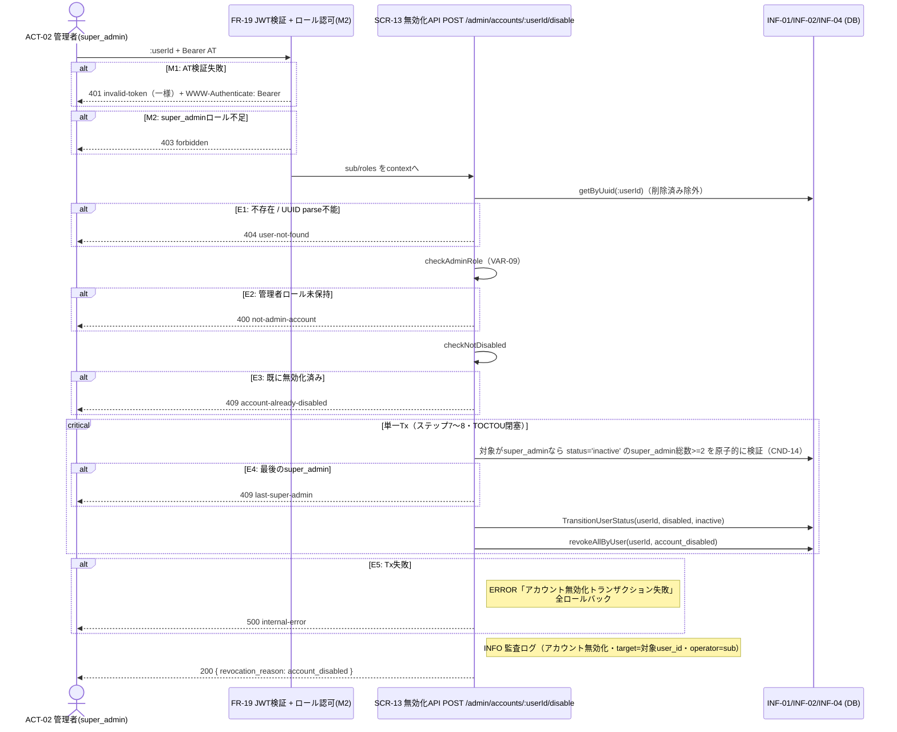

# UC-014 管理者アカウントを無効化する

| メタ | 値 |
|---|---|
| UC ID | UC-014（発番は `.docs/design/buc.md`） |
| BUC ID | BUC-A04（[buc.md](../buc.md) の該当行） |
| 主アクター | ACT-02（管理者・`super_admin` のみ） |
| 副アクター（任意） | — |

記法ノート（初見時に読む）

- 入出力は UC—画面—アクター（§2.1）・UC—イベント—外部システム（§2.2）・UC—情報（§2.3）の三経路で書き分ける。
- 状態遷移に関わるUCは states.md の遷移トリガーと名前を揃える。
- 実装の正はコード。§8 はトレーサビリティ用の実装アンカー。

---

## 1. 概要

`super_admin` 管理者（ACT-02）が、対象の管理者アカウントを無効化する（`FR-15`）。対象の状態を `disabled` へ遷移し、当該ユーザーの**全リフレッシュトークンを失効**（`account_disabled`・`RevocationReasonAccountDisabled`）する。最後の `super_admin` は無効化不可（`CND-14`）。認可はFR-19＋`RequireRoles`（`super_admin` 限定・T-019）を流用。自己無効化はCND-14を満たす限り特別扱いせず許可（T-020 Q-5）。

## 2. カタログとの突合

### 2.1 UC — 画面 — アクター（人が操作する）

| SCR-NN | 補足 |
|---|---|
| SCR-13（無効化API） | `POST /admin/accounts/:userId/disable`（openapi: `{userId}`）。`Authorization: Bearer` 必須（`bearerAuth`＋`super_admin` ロール要件）。ボディなし |

### 2.2 UC — イベント — 外部システム（連携・非画面入口）

なし。

### 2.3 UC — 情報（システムが扱うデータ）

| INF-NN（名前） | 読み / 書き / 両方 |
|---|---|
| INF-01（ユーザー情報） | 両方（`:userId` で検索・削除済み除外・status/roles確認・`status` を `disabled` へ更新） |
| INF-02（ロール情報） | 読み（管理者ロール確認・E2／super_admin計数・E4） |
| INF-04（リフレッシュトークン） | 書き（当該ユーザーの全レコードを `revoked_at`＋`revocation_reason: account_disabled` で失効・既失効は上書きしない） |
| INF-03（アクセストークン） | 読み（FR-19で操作者 `sub`/`roles` 検証。操作対象のATは即時失効せず自然失効） |

<b>2.4 状態遷移（該当時のみ開く）</b>

| 状態モデル | 遷移 |
|---|---|
| STM-01（アカウント状態） | `STM-01.未認証`（inactive）→ `STM-01.無効化済み`（disabled）（states.md・UC-014（管理者アカウントを無効化する）） |
| STM-02（セッション状態） | `STM-02.認証済み` → `STM-02.セッション失効`（全RT失効・`account_disabled`・states.md） |

<b>2.5 条件・バリエーション（該当時のみ開く）</b>

| CND-NN / VAR-NN | 本UCとの関係の一言 |
|---|---|
| CND-14（`super_admin` が2人以上存在すること） | 対象が `super_admin` のときの前提（E4）。計数対象は `status='inactive'`（disabled/deleted除外）・現存総数>=2（T-020 Q-2） |
| CND-17（いずれか1つのロールが条件を満たせば許可・OR評価） | M2のロール認可判定（`super_admin`） |
| VAR-09（管理者ロール） | E2の判定基準（対象が管理者ロールを持つこと） |
| VAR-10（セッション失効理由コード） | `account_disabled`（全失効・応答にも包含） |
| VAR-03（アクセストークン有効期限） | 操作対象ATの自然失効根拠（即時失効は非対象） |

## 3. 主成功シナリオ（基本コース）

1. [アクター] アクセストークンを添えて対象ユーザーIDを送信する（SCR-13: `POST /admin/accounts/:userId/disable`）
2. [システム] FR-19ミドルウェアがATを検証し `sub`/`roles` をcontextへ格納する（M1）
3. [システム] `roles` が `super_admin` を含むことを確認する（M2・CND-17 OR評価）
4. [システム] `:userId`（UUID）で対象ユーザーを検索する（削除済み除外・INF-01。不存在・UUID parse不能はE1）
5. [システム] 対象が管理者ロール（VAR-09）を持つことを確認する（未保持はE2）
6. [システム] 対象が `disabled` でないことを確認する（既に無効化済みはE3）
7. [システム] 対象が `super_admin` の場合、`status='inactive'` の `super_admin` 現存総数（対象を含む）が2以上であることを確認する（CND-14・1人のみはE4）
8. [システム] **単一トランザクション**で、対象の状態を `disabled` へ遷移（`TransitionUserStatus`・遷移元 `inactive` 固定）し、当該ユーザーの**全リフレッシュトークンを失効**（`account_disabled`）する（E5）
9. [システム] 監査ログ（アカウント無効化・INFO・target=対象user_id・operator=操作者sub・NFR-07）を記録する
10. [システム] 200レスポンスを返す（body: `revocation_reason: account_disabled`）

> ステップ7の計数とステップ8の無効化は**同一Tx境界で原子的に評価**し、2並行無効化がともにCND-14を通過して稼働中 `super_admin` を0にする競合（TOCTOU）を防ぐ（T-020 Q-2・T-014先例）。自己無効化（操作者 `sub` == `:userId`）は特別扱いせず許可（CND-14充足時・操作者自身のRTも失効対象）。

## 4. 代替フロー・例外（代替コース）

**評価順はステップ順（M1→M2→E1→E2→E3→E4）。**

| 条件 | 振る舞い（RFC 9457形式） |
|---|---|
| M1: アクセストークン検証失敗（ステップ2・FR-19） | **401** `invalid-token` 一様＋`WWW-Authenticate: Bearer`（FR-19既定） |
| M2: `super_admin` ロール不足（ステップ3） | **403** `forbidden`（UC-011 M2同型）。WARNINGログ（`ctx: "account_disable"`） |
| E1: 対象ユーザー不存在（ステップ4。UUID parse不能も含む） | **404** `user-not-found`。WARNINGログ（`msg: "対象ユーザーが存在しない"`） |
| E2: 対象が管理者ロール未保持（ステップ5） | **400** `not-admin-account`。WARNINGログ（`msg: "管理者ロール未保持のアカウントへの無効化試行"`） |
| E3: 既に無効化済み（ステップ6。遷移元ガード0行のレースも合流） | **409** `account-already-disabled`。WARNINGログ（`msg: "既に無効化済みのアカウント"`） |
| E4: 最後の `super_admin`（ステップ7・CND-14違反） | **409** `last-super-admin`。WARNINGログ（`msg: "最後のsuper_adminの無効化試行"`） |
| E5: トランザクション失敗（ステップ8） | **500** `internal-error`。全ロールバック（状態・セッションとも変更前へ）。ERRORログ（`msg: "アカウント無効化トランザクション失敗"`） |

## 5. シーケンス図

<b>6. 監査ログ（該当時のみ開く）</b>

| イベント | レベル |
|---|---|
| アカウント無効化（基本フロー完了時・target=対象user_id・operator=操作者sub・全セッション失効を含む） | INFO |

（M1はFR-19既定・M2/E1〜E4はビジネス例外WARNING・E5はERROR。NFR-08。**操作者sub・対象user_idはUUID＝NFR-09機密に非該当・トークン/パスワードはログに含めない**）

## 8. 実装参照（突合用・T-020 P5で実パス確定）

| 種別 | 参照 |
|---|---|
| HTTP | `POST /admin/accounts/{userId}/disable`（SCR-13・200/400/401/403/404/409/500・`bearerAuth`＋super_adminロール要件） |
| ミドルウェア | FR-19: `backend/common/http/jwtauth.go`＋ロール認可: `backend/common/http/roleauth.go`（`RequireRoles`）。適用: `backend/auth/api/http/handler.go` protectedRouter保護マップ（param path 対応） |
| Handler / UseCase | `backend/auth/api/http/handler.go`・`backend/auth/app/command/`（無効化UseCase・新設） |
| Repository | `backend/auth/adapters/db/`（無効化Tx: CND-14計数＋TransitionUserStatus＋RevokeRefreshTokensByUser・新設）。sqlc: `queries/users.sql`（super_admin計数クエリ新設）・`queries/refresh_tokens.sql` |
| 失効理由定数 | `backend/auth/app/command/revocation_reason.go`（`RevocationReasonAccountDisabled`） |
| テスト | `backend/tests/unit/`・`backend/tests/component/`（`UC-014` でgrep可） |
