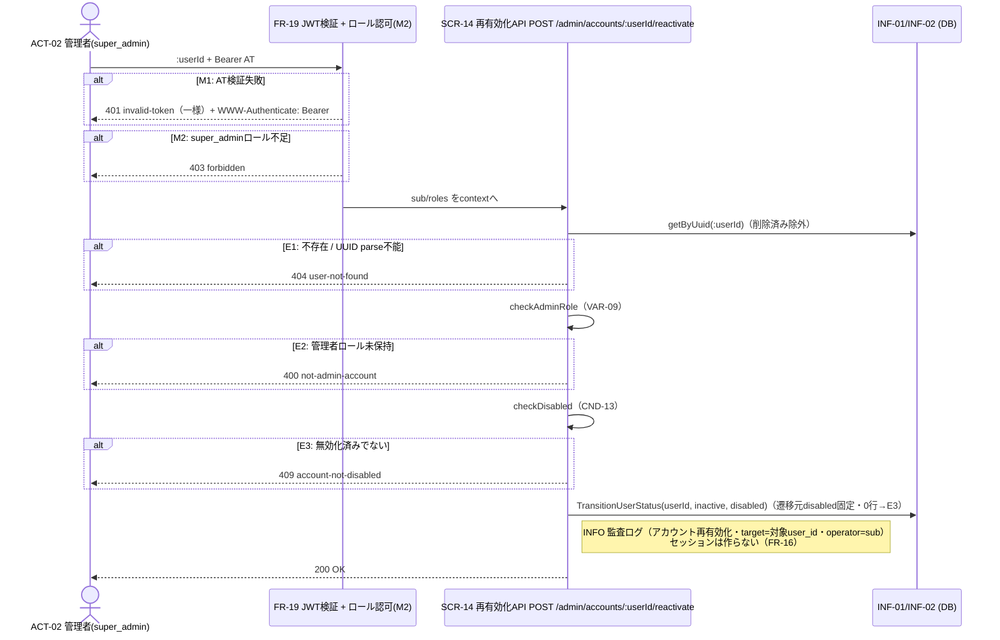

# UC-015 管理者アカウントを再有効化する

| メタ | 値 |
|---|---|
| UC ID | UC-015（発番は `.docs/design/buc.md`） |
| BUC ID | BUC-A05（[buc.md](../buc.md) の該当行） |
| 主アクター | ACT-02（管理者・`super_admin` のみ） |
| 副アクター（任意） | — |

記法ノート（初見時に読む）

- 入出力は UC—画面—アクター（§2.1）・UC—イベント—外部システム（§2.2）・UC—情報（§2.3）の三経路で書き分ける。
- 状態遷移に関わるUCは states.md の遷移トリガーと名前を揃える。
- 実装の正はコード。§8 はトレーサビリティ用の実装アンカー。

---

## 1. 概要

`super_admin` 管理者（ACT-02）が、無効化済みの管理者アカウントを再有効化する（`FR-16`）。対象の状態を `disabled` → `inactive`（未認証）へ遷移する。**セッションは作らず**、再有効化後は手動ログイン（UC-005）を要求する（FR-16）。BUC-A04（無効化）と対称の制約（管理者ロール限定・遷移元ガード）。認可はFR-19＋`RequireRoles`（`super_admin` 限定）を流用。

## 2. カタログとの突合

### 2.1 UC — 画面 — アクター（人が操作する）

| SCR-NN | 補足 |
|---|---|
| SCR-14（再有効化API） | `POST /admin/accounts/:userId/reactivate`（openapi: `{userId}`）。`Authorization: Bearer` 必須（`bearerAuth`＋`super_admin` ロール要件）。ボディなし |

### 2.2 UC — イベント — 外部システム（連携・非画面入口）

なし。

### 2.3 UC — 情報（システムが扱うデータ）

| INF-NN（名前） | 読み / 書き / 両方 |
|---|---|
| INF-01（ユーザー情報） | 両方（`:userId` で検索・削除済み除外・status/roles確認・`status` を `inactive` へ更新） |
| INF-02（ロール情報） | 読み（管理者ロール確認・E2） |

<b>2.4 状態遷移（該当時のみ開く）</b>

| 状態モデル | 遷移 |
|---|---|
| STM-01（アカウント状態） | `STM-01.無効化済み`（disabled）→ `STM-01.未認証`（inactive）（states.md・UC-015（管理者アカウントを再有効化する）） |

<b>2.5 条件・バリエーション（該当時のみ開く）</b>

| CND-NN / VAR-NN | 本UCとの関係の一言 |
|---|---|
| CND-13（対象アカウントが無効化済みであること） | 再有効化の前提（E3・`disabled` でなければ409） |
| CND-17（いずれか1つのロールが条件を満たせば許可・OR評価） | M2のロール認可判定（`super_admin`） |
| VAR-09（管理者ロール） | E2の判定基準（対象が管理者ロールを持つこと） |

## 3. 主成功シナリオ（基本コース）

1. [アクター] アクセストークンを添えて対象ユーザーIDを送信する（SCR-14: `POST /admin/accounts/:userId/reactivate`）
2. [システム] FR-19ミドルウェアがATを検証し `sub`/`roles` をcontextへ格納する（M1）
3. [システム] `roles` が `super_admin` を含むことを確認する（M2・CND-17 OR評価）
4. [システム] `:userId`（UUID）で対象ユーザーを検索する（削除済み除外・INF-01。不存在・UUID parse不能はE1）
5. [システム] 対象が管理者ロール（VAR-09）を持つことを確認する（未保持はE2）
6. [システム] 対象が `disabled` であることを確認する（CND-13・無効化されていなければE3）
7. [システム] 対象の状態を `inactive`（未認証）へ遷移する（`TransitionUserStatus`・遷移元 `disabled` 固定・`:execrows` 0行はE3へ倒す。セッションは作らない）
8. [システム] 監査ログ（アカウント再有効化・INFO・target=対象user_id・operator=操作者sub・NFR-07）を記録する
9. [システム] 200レスポンスを返す

> 再有効化後はセッションを作らず、手動ログイン（UC-005（ログインする））を要求する（FR-16）。ステップ6の読取と7の遷移元ガードで読取〜Tx間の並行競合（二重reactivate等）を閉じる（BUC-A04無効化と対称・T-020）。

## 4. 代替フロー・例外（代替コース）

**評価順はステップ順（M1→M2→E1→E2→E3）。**

| 条件 | 振る舞い（RFC 9457形式） |
|---|---|
| M1: アクセストークン検証失敗（ステップ2・FR-19） | **401** `invalid-token` 一様＋`WWW-Authenticate: Bearer`（FR-19既定） |
| M2: `super_admin` ロール不足（ステップ3） | **403** `forbidden`（UC-011 M2同型）。WARNINGログ（`ctx: "account_reactivate"`） |
| E1: 対象ユーザー不存在（ステップ4。UUID parse不能も含む） | **404** `user-not-found`。WARNINGログ（`msg: "対象ユーザーが存在しない"`） |
| E2: 対象が管理者ロール未保持（ステップ5） | **400** `not-admin-account`。WARNINGログ（`msg: "管理者ロール未保持のアカウントへの再有効化試行"`） |
| E3: 対象が無効化済みでない（ステップ6・CND-13違反。遷移元ガード0行のレースも合流） | **409** `account-not-disabled`。WARNINGログ（`msg: "無効化されていないアカウントへの再有効化試行"`） |

## 5. シーケンス図

<b>6. 監査ログ（該当時のみ開く）</b>

| イベント | レベル |
|---|---|
| アカウント再有効化（基本フロー完了時・target=対象user_id・operator=操作者sub） | INFO |

（M1はFR-19既定・M2/E1〜E3はビジネス例外WARNING。NFR-08。操作者sub・対象user_idはUUID＝NFR-09機密に非該当）

## 8. 実装参照（突合用）

| 種別 | 参照 |
|---|---|
| HTTP | `POST /admin/accounts/{userId}/reactivate`（SCR-14・200/400/401/403/404/409/500・`bearerAuth`＋super_adminロール要件。500は業務E系でなくインフラ障害の普遍フォールバック＝UC-014と表記統一） |
| ミドルウェア | FR-19＋`RequireRoles`（UC-014と共通・protectedRouter param path） |
| Handler / UseCase | `backend/auth/api/http/handler.go`（`ReactivateAdminAccount`）・`backend/auth/app/command/reactivate_account.go`（`ReactivateAccountHandler`） |
| Repository | `backend/auth/adapters/db/admin_account_repo.go`（`ReactivateAccount`＝`TransitionUserStatus(uuid, inactive, disabled)` 遷移元ガード）。sqlc: `queries/users.sql` |
| テスト | `backend/tests/unit/auth_reactivate_account_http_test.go`・`backend/tests/component/admin_account_repo_test.go`（遷移元ガード）・`backend/tests/component/admin_account_realserver_test.go`（E2E） |
