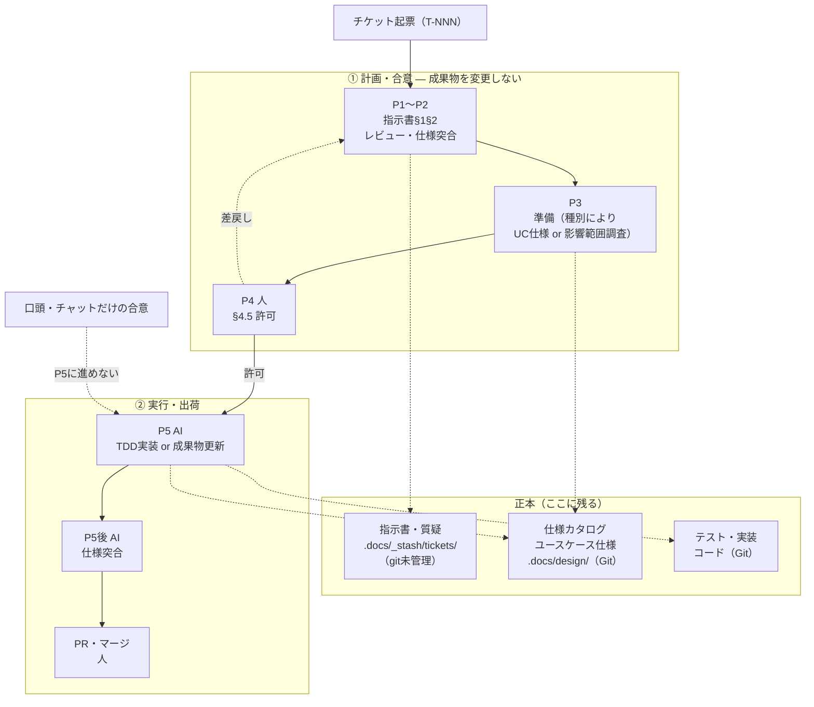

# AIDD（AI駆動開発）運用ガイド

本プロジェクトの開発プロセスの入口ドキュメント。仕様書を先に作り、TDDで品質を確保し、AIと人で役割を分けて進める。

- **仕様書で合意** — 指示書・質疑を残し、実行前に「何を・なぜ」を揃える
- **品質はテストと突合** — テストを軸に実装し、完了後に指示書とdiffを突合する
- **役割分担** — 起草・レビュー・準備・実行・突合はAI。**§4.5の許可とPR判断は人**

状態遷移の正本は [workflow.md](workflow.md)。本ガイドは読み物として全体像を示す。

---

## 全体像

## フェーズ早見

| フェーズ | 誰 | やること | 主な成果物 |
|---|---|---|---|
| **P1** 計画 | 人＋AI | 指示書§1§2・質疑起票・ブランチ名 | `指示書-T-NNN.md`・`質疑.md` |
| **P2** レビュー | AI | 要求の穴・仕様との突合 | 指摘 or「問題なし」 |
| **P3** 準備 | AI | 実装: UC仕様・受入条件・§4骨子 ／ ドキュメント: 影響範囲（ID grep）・変更対象一覧・§4骨子 | ユースケース仕様・指示書§3〜§4 |
| **P4** 承認 | **人** | §3を読んで合意・**§4.5に許可を記入** | §4.5・`ready-to-implement` |
| **P5** 実行 | AI | §4どおりTDD or 成果物更新・サイクルcommit（メッセージに `T-NNN`） | コード or 成果物 |
| **P5後** | AI | 指示書§2·§4とdiffの突合・ID整合チェック | `レビュー-P5.md`（指摘時） |
| **PR** | **人** | CI・第3層レビュー・マージ | PR・`done` |

## 人間がやること

| タイミング | やること |
|---|---|
| P1 | §1§2・質疑への回答・`ステータス: ready-to-prepare` |
| P3後 | §3§4を読む・不足なら差し戻し（ステータスを人が戻す） |
| **P4** | §3承認・**§4.5全チェック**・`ready-to-implement` |
| P5着手 | 着手宣言・`ステータス: implementing` |
| PR後 | 第3層レビュー・Approve・`ステータス: done` |

**P4はAIが代行しない。** 入口コマンドは `ready-to-approve` を見ると「§4.5を埋めてください」と案内して止まる。

## チケットの考え方

- チケットは `.docs/_stash/tickets/T-NNN/` に置く（**git未管理**・`.docs/README.md` 参照）
- **チケットは指示に徹する。** 恒久化すべき決定・仕様変更は、必ずGit管理の成果物（仕様カタログ・ユースケース仕様・ポリシー・コード）に反映して受け止める
- コードとの紐付けはコミットメッセージの `T-NNN`

## 関連ドキュメント

| 見たいもの | 場所 |
|---|---|
| 状態遷移の正本・強制ルール | [workflow.md](workflow.md) |
| 成果物の全体マップ・ID体系 | `.docs/README.md`・仕様カタログの README |
| 指示書などのひな形 | `.docs/operations/templates/` |
| 規約（コーディング・レビュー） | `.docs/operations/policies/` |
