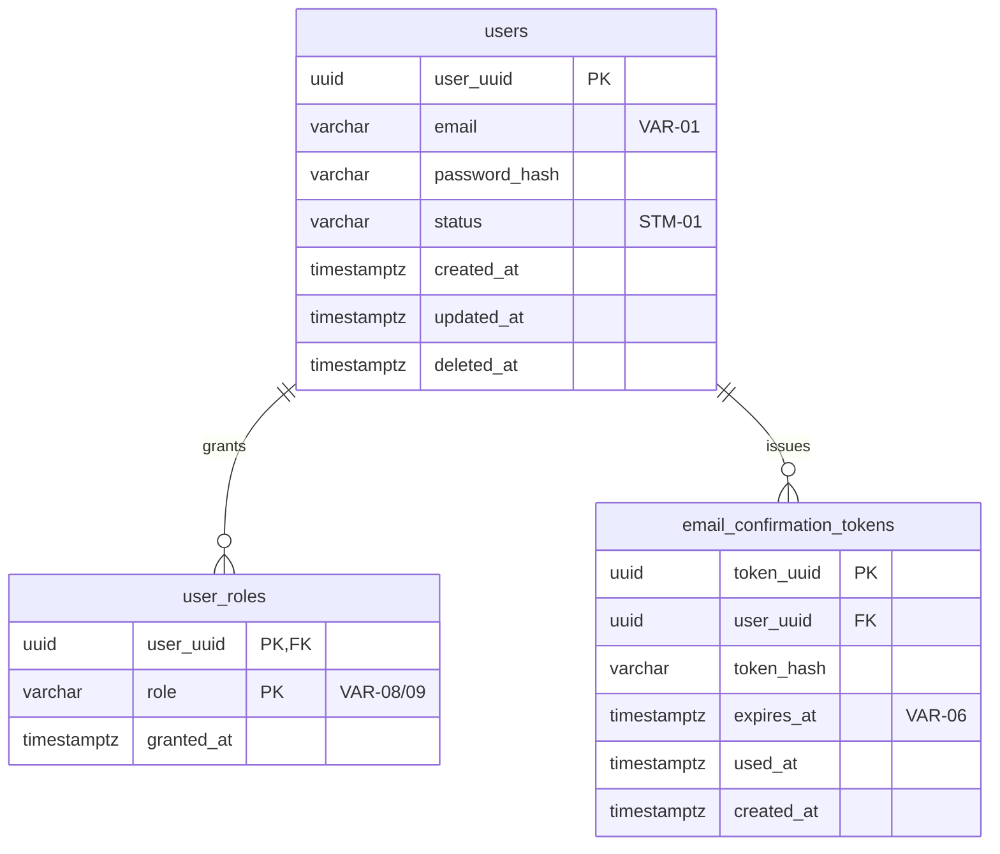

# auth スキーマ — テーブル定義

> 物理スキーマの正本は `migrations/*.up.sql`。本ドキュメントは可読な参照用（テーブル・列・制約・インデックスの一覧）で、要件カタログ（`.docs/design/`）のID（INF-NN・CND-NN・VAR-NN・STM-NN）との対応を記載する。SQLとの不一致に気付いたらSQL側を正として本ドキュメントを更新する。

## ER図

## auth.users

対応: INF-01（ユーザー情報）

| 列 | 型 | 制約 | 説明 |
|---|---|---|---|
| `user_uuid` | uuid | PK | ユーザーの主キー |
| `email` | varchar(254) | NOT NULL | VAR-01（RFC5322準拠・最大254文字） |
| `password_hash` | varchar(255) | NOT NULL | bcryptハッシュ（平文非保存） |
| `status` | varchar(30) | NOT NULL | STM-01の英語ID（正本: `.docs/design/states.md`）: `mail_unverified` / `invited` / `inactive` / `disabled` / `deleted` |
| `created_at` | timestamptz | NOT NULL DEFAULT now() | |
| `updated_at` | timestamptz | NOT NULL DEFAULT now() | |
| `deleted_at` | timestamptz | NULL可 | 論理削除（GDPR対応カラムnull化は別途マイグレーションで対応。README未決事項参照） |

**インデックス**

- `users_email_unique`: `(email)` UNIQUE WHERE `deleted_at IS NULL` — CND-01（メールアドレスが未登録であること）。論理削除済みを除いて一意とし、削除後の同一メールアドレス再登録を許す

## auth.user_roles

対応: INF-02（ロール情報）

| 列 | 型 | 制約 | 説明 |
|---|---|---|---|
| `user_uuid` | uuid | PK（複合）・FK → `users.user_uuid` | |
| `role` | varchar(30) | PK（複合）・NOT NULL | VAR-08（`user`）・VAR-09（`super_admin`/`operator`/`system_admin`）。1ユーザーに複数ロール付与可能 |
| `granted_at` | timestamptz | NOT NULL DEFAULT now() | |

## auth.email_confirmation_tokens

対応: INF-06（メール確認トークン）

| 列 | 型 | 制約 | 説明 |
|---|---|---|---|
| `token_uuid` | uuid | PK | |
| `user_uuid` | uuid | NOT NULL・FK → `users.user_uuid` | |
| `token_hash` | varchar(255) | NOT NULL | SHA-256ハッシュ（平文は保存しない。漏洩対策） |
| `expires_at` | timestamptz | NOT NULL | VAR-06（有効期限24時間） |
| `used_at` | timestamptz | NULL可 | 使用済みは使用時刻で表す（未使用はnull。「使用済みフラグ」ではない） |
| `created_at` | timestamptz | NOT NULL DEFAULT now() | |

**インデックス**

- `email_confirmation_tokens_hash_unique`: `(token_hash)` UNIQUE

## レート制限（DB外）

VAR-16（登録レートリミット）・INF-13（登録送信記録）はテーブルを持たない。Redis（EXT-02）の `registration:ratelimit:<email>` キー（SET NX・TTL 5分・固定ウィンドウ）で実装する（`adapters/ratelimit/redis.go`）。

## マイグレーション運用

- ファイル: `migrations/NNNN_<name>.up.sql`（連番・up onlyの現状。down未整備）
- 適用: `Module.Init` で `common.MigrateDatabaseUp` を呼び、`auth` スキーマへ golang-migrate（iofs embed）で適用する
- コード生成: `sqlc`（`sqlc.yaml`・`queries/*.sql` → `dbmodels/`）。クエリ追加時は `queries/` にSQLを書いて `go generate ./backend/auth/...` を実行する
