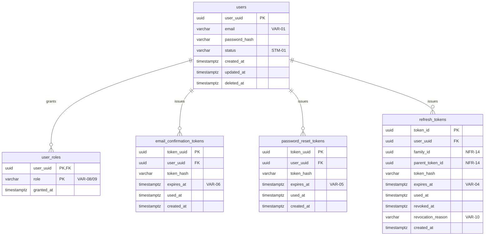

# auth スキーマ — テーブル定義

> 物理スキーマの正本は `migrations/*.up.sql`。本ドキュメントは可読な参照用（テーブル・列・制約・インデックスの一覧）で、要件カタログ（`.docs/design/`）のID（INF-NN・CND-NN・VAR-NN・STM-NN）との対応を記載する。SQLとの不一致に気付いたらSQL側を正として本ドキュメントを更新する。

## ER図

```mermaid
erDiagram
    users ||--o{ user_roles : "grants"
    users ||--o{ email_confirmation_tokens : "issues"
    users ||--o{ password_reset_tokens : "issues"
    users ||--o{ refresh_tokens : "issues"

    users {
        uuid user_uuid PK
        varchar email "VAR-01"
        varchar password_hash
        varchar status "STM-01"
        timestamptz created_at
        timestamptz updated_at
        timestamptz deleted_at
    }
    user_roles {
        uuid user_uuid PK,FK
        varchar role PK "VAR-08/09"
        timestamptz granted_at
    }
    email_confirmation_tokens {
        uuid token_uuid PK
        uuid user_uuid FK
        varchar token_hash
        timestamptz expires_at "VAR-06"
        timestamptz used_at
        timestamptz created_at
    }
    password_reset_tokens {
        uuid token_uuid PK
        uuid user_uuid FK
        varchar token_hash
        timestamptz expires_at "VAR-05"
        timestamptz used_at
        timestamptz created_at
    }
    refresh_tokens {
        uuid token_id PK
        uuid user_uuid FK
        uuid family_id "NFR-14"
        uuid parent_token_id "NFR-14"
        varchar token_hash
        timestamptz expires_at "VAR-04"
        timestamptz used_at
        timestamptz revoked_at
        varchar revocation_reason "VAR-10"
        timestamptz created_at
    }
```

## auth.users

対応: INF-01（ユーザー情報）

| 列 | 型 | 制約 | 説明 |
|---|---|---|---|
| `user_uuid` | uuid | PK | ユーザーの主キー |
| `email` | varchar(254) | NOT NULL | VAR-01（RFC5322準拠・最大254文字） |
| `password_hash` | varchar(255) | NOT NULL | bcryptハッシュ（平文非保存） |
| `status` | varchar(30) | NOT NULL・CHECK `users_status_check` | STM-01の英語ID（正本: `.docs/design/states.md`）: `mail_unverified` / `inactive` / `disabled` / `deleted`（`invited` はSTM-01から除去済み＝招待済み未受付はINF-07で表す・CND-19。CHECK制約からの除去はmigration 0005） |
| `created_at` | timestamptz | NOT NULL DEFAULT now() | |
| `updated_at` | timestamptz | NOT NULL DEFAULT now() | |
| `deleted_at` | timestamptz | NULL可 | 論理削除（GDPR対応カラムnull化は別途マイグレーションで対応。README未決事項参照） |

**インデックス**

- `users_email_unique`: `(email)` UNIQUE WHERE `deleted_at IS NULL` — CND-01（メールアドレスが未登録であること）。論理削除済みを除いて一意とし、削除後の同一メールアドレス再登録を許す

## auth.user_roles

対応: INF-02（ロール情報）

| 列 | 型 | 制約 | 説明 |
|---|---|---|---|
| `user_uuid` | uuid | PK（複合）・FK → `users.user_uuid` | |
| `role` | varchar(30) | PK（複合）・NOT NULL | VAR-08（`user`）・VAR-09（`super_admin`/`operator`/`system_admin`）。1ユーザーに複数ロール付与可能 |
| `granted_at` | timestamptz | NOT NULL DEFAULT now() | |

## auth.email_confirmation_tokens

対応: INF-06（メール確認トークン）

| 列 | 型 | 制約 | 説明 |
|---|---|---|---|
| `token_uuid` | uuid | PK | |
| `user_uuid` | uuid | NOT NULL・FK → `users.user_uuid` | |
| `token_hash` | varchar(255) | NOT NULL | SHA-256ハッシュ（平文は保存しない。漏洩対策） |
| `expires_at` | timestamptz | NOT NULL | VAR-06（有効期限24時間） |
| `used_at` | timestamptz | NULL可 | 使用済みは使用時刻で表す（未使用はnull。「使用済みフラグ」ではない） |
| `created_at` | timestamptz | NOT NULL DEFAULT now() | |

**インデックス**

- `email_confirmation_tokens_hash_unique`: `(token_hash)` UNIQUE

## auth.password_reset_tokens

対応: INF-05（パスワードリセットトークン）

| 列 | 型 | 制約 | 説明 |
|---|---|---|---|
| `token_uuid` | uuid | PK | |
| `user_uuid` | uuid | NOT NULL・FK → `users.user_uuid` | |
| `token_hash` | varchar(255) | NOT NULL | SHA-256ハッシュ（平文は保存しない・NFR-15） |
| `expires_at` | timestamptz | NOT NULL | VAR-05（有効期限30分） |
| `used_at` | timestamptz | NULL可 | 使用済みは使用時刻で表す（未使用はnull）。消費だけでなく再要求・完了時の一括無効化（CND-18）にも用いる |
| `created_at` | timestamptz | NOT NULL DEFAULT now() | |

**インデックス**

- `password_reset_tokens_hash_unique`: `(token_hash)` UNIQUE

## auth.refresh_tokens

対応: INF-04（リフレッシュトークン）・NFR-14（opaque token実装要件）

| 列 | 型 | 制約 | 説明 |
|---|---|---|---|
| `token_id` | uuid | PK | NFR-14: DB主キー（トークン値とは独立） |
| `user_uuid` | uuid | NOT NULL・FK → `users.user_uuid` | |
| `family_id` | uuid | NOT NULL | NFR-14: ローテーションチェーン識別子。再利用検知時はfamily単位で一括失効 |
| `parent_token_id` | uuid | NULL可・FK → `refresh_tokens.token_id`（自己参照） | NFR-14: 前トークンの参照（初回発行はnull） |
| `token_hash` | varchar(255) | NOT NULL | SHA-256ハッシュのみ保存（平文永続化禁止・NFR-14） |
| `expires_at` | timestamptz | NOT NULL | VAR-04（30日） |
| `used_at` | timestamptz | NULL可 | ローテーション消費時刻（使用済みは使用時刻で表す・INF-04。消費はBUC-U05） |
| `revoked_at` | timestamptz | NULL可 | 失効時刻（消費とは別概念） |
| `revocation_reason` | varchar(50) | NULL可 | VAR-10（セッション失効理由コード） |
| `created_at` | timestamptz | NOT NULL DEFAULT now() | |

**インデックス**

- `refresh_tokens_hash_unique`: `(token_hash)` UNIQUE
- `refresh_tokens_family_idx`: `(family_id)` — family一括失効用
- `refresh_tokens_user_idx`: `(user_uuid)` — ユーザー単位失効（BUC-A03等）用

## レート制限（DB外）

VAR-16（登録レートリミット）・INF-13（登録送信記録）はテーブルを持たない。Redis（EXT-02）の `registration:ratelimit:<email>` キー（SET NX・TTL 5分・固定ウィンドウ）で実装する（`adapters/ratelimit/redis.go`）。

## マイグレーション運用

- ファイル: `migrations/NNNN_<name>.up.sql`（連番・up onlyの現状。down未整備）
- 適用: `Module.Init` で `common.MigrateDatabaseUp` を呼び、`auth` スキーマへ golang-migrate（iofs embed）で適用する
- コード生成: `sqlc`（`sqlc.yaml`・`queries/*.sql` → `dbmodels/`）。クエリ追加時は `queries/` にSQLを書いて `go generate ./backend/auth/...` を実行する
